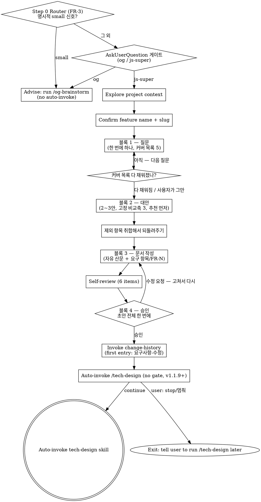

# PRD 제거 + 소크라테스 고도화 구현계획서

> **다음 단계 안내**: 이 계획을 task-by-task 로 실행하려면 `js-super-sub-driven` (보조 에이전트 강제 모드, 권장) 또는 `executing-plans` (인라인 모드) 를 사용하세요. 각 step 은 체크박스 (`- [ ]`) 형식이라 진행 상황 추적이 가능합니다.

**Goal:** `brainstorming` 스킬에서 PRD 모드를 없애고 소크라테스 절차를 단일 경로로 다시 쓴다. 요구 항목 섹션과 `FR-N` 앵커를 계약으로 두어 다운스트림 검증을 되살린다.

**Architecture:** 진입 후 갈라지던 두 갈래(PRD / 소크라테스)를 한 줄기로 만든다. 소크라테스 절차는 질문 → 대안 → 문서 → 승인 네 블록으로 재작성한다. 산출물에서 고정되는 것은 H1 제목, `## 요구 항목` 섹션과 `FR-N`, `## 변경이력` footer 셋이고 나머지 섹션은 자유다. `tech-design` 의 입력 형식 감지 분기는 두 형식이 같은 앵커를 공유하므로 제거한다.

**Tech Stack:** 마크다운 스킬 본문. 실행 코드 변경 없음. 검증은 grep 과 예제 문서.

**Spec inputs:**
- `prd제거-소크라테스고도화-requirements.md` — FR-1~FR-3 (제거), FR-4 (이식), FR-5~FR-6 (계약), FR-7~FR-10 (대화 고도화), FR-11~FR-13 (다운스트림), FR-14~FR-15 (문서), FR-16~FR-17 (검증), FR-18 (공용 문구)
- `prd제거-소크라테스고도화-tech-design.md` — D1 모드 줄 제거 / D2 요구 항목만 필수 / D3 종료 판정 / D4 비교축 3개 / D5 3단 사다리 / D6 자산 흡수 / D7 점검 6항목 / D8 예제 위치

**편집 위치 지정 방식:** 이 계획의 모든 수정은 라인 번호가 아니라 고유 문자열 앵커로 위치를 잡는다. `brainstorming/SKILL.md` 한 파일에서 23곳을 고치므로 앞선 task 가 적용되면 라인 번호가 계속 밀린다. 각 task 의 `**원본**` 블록은 그 시점 파일에 그대로 존재하는 문자열이며, 삭제만 하는 task 는 시작과 끝 앵커로 구간을 지정한다.

**같은 파일 묶음 룰 검토 결과:** Task 2~10 이 모두 `brainstorming/SKILL.md` 를 만진다. 묶음 조건 세 가지 중 앞의 둘(같은 파일 / 테스트 경계 없음)은 맞지만 세 번째(mechanical)가 맞지 않는다. 여기서 하는 일은 수식어 추가나 핸들러 등록 같은 기계적 변경이 아니라 삭제와 재작성이다. 한 덩어리로 묶으면 실패 지점을 좁히기 어렵고 되돌릴 때도 통째로 되돌려야 한다. 그래서 의도적으로 나눴다. 다만 순서는 지켜야 한다 — Task 2 가 지운 자리를 Task 7 이 다시 채우므로 앞뒤가 바뀌면 앵커가 어긋난다.

---

## 1. 단계별 작업

### Task 1: 보존 문자열 기준선 기록

**Files:**
- Create: `docs/features/2026-08-15-prd제거-소크라테스고도화/baseline-grep.txt`

**Model**: haiku

**검증**: 착수 시점의 보존 대상 문자열 개수와 PRD 문자열 분포를 파일로 남긴다. 성공 기준은 6종 보존 문자열과 7개 파일의 PRD 건수가 모두 숫자로 기록되어 있고, Task 18 에서 같은 명령으로 재현 가능한 형태인 것.

- [ ] **Step 1: 기준선 수집 명령 실행**

```bash
cd "$(git rev-parse --show-toplevel)"
{
  echo "# 착수 기준선 $(date '+%Y-%m-%d %H:%M')"
  echo "## 보존 대상"
  echo -n "no-ask 섹션 제목 보유 파일: "; grep -rlF '`--no-ask` 플래그 (v2.5+)' skills/ commands/ | wc -l
  echo -n "Advise: run /og-brainstorm (brainstorming 내): "; grep -cF "Advise: run /og-brainstorm" skills/brainstorming/SKILL.md
  echo -n "visual-companion.md 참조 파일: "; grep -rlF "visual-companion.md" skills/ commands/ | wc -l
  echo -n "체인 invoke auto-tech-design: "; grep -cF "js-super:auto-tech-design" skills/auto-brainstorming/SKILL.md
  echo -n "체인 invoke auto-writing-plans: "; grep -cF "js-super:auto-writing-plans" skills/auto-tech-design/SKILL.md
  echo -n "체인 invoke auto-executing-plans: "; grep -cF "js-super:auto-executing-plans" skills/auto-writing-plans/SKILL.md
  echo "## PRD 문자열 분포"
  grep -rc "PRD" skills/*/SKILL.md commands/*.md README.md CLAUDE.md 2>/dev/null | grep -v ":0"
} > docs/features/2026-08-15-prd제거-소크라테스고도화/baseline-grep.txt
cat docs/features/2026-08-15-prd제거-소크라테스고도화/baseline-grep.txt
```

Expected: 보존 대상 6줄과 PRD 분포 9줄이 출력된다. 착수 시점 실측은 `brainstorming` 59, `tech-design` 11, `README.md` 7, `og-brainstorm` 3, `writing-plans` 2, `auto-brainstorming` 1, `js-super-sub-driven` 1, `brainstorm` 커맨드 1, `CLAUDE.md` 1.

- [ ] **Step 2: Commit**

```bash
git add docs/features/2026-08-15-prd제거-소크라테스고도화/baseline-grep.txt
git commit -m "chore: PRD 제거 착수 전 보존 문자열 기준선 기록"
```

---

### Task 2: brainstorming — PRD 전용 구간 3개 삭제

**Files:**
- Modify: `skills/brainstorming/SKILL.md`

**Model**: sonnet

**검증**: PRD 전용 블록 세 덩어리가 사라지고 그 자리에 아무것도 남지 않는다. 성공 기준은 `Mode Selection` · `PRD Adaptive Planning` · `Step P1` · `Step P2` · `Step P3` 문자열이 각각 0건이고, 파일이 마크다운으로 정상 파싱되며 인접 섹션 제목이 붙어버리지 않은 것.

- [ ] **Step 1: `## Mode Selection` 섹션 삭제**

시작 앵커 `## Mode Selection` 부터 끝 앵커 `Once chosen, the mode is fixed for this brainstorming run.` 까지(끝 앵커 포함) 삭제한다. 바로 다음 줄인 `## PRD Adaptive Planning (PRD mode only)` 는 Step 2 에서 지운다.

- [ ] **Step 2: `## PRD Adaptive Planning (PRD mode only)` 섹션 삭제**

시작 앵커 `## PRD Adaptive Planning (PRD mode only)` 부터 끝 앵커 `The 범위 밖 (Out of Scope) consolidation rule still applies — track exclusions through the dialogue and offer them back. Do NOT ask from a blank prompt.` 까지(끝 앵커 포함) 삭제한다. 이 구간에는 카테고리 미니질문, Visual Companion 엄격 트리거, 질문 계획 루브릭 표, 질문 실행 규정이 모두 들어 있다.

- [ ] **Step 3: 자체 점검의 PRD 전용 6항목 삭제**

**원본**:
```markdown
**PRD-specific (6 items, PRD mode only) — applies only to sections marked ✅ 필수 in the agreed plan; ➖ 간소 / ⏭ 스킵 sections are exempt:**
1. Every FR has a unique id (FR-1, FR-2, ...)
2. Every acceptance criterion is measurable (Yes/No answerable)
3. Out-of-scope is explicit (use "없음" if truly empty) AND captures every exclusion the user mentioned during the dialogue — not just answers to step 5 itself
4. No technical/implementation details leak into the body — those belong in <slug>-tech-design.md
5. NFRs are concrete, not vague (e.g., "fast" → "p95 < 200ms")
6. User stories include all three of who/what/why

**Abstract scan (4 items, both modes, fresh-eyes pass):**

```

**수정 후**:
```markdown
```

Task 7 에서 이 자리에 단일 점검 목록을 다시 쓴다. 지금은 지우기만 한다.

- [ ] **Step 4: 삭제 확인**

```bash
grep -c "Mode Selection\|PRD Adaptive Planning\|Step P1\|Step P2\|Step P3" skills/brainstorming/SKILL.md
```

Expected: `0`

- [ ] **Step 5: Commit**

```bash
git add skills/brainstorming/SKILL.md
git commit -m "refactor(brainstorming): PRD 모드 선택 게이트와 적응형 질문 계획 제거"
```

---

### Task 3: brainstorming — 스킬 소개와 진입 가드 재작성

**Files:**
- Modify: `skills/brainstorming/SKILL.md`

**Model**: sonnet

**검증**: 스킬 설명문과 제목, 소개 문단, 진입 가드에서 두 모드 언급이 사라지고 소크라테스 단일 경로로 읽힌다. 성공 기준은 frontmatter description 에 `two modes` 와 `PRD` 가 없고, 자동 발동 조건("피처를 만들기 전에 반드시")은 그대로 남은 것.

- [ ] **Step 1: frontmatter description 교체**

**원본**:
```markdown
description: You MUST use this before creating any feature, component, or behavior change. Offers two modes — PRD (structured, default) for productisation work, or Socratic (free-form, upstream-superpowers style) for exploratory/internal work. Both modes write <slug>-requirements.md to docs/features/YYYY-MM-DD-<slug>/. Does NOT cover technical design — that belongs to tech-design.
```

**수정 후**:
```markdown
description: You MUST use this before creating any feature, component, or behavior change. Runs a Socratic dialogue — one question at a time, alternatives with tradeoffs, then a free-form requirements doc whose only fixed parts are the title, a `## 요구 항목` section with FR-N anchors, and the change-log footer. Writes <slug>-requirements.md to docs/features/YYYY-MM-DD-<slug>/. Does NOT cover technical design — that belongs to tech-design.
```

- [ ] **Step 2: H1 제목 교체**

**원본**:
```markdown
# Brainstorming → <slug>-requirements.md (PRD or Socratic)
```

**수정 후**:
```markdown
# Brainstorming → <slug>-requirements.md (Socratic)
```

- [ ] **Step 3: 모드 소개 문단 교체**

**원본**:
```markdown
Two modes are offered at the start, both producing the same file path (`<slug>-requirements.md`) so downstream skills work uniformly:

- **PRD mode (default)** — structured 6-section template (배경/목적 → 사용자 스토리 → FR → NFR → 범위 밖 → 수용 기준), with **adaptive question planning** (skip/minimize sections that don't fit the feature category — no over-asking).
- **Socratic mode** — free-form upstream-superpowers-style dialogue: one question at a time, propose 2-3 approaches with tradeoffs, section-by-section approval. Output is free-form prose under the same filename. Use this for internal/exploratory work where the PRD template would be over-structure.
```

**수정 후**:
```markdown
The dialogue is Socratic: one question at a time, alternatives with tradeoffs before any decision, and a single review of the finished draft. There is no mode gate — every feature goes through the same path.

The output is free-form prose. Only three things are fixed: the H1 title, a `## 요구 항목` section whose items carry `FR-N` anchors, and the `## 변경이력` footer. Everything else takes whatever shape the dialogue produced. Downstream skills (`tech-design`, `verifying-spec`, `writing-plans`, `change-propagation`) read the `FR-N` anchors, so that section is the one contract this doc must honour.
```

- [ ] **Step 4: 진입 가드 첫 문장 교체**

**원본**:
```markdown
This skill is for PRD only — NOT writing <slug>-tech-design.md, NOT touching code, NOT writing implementation plans. brainstorming = PRD only.
```

**수정 후**:
```markdown
This skill produces requirements only — NOT <slug>-tech-design.md, NOT code, NOT implementation plans. Technical decisions belong to the next step.
```

- [ ] **Step 5: 확인**

```bash
head -6 skills/brainstorming/SKILL.md
grep -c "two modes\|PRD mode\|Socratic mode" skills/brainstorming/SKILL.md
```

Expected: description 에 `Socratic dialogue` 가 보이고 두 번째 명령은 `0`

- [ ] **Step 6: Commit**

```bash
git add skills/brainstorming/SKILL.md
git commit -m "refactor(brainstorming): 스킬 소개와 진입 가드를 단일 경로로 재작성"
```

---

### Task 4: brainstorming — Checklist 재작성

**Files:**
- Modify: `skills/brainstorming/SKILL.md`

**Model**: sonnet

**검증**: 진행 항목에서 모드 선택과 모드별 분기가 사라지고 단일 흐름이 된다. 성공 기준은 항목 번호가 0~7로 연속하고, 각 항목이 사용자에게 보일 한국어 표현이며(영어 식별자 미노출), Entry Router 항목(0번)은 표현이 바뀌지 않은 것.

- [ ] **Step 1: Checklist 항목 3~6 교체**

**원본**:
```markdown
3. **모드 선택** — ask user PRD (default) or Socratic. Parse intent (any language). On ambiguous reply, default to PRD with a one-line note. See "Mode Selection" below.
4. **모드별 질의응답 진행**:
   - **[PRD mode]** Feature category mini-question → **Visual Companion offer** (if UI/layout/visual feature based on category — own message, mode-aware trigger) → Question plan agreement → Adaptive PRD questions (only the agreed subset). See "PRD Adaptive Planning" below.
   - **[Socratic mode]** **Visual Companion offer** (if visual questions ahead — own message) → Free-form upstream-style dialogue: one question at a time, propose 2-3 approaches with tradeoffs, section-by-section approval. See "Socratic Mode" below.
5. **자체 점검** — mode-specific (PRD: 6-item PRD scan + 4-item abstract scan; Socratic: 4-item abstract scan only)
6. **사용자 검토 (PRD 초안)** — show the RAW `<slug>-requirements.md`, get approval (loop until OK; on changes → revise → re-show)
```

**수정 후**:
```markdown
3. **질문으로 좁히기** — 한 번에 하나씩. 커버 목록 다섯 가지가 채워지면 멈춘다. 자세한 룰은 "Socratic Procedure" 의 블록 1 참조.
4. **대안 비교와 방향 결정** — 2~3안을 고정 비교축으로 제시하고 추천을 먼저 말한다. 블록 2 참조.
5. **요구사항 문서 작성** — 자유 산문. `## 요구 항목` 섹션과 `FR-N` 만 필수. 제외 항목 취합 룰 포함. 블록 3 참조.
6. **자체 점검** — 여섯 항목 단일 목록. "Self-Review" 참조.
7. **사용자 검토** — 초안 전체를 한 번에 보여주고 승인받는다. 수정 요청이 오면 고쳐서 다시 보여준다.
```

- [ ] **Step 2: 뒤따르는 항목 번호 조정**

**원본**:
```markdown
7. **변경이력 기록** — append first `[요구사항-수정]` entry via `change-history` skill
8. **개발방향 단계 자동 진행** — Right after the change-history entry is logged, auto-invoke `tech-design` via the Skill tool with a one-line interrupt-notice. On user "stop"/"멈춰"/"잠깐" → exit cleanly with notice telling the user to run /tech-design later.
```

**수정 후**:
```markdown
8. **변경이력 기록** — append first `[요구사항-수정]` entry via `change-history` skill
9. **개발방향 단계 자동 진행** — Right after the change-history entry is logged, auto-invoke `tech-design` via the Skill tool with a one-line interrupt-notice. On user "stop"/"멈춰"/"잠깐" → exit cleanly with notice telling the user to run /tech-design later.
```

- [ ] **Step 3: "너무 단순해서" 안티 패턴 제목과 본문 교체**

**원본**:
```markdown
## Anti-Pattern: "This is too simple to need a PRD"

Every project goes through this process. A single-function utility, a config change — all of them. "Simple" projects are where unexamined assumptions cause the most wasted work. The PRD can be short (a few sentences), but you MUST write it and get user approval.
```

**수정 후**:
```markdown
## Anti-Pattern: "This is too simple to need a requirements doc"

Every project goes through this process. A single-function utility, a config change — all of them. "Simple" projects are where unexamined assumptions cause the most wasted work. The doc can be short (a few sentences and one 요구 항목), but you MUST write it and get user approval.
```

- [ ] **Step 4: 확인**

```bash
grep -n "^[0-9]\." skills/brainstorming/SKILL.md | head -12
```

Expected: 0부터 9까지 번호가 연속하고 중복이 없다

- [ ] **Step 5: Commit**

```bash
git add skills/brainstorming/SKILL.md
git commit -m "refactor(brainstorming): 진행 항목을 단일 흐름으로 재작성"
```

---

### Task 5: brainstorming — 문서 형식 계약 교체

**Files:**
- Modify: `skills/brainstorming/SKILL.md`

**Model**: sonnet

**검증**: 6섹션 템플릿이 사라지고 자유 산문 형식이 자리를 잡는다. 성공 기준은 새 형식에 `## 요구 항목` 과 `FR-N` 예시가 있고, 다음 단계 안내 배너가 유지되며, 모드 표기 줄이 없는 것.

- [ ] **Step 1: 문서 형식 블록 교체**

**원본**:
````markdown
## Document Schema (<slug>-requirements.md)

```markdown
# 요구사항: <feature-name>

> **다음 단계 안내**: 이 문서는 PRD (기획 단계 요구사항만) 입니다. 다음 단계로 `tech-design` skill (또는 `/tech-design` 슬래시) 을 호출해서 `<slug>-tech-design.md` (기술 설계서) 를 만드세요. 기술 결정이나 구현 세부사항은 여기 박지 마세요 — 그건 다음 산출물 (tech-design, 3개 트랙이면 plan 까지) 에 들어갑니다.

## 1. 배경/목적
## 2. 사용자 스토리 / 시나리오
## 3. 기능 요구사항 (FR)
   - FR-1: ...
   - FR-2: ...
## 4. 비기능 요구사항 (NFR)
## 5. 범위 밖 (Out of Scope)
## 6. 수용 기준 (Acceptance Criteria)

---
## 변경이력
<!-- change-history skill auto-appends entries here, oldest first -->
```
````

**수정 후**:
````markdown
## Document Schema (<slug>-requirements.md)

자유 산문이다. 섹션 이름과 개수는 대화에서 나온 대로 쓴다. 고정된 것은 셋뿐이다 — H1 제목, `## 요구 항목` 섹션, `## 변경이력` footer.

```markdown
# 요구사항: <feature-name>

> **다음 단계 안내**: 이 문서는 요구사항 (기획 단계) 입니다. 다음 단계로 `tech-design` skill (또는 `/tech-design` 슬래시) 을 호출해서 `<slug>-tech-design.md` (기술 설계서) 를 만드세요. 기술 결정이나 구현 세부사항은 여기 박지 마세요 — 그건 다음 산출물 (tech-design, 3개 트랙이면 plan 까지) 에 들어갑니다.

<대화에서 나온 섹션들. 예: ## 배경 / ## 핵심 결정 / ## 인터랙션 흐름 / ## 우려와 해결>

## 요구 항목

**FR-1**: <시스템이 무엇을 해야 하는지 한 문장>
**FR-2**: ...

<필요하면 더: ## 범위 밖 / ## 수용 기준 / ## 다음 단계>

---
## 변경이력
<!-- change-history skill auto-appends entries here, oldest first -->
```

`## 요구 항목` 규칙:

- 섹션 이름은 `## 요구 항목` 으로 고정한다. 다른 이름을 쓰면 다운스트림이 못 찾는다.
- 항목마다 `FR-N` 을 붙인다. 번호는 1부터 순서대로, 문서 안에서 유일해야 한다.
- 항목이 많으면 소제목으로 묶어도 된다 (`### 제거` / `### 신설` 등). 번호는 묶음을 가로질러 이어진다.
- 요구 항목이 하나뿐이어도 섹션과 번호를 쓴다. 다운스트림은 셀 수 있는 단위를 필요로 한다.

모드를 표기하는 줄은 쓰지 않는다. 경로가 하나뿐이라 표기할 모드가 없다.
````

- [ ] **Step 2: 확인**

```bash
grep -c "## 요구 항목" skills/brainstorming/SKILL.md
grep -c "사용자 스토리 / 시나리오\|비기능 요구사항 (NFR)" skills/brainstorming/SKILL.md
```

Expected: 첫 명령은 `2` 이상, 두 번째는 `0`

- [ ] **Step 3: Commit**

```bash
git add skills/brainstorming/SKILL.md
git commit -m "refactor(brainstorming): 6섹션 템플릿을 자유 산문 + 요구 항목 계약으로 교체"
```

---

### Task 6: brainstorming — 소크라테스 절차 4블록 작성

**Files:**
- Modify: `skills/brainstorming/SKILL.md`

**Model**: sonnet

**검증**: 5줄짜리 절차가 네 블록의 실행 가능한 지시로 바뀐다. 성공 기준은 커버 목록 다섯 가지, 종료 판정, 비교축 세 가지, 3단 사다리, 제외 항목 취합 룰이 각각 본문에 존재하고, 각 블록이 "무엇을 하라"는 명령형으로 쓰인 것.

- [ ] **Step 1: `## Socratic Mode` 섹션 전체 교체**

시작 앵커 `## Socratic Mode` 부터 끝 앵커 `If, mid-dialogue, the conversation reveals that the work IS user-facing/productisation in nature, suggest switching to PRD mode once: "ℹ️ 이 피처는 외부 사용자향처럼 보이는데 PRD 모드가 더 안전합니다. 전환할까요?" — if the user agrees, restart with the PRD planning step (step P1). Otherwise stay in Socratic.` 까지(끝 앵커 포함)를 아래 내용으로 교체한다.

**수정 후**:
````markdown
## Socratic Procedure

네 블록으로 진행한다. 앞 블록이 끝나야 다음으로 간다.

### 블록 1 — 질문

한 번에 하나만 묻는다. 여러 개를 한 메시지에 담지 않는다. 고를 수 있는 형태로 물을 수 있으면 그렇게 한다.

**커버 목록** — 다음 다섯 가지를 채우는 것이 목표다.

1. 무엇을 만드는가 — 대상과 범위
2. 왜 필요한가 — 해결하려는 문제
3. 성공을 어떻게 아는가 — 판정 가능한 기준
4. 무엇을 하지 않는가 — 명시적 제외
5. 무엇이 걸림돌인가 — 제약과 의존

**종료 판정** — 다섯 가지가 다 채워지면 멈춘다. 개수 상한은 없다. 가벼운 사안이면 두세 개로 끝나고 무거운 사안이면 길어진다. 사용자가 먼저 "그만" 이라고 하면 채워진 것까지만 쓰고, 빈 항목은 문서에 `미정 — <이유>` 로 남긴다.

이미 답이 나온 항목을 다시 묻지 않는다. 사용자의 첫 입력이나 앞선 답변에 들어 있으면 그것으로 채우고 넘어간다.

**사용자가 모르겠다고 할 때** — 순서대로 내려간다. 위 단계에서 풀리면 아래로 안 간다.

1. 같은 질문을 더 쉬운 말로 바꿔 다시 묻는다. 전문 용어를 빼고 구체적인 상황으로 바꾼다.
2. 그래도 막히면 선택지를 만들어 고르게 한다. 각 선택지가 무엇을 뜻하는지 한 줄씩 붙인다.
3. 그래도 막히면 기본값을 제안하고 "이대로 갈지" 만 확인한다. 그 기본값이 무엇을 전제하는지 한 줄 덧붙인다. 나중에 되짚을 수 있어야 한다.

### 블록 2 — 대안

방향을 정해야 하는 지점마다 2~3안을 제시한다. 하나만 내놓고 넘어가지 않는다.

**비교축은 셋으로 고정한다.**

- 무엇이 달라지는가
- 무엇을 포기하는가
- 되돌리는 비용

**추천을 먼저 말한다.** 안을 나열한 뒤 "어느 쪽인가요" 로 끝내지 말고, 어느 쪽을 권하는지와 그 이유를 먼저 밝힌다. 그리고 **추천안이 깨지는 조건 하나**를 스스로 제시한다. "이 전제가 틀리면 다른 안이 낫습니다" 형태다.

고른 안과 버린 안, 그리고 고른 이유를 문서에 남긴다. 버린 안을 안 적으면 나중에 같은 논의를 처음부터 다시 하게 된다.

### 블록 3 — 문서 작성

`docs/features/YYYY-MM-DD-<slug>/<slug>-requirements.md` 를 쓴다. 형식은 "Document Schema" 를 따른다.

**제외 항목은 취합해서 되돌려준다.** 대화 내내 사용자는 "X는 빼고", "Y는 다음에", "Z는 안 만들어" 같은 말을 한다. 그때마다 적어두었다가, 문서를 쓰기 전에 모아서 보여준다.

```
지금까지 나온 제외 항목입니다.
- 의미 검색 (대화 중 언급)
- 다국어 지원 (범위가 커진다고 하셔서 보류)

여기 더 넣을 게 있을까요? 없으면 "없음" 이라고 답해주세요.
```

빈 상태에서 "범위 밖이 뭔가요" 라고 묻지 않는다. 사용자 시간을 뺏고, 앞서 말한 제외가 통째로 빠진다.

**기술 세부는 넣지 않는다.** 어떤 라이브러리를 쓸지, 파일을 어떻게 나눌지, 어떤 함수를 만들지는 다음 단계 산출물의 몫이다. 여기서는 "무엇이 되어야 하는가" 까지만 쓴다.

### 블록 4 — 승인

초안 전체를 한 번에 보여주고 승인받는다. 섹션마다 끊어서 확인받지 않는다. 확인 지점이 늘면 알람이 그만큼 늘고, 전체를 못 본 채로 부분에 동의하게 된다.

수정 요청이 오면 고쳐서 다시 전체를 보여준다. "어디를 고칠까요" 라고 되묻지 않는다. 사용자가 알아서 말한다.

### 대화가 커질 때

주고받다 보니 요청이 독립된 여러 덩어리로 드러나면, 계속 진행하기 전에 나누자고 제안한다. 한 문서에 여러 피처를 담으면 다음 단계가 전부 엉킨다.
````

- [ ] **Step 2: 확인**

```bash
grep -c "블록 1 — 질문\|블록 2 — 대안\|블록 3 — 문서 작성\|블록 4 — 승인" skills/brainstorming/SKILL.md
grep -c "되돌리는 비용\|커버 목록\|종료 판정" skills/brainstorming/SKILL.md
```

Expected: 첫 명령 `4`, 두 번째 `3` 이상

- [ ] **Step 3: Commit**

```bash
git add skills/brainstorming/SKILL.md
git commit -m "feat(brainstorming): 소크라테스 절차를 질문/대안/문서/승인 4블록으로 재작성"
```

---

### Task 7: brainstorming — 자체 점검 단일화

**Files:**
- Modify: `skills/brainstorming/SKILL.md`

**Model**: sonnet

**검증**: 두 곳에 나뉘어 있던 점검이 여섯 항목 단일 목록이 된다. 성공 기준은 `mode-specific` · `Socratic mode runs only` 같은 분기 표현이 0건이고, 제외 항목 취합과 기술 세부 누출 점검이 목록에 포함된 것.

- [ ] **Step 1: 소크라테스 축약 점검 삭제**

**원본**:
```markdown
### Self-review (Socratic — only the abstract scan)

- Placeholder scan (TBD/TODO?)
- Internal consistency
- Scope check (single feature?)
- Ambiguity check

The 6-item PRD-specific scan does NOT apply (no FR-N/NFR template to check).

```

**수정 후**:
```markdown
```

- [ ] **Step 2: 정본 점검 목록 교체**

**원본**:
```markdown
## Self-Review

Mode-aware. PRD mode runs both checks; Socratic mode runs only the abstract scan (the PRD-specific items don't apply to free-form prose).

7. **Placeholder scan**: Any "TBD", "TODO", incomplete sections, or vague requirements? Fix them.
8. **Internal consistency**: Do any sections contradict each other?
9. **Scope check**: Is this focused enough for a single feature, or does it need decomposition? If yes, split.
10. **Ambiguity check**: Could any requirement be interpreted two different ways? If so, pick one and make it explicit.

Fix any issues inline. No need to re-review — just fix and move on.
```

**수정 후**:
```markdown
## Self-Review

초안을 다 쓴 뒤 처음 보는 눈으로 여섯 가지를 훑는다.

1. **미완성 표현**: "TBD", "TODO", 비어 있는 섹션, 뭉뚱그린 요구가 있는가? 고친다.
2. **내부 모순**: 서로 어긋나는 서술이 있는가?
3. **범위**: 한 피처로 묶이는가, 나눠야 하는가? 나눠야 하면 나눈다.
4. **중의성**: 두 가지로 읽히는 요구가 있는가? 하나로 정하고 명시한다.
5. **제외 항목 취합**: 대화에서 나온 제외가 문서에 다 들어갔는가? 블록 3 에서 되돌려준 목록과 대조한다.
6. **기술 세부 누출**: 구현 방법이나 파일 구조가 본문에 섞였는가? 다음 단계 산출물로 넘긴다.

찾은 문제는 그 자리에서 고친다. 다시 검토할 필요 없이 고치고 넘어간다.
```

`## Self-Review` 앞에 남아 있던 `**Abstract scan (4 items, both modes, fresh-eyes pass):**` 줄은 Task 2 Step 3 에서 이미 지워졌다. 위 원본 블록에 그 줄이 보이면 함께 지운다.

- [ ] **Step 3: 확인**

```bash
grep -c "mode-specific\|Mode-aware\|PRD-specific" skills/brainstorming/SKILL.md
grep -c "제외 항목 취합\|기술 세부 누출" skills/brainstorming/SKILL.md
```

Expected: 첫 명령 `0`, 두 번째 `2` 이상

- [ ] **Step 4: Commit**

```bash
git add skills/brainstorming/SKILL.md
git commit -m "refactor(brainstorming): 자체 점검을 여섯 항목 단일 목록으로 통합"
```

---

### Task 8: brainstorming — 흐름도 재작성

**Files:**
- Modify: `skills/brainstorming/SKILL.md`

**Model**: sonnet

**검증**: 흐름도가 단일 경로를 그리고 끊긴 연결선이 없다. 성공 기준은 `[PRD]` · `[Socratic]` 접두 노드가 0건이고, 모든 연결선의 양끝 노드가 선언부에 존재하며, 그래프가 진입부터 다음 단계까지 하나로 이어지는 것.

- [ ] **Step 1: 흐름도 블록 통째 교체**

시작 앵커 `## Process Flow (two modes)` 부터 끝 앵커까지 — 즉 `digraph brainstorm_flow {` 로 시작해 `}` 로 닫히는 코드 블록 전체와 그 제목 줄을 아래로 교체한다. 부분 수정하지 않는다. 노드만 지우면 그 노드를 가리키는 연결선이 남아 그래프가 깨진다.

**수정 후**:
````markdown
## Process Flow


````

- [ ] **Step 2: 연결선 양끝 노드 존재 확인**

```bash
python3 - <<'PY'
import re, pathlib
src = pathlib.Path('skills/brainstorming/SKILL.md').read_text()
block = re.search(r'digraph brainstorm_flow \{(.*?)\n\}', src, re.S).group(1)
declared = set(re.findall(r'^\s*"([^"]+)"\s*\[', block, re.M))
edges = re.findall(r'"([^"]+)"\s*->\s*"([^"]+)"', block)
missing = {n for e in edges for n in e} - declared
print("노드", len(declared), "연결선", len(edges))
print("미선언 노드:", missing if missing else "없음")
PY
```

Expected: `미선언 노드: 없음`

- [ ] **Step 3: Commit**

```bash
git add skills/brainstorming/SKILL.md
git commit -m "refactor(brainstorming): 흐름도를 단일 경로로 재작성"
```

---

### Task 9: brainstorming — 절차 상세와 남은 표현 정리

**Files:**
- Modify: `skills/brainstorming/SKILL.md`

**Model**: sonnet

**검증**: 절차 상세와 각종 표에서 모드 분기와 PRD 표현이 사라진다. 성공 기준은 `Process (detail)` 안에 모드 관련 단계가 없고, 안티 패턴과 경고 표에 삭제된 섹션을 가리키는 행이 없으며, Visual Companion 제안 기준이 하나로 남은 것.

- [ ] **Step 1: 절차 상세 3~4단계와 제외 항목 룰 교체**

**원본**:
```markdown
**3. Mode selection gate** — see "Mode Selection" section below for the prompt template and intent parsing rules.

**4. Mode-specific dialogue**
- **PRD** → "PRD Adaptive Planning" (category → plan agreement → adaptive questions)
- **Socratic** → "Socratic Mode" (free-form upstream-style)

Both modes ultimately produce `<slug>-requirements.md` at the same path.

### PRD-mode special handling: 범위 밖 (Out of Scope) — CONSOLIDATE, do not re-ask

Throughout the earlier dialogue (배경/목적, 사용자 스토리, FR, NFR), the user often says things like "X는 제외", "Y는 안 만들어", "Z는 다음 버전에" — track those exclusions as they are mentioned.

When you reach the 범위 밖 step, do NOT ask "what's out of scope?" from scratch. Instead:

1. List every exclusion already collected during the dialogue
2. Show the consolidated list back to the user
3. Ask only: "추가로 §5 범위 밖에 넣을 항목 있나요? 없으면 '없음'."

Template (user-facing):
```
지금까지 명시된 제외 항목:
- 의미검색 (대화 중 언급)
- 다국어 검색 (FR-3 논의 중 보류)

§5 범위 밖에 추가로 넣을 항목이 있나요? 없으면 "없음" 이라고 답해주세요.
```

If the user says "없음" or equivalent, §5 = the consolidated list as-is. If they add more, append. Do NOT start from a blank prompt — that wastes the user's time and can drop earlier-stated exclusions.

**5. Self-review** (mode-specific, see checklist below)

**6. Show the RAW doc + user review gate**
```

**수정 후**:
```markdown
**3~5. Socratic dialogue** — "Socratic Procedure" 의 블록 1~3 을 따른다. 질문으로 좁히고, 대안을 비교하고, 문서를 쓴다. 제외 항목 취합 룰은 블록 3 안에 있다.

**6. Self-review** — "Self-Review" 의 여섯 항목.

**7. Show the RAW doc + user review gate**
```

- [ ] **Step 2: 절차 상세 뒤쪽 번호 조정**

**원본**:
```markdown
**7. Invoke change-history skill** (first entry: initial creation)
- Tag: `[요구사항-수정]` (use the entry type even on first creation)
- 이유: 신규 피처 brainstorming 결과
- 무엇이: <slug>-requirements.md 전체 (PRD: FR-1..N / Socratic: free-form sections)
- 영향범위: 없음 (최초 생성)

**8. Auto-proceed to tech-design (v1.1.9+ — no gate)**
```

**수정 후**:
```markdown
**8. Invoke change-history skill** (first entry: initial creation)
- Tag: `[요구사항-수정]` (use the entry type even on first creation)
- 이유: 신규 피처 brainstorming 결과
- 무엇이: <slug>-requirements.md 전체 (FR-1..N + 대화에서 나온 섹션들)
- 영향범위: 없음 (최초 생성)

**9. Auto-proceed to tech-design (v1.1.9+ — no gate)**
```

- [ ] **Step 3: 프로젝트 탐색 단계의 표현 교체**

**원본**:
```markdown
- Scope check: if the request bundles multiple independent subsystems, propose decomposition before continuing — never bundle multiple features into one PRD.
```

**수정 후**:
```markdown
- Scope check: if the request bundles multiple independent subsystems, propose decomposition before continuing — never bundle multiple features into one requirements doc.
```

- [ ] **Step 4: 안티 패턴 표 정리**

**원본**:
```markdown
| Embedding tech decisions ("use Postgres", "REST API") in the PRD | Put those in <slug>-tech-design.md. PRD is tech-agnostic. |
| Writing only "user can do X" without an FR id | `FR-N: <action>` plus a measurable acceptance criterion |
| Asking "범위 밖이 뭔가요?" from scratch when exclusions were stated earlier | Consolidate prior exclusions first; ask only for additions on top |
```

**수정 후**:
```markdown
| Embedding tech decisions ("use Postgres", "REST API") in the requirements doc | Put those in <slug>-tech-design.md. Requirements stay tech-agnostic. |
| Writing only "user can do X" without an FR id | `FR-N: <action>` in the `## 요구 항목` section, plus a way to tell it's done |
| Asking "범위 밖이 뭔가요?" from scratch when exclusions were stated earlier | Consolidate prior exclusions first; ask only for additions on top |
| Renaming the `## 요구 항목` section or dropping FR numbers | Downstream skills look for that exact heading and those anchors. Keep both. |
```

- [ ] **Step 5: 안티 패턴 표 마지막 행 교체**

**원본**:
```markdown
| "Skip PRD because it's simple" | Simple cases just produce a shorter PRD, never a missing one. |
```

**수정 후**:
```markdown
| "Skip the doc because it's simple" | Simple cases just produce a shorter doc, never a missing one. |
```

- [ ] **Step 6: 경고 표 행 교체**

**원본**:
```markdown
| "Intent is obvious, summarize in one line" | Even obvious intent has gaps. Run the agreed P2 plan instead of skipping it — fill ✅ 필수 fully, ➖ 간소 with a one-line, ⏭ 스킵 with `해당 없음 — <reason>`. Skipping the planning step is the failure mode, not slimming. |
| "spec.md is fine, isn't it?" | js-superpowers separates PRD from technical spec. The file is <slug>-requirements.md, not spec.md. |
```

**수정 후**:
```markdown
| "Intent is obvious, summarize in one line" | Even obvious intent has gaps. Walk the 커버 목록 — an item you can already answer costs one line, an item you skipped costs a rewrite later. |
| "spec.md is fine, isn't it?" | js-superpowers separates requirements from technical spec. The file is <slug>-requirements.md, not spec.md. |
| "The user said 모르겠다, so I'll just pick something" | Walk the 3단 사다리 instead. Rephrase, then offer choices, then propose a default and say what it assumes. |
```

- [ ] **Step 7: 저장 후 안내 문구 교체**

**원본**:
```markdown
- 무엇이: <slug>-requirements.md 전체 (FR-1..N)
- 영향범위: 없음 (최초 생성)
```

**수정 후**:
```markdown
- 무엇이: <slug>-requirements.md 전체 (FR-1..N + 대화에서 나온 섹션들)
- 영향범위: 없음 (최초 생성)
```

- [ ] **Step 8: Visual Companion 제안 기준 교체**

**원본**:
```markdown
**PRD context — stricter trigger:** PRD work is mostly textual. Do NOT offer the companion by default. Offer ONLY when the feature explicitly involves UI/layout/visual artifacts (e.g., "대시보드 화면", "폼 디자인", "리포트 레이아웃"). For pure backend/API/data-flow PRDs, skip the offer entirely.
```

**수정 후**:
```markdown
**Trigger:** Requirements work is mostly textual. Do NOT offer the companion by default. Offer ONLY when the feature explicitly involves UI/layout/visual artifacts (e.g., "대시보드 화면", "폼 디자인", "리포트 레이아웃"). For pure backend/API/data-flow work, skip the offer entirely.
```

- [ ] **Step 9: 핵심 원칙에 항목 추가**

**원본**:
```markdown
- **2-3 approaches** — when proposing options, show alternatives plus a recommendation
- **Be flexible** — backtrack and re-ask when an earlier answer no longer holds
```

**수정 후**:
```markdown
- **2-3 approaches** — when proposing options, show alternatives plus a recommendation
- **Be flexible** — backtrack and re-ask when an earlier answer no longer holds
- **Incremental validation** — confirm each piece as it lands instead of saving every check for the end
```

- [ ] **Step 10: 관련 스킬 표현 교체**

**원본**:
```markdown
- `change-history` — first PRD entry
- `change-propagation` — when the PRD is later edited, cascades to downstream MDs
```

**수정 후**:
```markdown
- `change-history` — first requirements entry
- `change-propagation` — when the requirements doc is later edited, cascades to downstream MDs
```

- [ ] **Step 11: 확인**

```bash
grep -n "PRD" skills/brainstorming/SKILL.md
```

Expected: 남는 것은 v2.3.6 공용 문구 2건뿐 (Task 10 에서 처리)

- [ ] **Step 12: Commit**

```bash
git add skills/brainstorming/SKILL.md
git commit -m "refactor(brainstorming): 절차 상세와 표에서 모드 분기 제거"
```

---

### Task 10: 공용 문구의 PRD 표현 교체 (3개 스킬)

**Files:**
- Modify: `skills/brainstorming/SKILL.md`
- Modify: `skills/tech-design/SKILL.md`
- Modify: `skills/writing-plans/SKILL.md`

**Model**: sonnet

**검증**: 세 스킬에 복제된 승인 게이트 문구에서 첫 산출물을 PRD라고 부르는 표현이 사라진다. 성공 기준은 세 파일에서 `산출물 (PRD /` 가 0건이고 `산출물 (요구사항 /` 가 각 1건이며, 같은 문장의 다른 부분은 그대로인 것.

같은 문장이 세 파일에 그대로 복제돼 있다. 한 곳만 고치면 문구가 갈린다.

- [ ] **Step 1: 세 파일에 같은 교체 두 건 적용**

각 파일에서 아래 두 문자열을 찾아 바꾼다.

**원본** (`skills/brainstorming/SKILL.md`, `skills/tech-design/SKILL.md`, `skills/writing-plans/SKILL.md` 공통):
```markdown
산출물 (PRD / tech-design / impl-plan) 작성 완료 후 사용자에게 **승인 / 수정 / 다른 방향** 류 multi-choice 결정을 요청할 때 → **반드시 `AskUserQuestion` 도구로 호출**. prose 자연어 멀티 옵션 금지.
```

**수정 후**:
```markdown
산출물 (요구사항 / tech-design / impl-plan) 작성 완료 후 사용자에게 **승인 / 수정 / 다른 방향** 류 multi-choice 결정을 요청할 때 → **반드시 `AskUserQuestion` 도구로 호출**. prose 자연어 멀티 옵션 금지.
```

**원본** (세 파일 공통):
```markdown
기존 v2.0.3+ Socratic clarifying Q boilerplate + v2.1.1+ Other / 모호 응답 처리 룰 보존 (변경 X). 본 룰은 그 위에 multi-choice 결정 게이트 시점 명시 보강. CLAUDE.md "AskUserQuestion 도구 우선 (v2.3.5+)" 글로벌 룰의 PRD 흐름 측 boilerplate.
```

**수정 후**:
```markdown
기존 v2.0.3+ Socratic clarifying Q boilerplate + v2.1.1+ Other / 모호 응답 처리 룰 보존 (변경 X). 본 룰은 그 위에 multi-choice 결정 게이트 시점 명시 보강. CLAUDE.md "AskUserQuestion 도구 우선 (v2.3.5+)" 글로벌 룰의 요구사항 흐름 측 boilerplate.
```

- [ ] **Step 2: 확인**

```bash
grep -c "산출물 (요구사항 /" skills/brainstorming/SKILL.md skills/tech-design/SKILL.md skills/writing-plans/SKILL.md
grep -c "PRD" skills/brainstorming/SKILL.md skills/writing-plans/SKILL.md
```

Expected: 첫 명령은 세 파일 모두 `1`, 두 번째는 `brainstorming` 과 `writing-plans` 모두 `0`

- [ ] **Step 3: Commit**

```bash
git add skills/brainstorming/SKILL.md skills/tech-design/SKILL.md skills/writing-plans/SKILL.md
git commit -m "refactor: 승인 게이트 공용 문구의 PRD 표현을 요구사항으로 교체"
```

---

### Task 11: tech-design — 입력 형식 감지 제거

**Files:**
- Modify: `skills/tech-design/SKILL.md`

**Model**: sonnet

**검증**: 입력 형식을 둘로 나눠 처리하던 분기가 사라지고 단일 경로가 된다. 성공 기준은 `PRD mode` · `Socratic mode` · `Detect input mode` 가 0건이고, 요구 항목을 읽는 경로는 남아 있으며, 옛 6섹션 문서를 넣어도 `FR-N` 을 찾을 수 있는 서술인 것.

- [ ] **Step 1: 입력 확인 단계의 감지 분기 교체**

**원본**:
```markdown
- **Detect input mode (PRD vs Socratic)** — read the doc and check:
  - Has `## 3. 기능 요구사항 (FR)` or `FR-` identifiers → **PRD mode** input
  - Has `> **Mode:** Socratic` line near the top, OR no FR-N pattern, OR free-form section names → **Socratic mode** input
- Both inputs are valid. Adapt §2-§3 below accordingly. NEVER reject a Socratic-style input as "missing FRs".
```

**수정 후**:
```markdown
- **Locate the requirements** — find the `## 요구 항목` section and read its `FR-N` items. Older docs (written before the section name was fixed) carry the same `FR-N` anchors under `## 3. 기능 요구사항 (FR)`; read those the same way.
- If a doc has no `FR-N` anchors at all, treat every sentence describing a behavior the system must have as one requirement, and say so in a one-line notice. Never reject a doc as "missing FRs".
```

- [ ] **Step 2: 코드베이스 조사 단계 교체**

**원본**:
```markdown
- **PRD input** — for each FR-N, Grep/Read to identify likely impacted code areas
- **Socratic input** — extract the implicit requirements from prose (any sentence describing a behavior the system MUST do is treated as an FR for survey purposes), then Grep/Read those areas
```

**수정 후**:
```markdown
- For each `FR-N`, Grep/Read to identify likely impacted code areas
```

- [ ] **Step 3: 자체 점검 항목 교체**

**원본**:
```markdown
- Every FR (PRD input) OR every behavior-implying sentence (Socratic input) in <slug>-requirements.md is mapped to either §2 (impacted components) or §4 (external IF)
```

**수정 후**:
```markdown
- Every `FR-N` in <slug>-requirements.md is mapped to either §2 (impacted components) or §4 (external IF)
```

- [ ] **Step 4: 진행 항목 2번의 섹션 번호 참조 교체**

**원본**:
```markdown
2. **기존 코드 둘러보기** — `<slug>-requirements.md` §2 (영향 컴포넌트) 먼저 Read. 추가 grep/Read 는 tech-design 결정 (아키텍처 / data flow / pattern) 깊이 부족할 때만. (v1.1.15+ slim)
```

**수정 후**:
```markdown
2. **기존 코드 둘러보기** — `<slug>-requirements.md` 의 `## 요구 항목` 을 먼저 Read. 추가 grep/Read 는 tech-design 결정 (아키텍처 / data flow / pattern) 깊이 부족할 때만. (v1.1.15+ slim)
```

- [ ] **Step 5: 흐름도 노드 라벨 교체 (3줄 동시)**

`PRD §2 재활용 v1.1.15+` 문자열이 노드 선언 1줄과 연결선 2줄, 총 3곳에 같은 형태로 있다. 세 곳을 한 번에 바꿔야 한다. 한 곳만 바꾸면 그래프가 노드 두 개로 쪼개진다.

`"Survey existing code\n(PRD §2 재활용 v1.1.15+)"` → `"Survey existing code\n(요구 항목 재활용 v1.1.15+)"` 로 전체 치환한다.

- [ ] **Step 6: 나머지 PRD 단어 교체**

**원본**:
```markdown
Take <slug>-requirements.md (PRD) as input and produce <slug>-tech-design.md, a technical spec covering architecture, data model, interfaces, key decisions with alternatives, preliminary risks, and test strategy. Step-by-step task decomposition belongs to `writing-plans`, not here.
```

**수정 후**:
```markdown
Take <slug>-requirements.md as input and produce <slug>-tech-design.md, a technical spec covering architecture, data model, interfaces, key decisions with alternatives, preliminary risks, and test strategy. Step-by-step task decomposition belongs to `writing-plans`, not here.
```

**원본**:
```markdown
> **다음 단계 안내**: 이 문서는 기술 설계서입니다 (아키텍처 / 컴포넌트 / 데이터 / 인터페이스 / 결정 / 위험 / 테스트 전략). `<slug>-requirements.md` (PRD) 를 기반으로 작성됩니다.
```

**수정 후**:
```markdown
> **다음 단계 안내**: 이 문서는 기술 설계서입니다 (아키텍처 / 컴포넌트 / 데이터 / 인터페이스 / 결정 / 위험 / 테스트 전략). `<slug>-requirements.md` 를 기반으로 작성됩니다.
```

**원본**:
```markdown
| Missing FR mapping | Every FR must appear in §2 or §4. |
```

**수정 후**:
```markdown
| Missing FR mapping | Every `FR-N` from `## 요구 항목` must appear in §2 or §4. |
```

- [ ] **Step 7: 테스트 전략 주제 신호 확인 및 보강**

**원본**:
```markdown
- **7 테스트 전략** — FR 수가 많거나 (≥3), 위험 카테고리 다수, 다중 파일 영향이면 활성. trivial 변경 / 단일 함수면 비활성.
```

**수정 후**:
```markdown
- **7 테스트 전략** — 요구 항목 수가 많거나 (≥3), 위험 카테고리 다수, 다중 파일 영향이면 활성. trivial 변경 / 단일 함수면 비활성.
```

- [ ] **Step 8: 확인**

```bash
grep -c "PRD mode\|Socratic mode\|Detect input mode" skills/tech-design/SKILL.md
grep -c "요구 항목" skills/tech-design/SKILL.md
grep -c "PRD §2 재활용" skills/tech-design/SKILL.md
```

Expected: 첫 명령 `0`, 두 번째 `4` 이상, 세 번째 `0`

- [ ] **Step 9: 흐름도 연결선 검사**

```bash
python3 - <<'PY'
import re, pathlib
src = pathlib.Path('skills/tech-design/SKILL.md').read_text()
block = re.search(r'digraph design_flow \{(.*?)\n\}', src, re.S).group(1)
declared = set(re.findall(r'^\s*"([^"]+)"\s*\[', block, re.M))
edges = re.findall(r'"([^"]+)"\s*->\s*"([^"]+)"', block)
missing = {n for e in edges for n in e} - declared
print("미선언 노드:", missing if missing else "없음")
PY
```

Expected: `미선언 노드: 없음`

- [ ] **Step 10: Commit**

```bash
git add skills/tech-design/SKILL.md
git commit -m "refactor(tech-design): 입력 형식 감지 분기 제거, 요구 항목 단일 경로로 통합"
```

---

### Task 12: auto-brainstorming — 산출물 뼈대 동기화

**Files:**
- Modify: `skills/auto-brainstorming/SKILL.md`

**Model**: sonnet

**검증**: auto 흐름의 산출물 뼈대가 새 형식과 맞는다. 성공 기준은 모드 표기 줄이 사라지고 요구 항목 섹션이 들어갔으며, 체인 호출 문자열과 `--no-ask` 섹션 참조는 그대로인 것.

- [ ] **Step 1: 산출물 뼈대 교체**

**원본**:
```markdown
`<slug>-requirements.md` 작성 (Socratic free-form):
- H1 + Mode line + 배경 + 핵심 결정 + 우려/해결 + 다음 단계 + 변경이력 footer
- RAW 본문 그대로.
```

**수정 후**:
```markdown
`<slug>-requirements.md` 작성 (자유 산문):
- H1 + 다음 단계 안내 배너 + 배경 + 핵심 결정 + `## 요구 항목` (FR-N) + 우려/해결 + 다음 단계 + 변경이력 footer
- `## 요구 항목` 과 `FR-N` 은 필수. 나머지 섹션은 대화에서 나온 대로. 모드 표기 줄은 쓰지 않는다.
- RAW 본문 그대로.
```

- [ ] **Step 2: 스킬 설명의 옛 명칭 정리**

**원본**:
```markdown
js-super:auto-brainstorming 은 명시적 사용자 invoke (`/auto-brainstorm <피처명>`) 시에만 작동. PRD `auto-flow-requirements.md` D1~D12 (D9 amend) + tech-design D-T1~D-T12 의 자동 흐름 본문.
```

**수정 후**:
```markdown
js-super:auto-brainstorming 은 명시적 사용자 invoke (`/auto-brainstorm <피처명>`) 시에만 작동. `auto-flow-requirements.md` D1~D12 (D9 amend) + tech-design D-T1~D-T12 의 자동 흐름 본문.
```

- [ ] **Step 3: 보존 문자열 확인**

```bash
grep -c "js-super:auto-tech-design" skills/auto-brainstorming/SKILL.md
grep -c "자동 선택 금지" skills/auto-brainstorming/SKILL.md
grep -c "Mode line" skills/auto-brainstorming/SKILL.md
grep -c "## 요구 항목" skills/auto-brainstorming/SKILL.md
```

Expected: 순서대로 `1` 이상, `1`, `0`, `1` 이상

- [ ] **Step 4: Commit**

```bash
git add skills/auto-brainstorming/SKILL.md
git commit -m "refactor(auto-brainstorming): 산출물 뼈대를 요구 항목 계약에 맞춰 동기화"
```

---

### Task 13: 슬래시 커맨드 안내문 갱신

**Files:**
- Modify: `commands/brainstorm.md`
- Modify: `commands/og-brainstorm.md`

**Model**: sonnet

**검증**: 커맨드 설명과 비교표가 새 흐름을 반영한다. 성공 기준은 `/brainstorm` 설명에 PRD가 없고, og 비교표에서 "PRD 6-섹션 대 자유 대화" 라는 대비가 사라지며, `disable-model-invocation` 과 `visual-companion.md` 참조는 그대로인 것.

- [ ] **Step 1: `/brainstorm` 설명 교체**

**원본** (`commands/brainstorm.md:2`):
```markdown
description: 새 피처의 <slug>-requirements.md(PRD)를 작성합니다. 기획 레벨 합의 후 /tech-design으로 넘어갑니다.
```

**수정 후**:
```markdown
description: 새 피처의 <slug>-requirements.md 를 소크라테스 대화로 작성합니다. 기획 레벨 합의 후 /tech-design으로 넘어갑니다.
```

- [ ] **Step 2: og 커맨드 설명에서 PRD 표현 교체**

`commands/og-brainstorm.md` 의 frontmatter description 과 본문 앞부분에서 "js-super 확장(PRD/변경이력/위험주석)" 형태로 쓰인 표현을 "js-super 확장(변경이력/위험주석)" 으로 바꾼다. PRD가 더 이상 js-super 확장의 특징이 아니다.

- [ ] **Step 3: 정식 흐름 비교표 재작성**

**원본**:
```markdown
| 항목 | og-brainstorm (본 커맨드) | js-super 정식 흐름 |
```

이 표 전체(제목 줄부터 마지막 행까지)를 아래로 교체한다. 두 흐름의 차이가 "틀이 있느냐"에서 "부가 산출물이 있느냐"로 바뀌었다.

**수정 후**:
```markdown
| 항목 | og-brainstorm (본 커맨드) | js-super 정식 흐름 |
|---|---|---|
| 대화 방식 | 자유 대화 (upstream 원본 절차) | 소크라테스 4블록 (커버 목록 / 고정 비교축 / 3단 사다리) |
| 산출물 형식 | 자유 산문, 고정 요소는 제목과 변경이력 | 자유 산문 + `## 요구 항목` 과 `FR-N` 필수 |
| 산출물 경로 | `docs/features/YYYY-MM-DD-<slug>/` | 동일 |
| 변경이력 | 없음 | 있음 (`change-history` 자동) |
| 위험 주석 | 없음 | 있음 (실행 단계에서 `risk-annotation`) |
| 다음 단계 | 사용자가 직접 이어감 | `/tech-design` 자동 진행 |
| 적합한 경우 | 단발성 가벼운 작업, 부가 산출물이 부담될 때 | 이어지는 작업, 추적이 필요할 때 |
```

- [ ] **Step 4: 확인**

```bash
grep -c "PRD" commands/brainstorm.md commands/og-brainstorm.md
grep -c "disable-model-invocation: true" commands/og-brainstorm.md
grep -c "visual-companion.md" commands/og-brainstorm.md
```

Expected: 첫 명령은 두 파일 모두 `0`, 나머지는 각 `1` 이상

- [ ] **Step 5: Commit**

```bash
git add commands/brainstorm.md commands/og-brainstorm.md
git commit -m "docs(commands): 브레인스토밍 커맨드 안내문을 단일 경로에 맞춰 갱신"
```

---

### Task 14: README 갱신

**Files:**
- Modify: `README.md`

**Model**: sonnet

**검증**: 사용자 문서에서 모드 선택이 사라지고 게이트 개수가 실제와 맞는다. 성공 기준은 슬래시 명령 표와 확인 게이트 표에 모드 관련 서술이 없고, 게이트 개수 표기가 실제 표의 행 수와 일치하며, 버전 이력의 과거 기록은 그대로인 것.

- [ ] **Step 1: 확인 게이트 표에서 모드 게이트 행 삭제**

`| brainstorm 진입 | PRD / 소크라테스식 |` 로 시작하는 행을 지운다.

- [ ] **Step 2: 게이트 개수 표기 조정**

행을 지웠으므로 바로 위 문장의 "8 곳에서 멈춥니다" 를 "7 곳에서 멈춥니다" 로 바꾼다. 실제 행 수를 세어 확인한다.

- [ ] **Step 3: 슬래시 명령 표의 PRD 표현 교체**

`/brainstorm` 행의 "PRD 또는 자유 모드 선택" 을 "소크라테스 대화로 요구사항 작성" 으로, `/og-brainstorm` 행의 "PRD 없이" 를 "변경이력·위험주석 없이" 로 바꾼다.

- [ ] **Step 4: 나머지 PRD 단어 교체**

auto-flow 소개와 `/fast-tasks` 인용문에 남은 PRD 표현을 "요구사항" 으로 바꾼다. 버전 이력의 `v1.1.0 | PRD / 자유 모드 선택` 은 **바꾸지 않는다** — 그 시점의 사실 기록이다.

- [ ] **Step 5: 확인**

```bash
grep -n "PRD" README.md
awk '/확인 게이트/,/^$/' README.md | grep -c "^|"
```

Expected: 첫 명령은 버전 이력 1건만 남는다. 두 번째는 표 헤더 2줄 + 데이터 7줄 = `9`

- [ ] **Step 6: Commit**

```bash
git add README.md
git commit -m "docs(README): 모드 선택 게이트 제거 반영, 게이트 개수 동기화"
```

---

### Task 15: CLAUDE.md 결합 메모 추가

**Files:**
- Modify: `CLAUDE.md`

**Model**: sonnet

**검증**: 이번 변경의 결합 관계와 회귀 확인 방법이 기록된다. 성공 기준은 새 섹션에 적용 범위·회귀 패턴 표·확인 명령이 있고, 모드 게이트를 전제하던 기존 서술 두 곳이 갱신되며, 회귀 확인 계약(`Advise: run /og-brainstorm`)은 그대로인 것.

- [ ] **Step 1: 결합 메모 신규 섹션 추가**

파일 끝에 아래 섹션을 추가한다.

**수정 후** (파일 끝에 append):
```markdown
## PRD 제거 + 소크라테스 단일화 결합

`brainstorming` 의 두 갈래(PRD / 소크라테스)를 없애고 소크라테스 단일 경로로 통합. 요구사항 문서의 계약은 `## 요구 항목` 섹션 + `FR-N` 앵커 셋. spec: `docs/features/2026-08-15-prd제거-소크라테스고도화/`.

### 핵심 룰

- **E-1 요구 항목 계약** — 산출물에서 고정되는 것은 H1 / `## 요구 항목` + `FR-N` / `## 변경이력` 셋. 섹션 이름을 바꾸거나 번호를 빼면 다운스트림 4곳(`tech-design` / `verifying-spec` / `writing-plans` / `change-propagation`)이 앵커를 잃는다
- **E-2 모드 표기 줄 폐지** — 경로가 하나라 표기할 모드가 없음. `tech-design` 의 입력 형식 감지도 함께 삭제 (옛 문서와 새 문서가 같은 `FR-N` 앵커를 공유하므로 구분 불필요)
- **E-3 소크라테스 4블록** — 질문(커버 목록 5 + 종료 판정 + 3단 사다리) / 대안(고정 비교축 3 + 추천 먼저 + 깨지는 조건) / 문서(제외 항목 취합) / 승인(초안 전체 한 번)
- **E-4 질문 개수 상한 없음** — 커버 목록 충족으로 종료 판정. `auto-brainstorming`(1~5개)·`fast-tasks`(2~3개)와 의도적으로 다름
- **E-5 auto-\* 는 별도 사본** — 정식을 고쳐도 자동 전파되지 않음. 이번에는 `auto-brainstorming` 의 산출물 뼈대만 동기화하고 대화 절차 차이는 그대로 둠

### 회귀 패턴

| 누락 | 증상 |
|---|---|
| `## 요구 항목` 섹션 이름 변경 | 다운스트림 4곳이 앵커를 못 찾음 |
| `FR-N` 번호 폐지 | `verifying-spec` A축이 셀 대상을 잃어 조용히 통과 |
| `tech-design` 감지 분기만 지우고 요구 항목 읽는 경로 누락 | 옛 6섹션 문서가 안 읽힘 |
| 공용 문구를 한 스킬만 교체 | 세 스킬(`brainstorming`/`tech-design`/`writing-plans`)의 문구가 갈림 |
| `README.md` 게이트 행만 삭제 | 바로 위 개수 표기와 불일치 |
| 흐름도 부분 수정 | 연결선이 없는 노드를 가리켜 그래프가 깨짐 |

### 회귀 확인

```bash
# 모드 게이트 잔존 확인
grep -c "Mode Selection\|PRD Adaptive Planning\|PRD mode\|Socratic mode" \
  skills/brainstorming/SKILL.md skills/tech-design/SKILL.md
# expected: 각 0

# 요구 항목 계약 존재
grep -c "## 요구 항목" skills/brainstorming/SKILL.md skills/auto-brainstorming/SKILL.md
# expected: 각 1 이상

# 소크라테스 4블록
grep -c "블록 1 — 질문\|블록 2 — 대안\|블록 3 — 문서 작성\|블록 4 — 승인" skills/brainstorming/SKILL.md
# expected: 4

# 보존 계약 (건드리면 안 되는 것)
grep -c "Advise: run /og-brainstorm" skills/brainstorming/SKILL.md
# expected: 1 이상
grep -rlF '`--no-ask` 플래그 (v2.5+)' skills/ commands/ | wc -l
# expected: 착수 시점과 동일 (12)
```

### 영향 범위

- 스킬 5(`brainstorming` / `tech-design` / `auto-brainstorming` / `writing-plans` 공용 문구 / 예제) + 커맨드 2 + `README.md` + `CLAUDE.md`
- `scripts/` `hooks/` 영향 0 — 요구사항 문서는 파일 이름만 검사
- `verifying-spec` / `change-propagation` 본문 변경 0 — `FR-N` 유지로 기존 앵커 그대로 동작
- og-\* / worktree 계열 / `generating-html` 영향 0
- 버전 bump 는 main 전용 룰에 따라 main 에서
```

- [ ] **Step 2: 모드 게이트를 전제하던 기존 서술 갱신**

`AskUserQuestion 도구 우선` 섹션의 적용 대상 목록에서 `- 모드 선택 게이트 진입 시점` 을 `- 실행 모드 선택 게이트 진입 시점` 으로 바꾼다. 이 항목은 `execute-plan` 의 인라인/보조 에이전트 선택도 포함하므로 통째로 지우지 않는다.

auto-flow mirror 메모의 `Visual Companion / 카테고리 미니질문 / question plan 동의 등 PRD-mode 분기 부재` 를 `Visual Companion 호출 부재 (정식 흐름의 PRD-mode 분기는 v2.9+ 에서 폐지됨)` 으로 바꾼다.

- [ ] **Step 3: 확인**

```bash
grep -c "PRD 제거 + 소크라테스 단일화 결합" CLAUDE.md
grep -c "모드 선택 게이트 진입 시점" CLAUDE.md
```

Expected: 첫 명령 `1`, 두 번째 `0`

- [ ] **Step 4: Commit**

```bash
git add CLAUDE.md
git commit -m "docs(CLAUDE): PRD 제거 + 소크라테스 단일화 결합 메모 추가"
```

---

### Task 16: 검증 예제 H16 작성

**Files:**
- Create: `skills/js-super-sub-driven/tests/H16-socratic-single-track/README.md`

**Model**: sonnet

**검증**: 소크라테스 단일 경로를 확인하는 시나리오 문서가 생긴다. 성공 기준은 네 시나리오(모드 질문 없음 / 요구 항목과 번호 / 제외 항목 취합 / 3단 사다리)가 각각 입력·기대 동작·판정 기준을 갖추고, 기존 예제 문서의 형식을 따르는 것.

- [ ] **Step 1: 기존 예제 형식 확인**

```bash
cat skills/js-super-sub-driven/tests/H14-depth-select/README.md
```

- [ ] **Step 2: H16 문서 작성**

**수정 후** (new file: `skills/js-super-sub-driven/tests/H16-socratic-single-track/README.md`):
```markdown
# H16 — 소크라테스 단일 경로

`brainstorming` 이 모드를 묻지 않고 단일 경로로 진행하는지, 산출물이 요구 항목 계약을 지키는지 확인한다.

관련 spec: `docs/features/2026-08-15-prd제거-소크라테스고도화/`

## S1 — 모드 질문이 뜨지 않는다

**입력**: `/brainstorm 알림 배지` (또는 자연어 "알림 배지 기능 만들자")

**기대 동작**:
1. 진입 라우터가 먼저 발화 (og 안내 또는 진입 모드 게이트)
2. js-super 풀 트랙 선택 후 프로젝트 탐색 → 피처 이름 확인
3. 곧바로 질문 블록으로 진입

**판정**: "PRD 로 할까요 소크라테스로 할까요" 류 질문이 한 번도 나오지 않으면 통과. 카테고리 미니질문(외부향/내부도구/수정/인프라)이나 질문 계획 동의 요청이 나오면 실패.

## S2 — 산출물이 요구 항목 계약을 지킨다

**입력**: S1 에 이어 질문에 답하고 초안 승인까지 진행

**기대 동작**: `<slug>-requirements.md` 에 `## 요구 항목` 섹션이 있고 항목마다 `FR-N` 이 붙는다.

**판정**:
```bash
grep -c "^## 요구 항목$" docs/features/*/알림-배지-requirements.md   # 1
grep -c "FR-1" docs/features/*/알림-배지-requirements.md            # 1 이상
grep -c "^> \*\*모드\*\*:" docs/features/*/알림-배지-requirements.md # 0
```
셋 다 맞으면 통과. 섹션 이름이 `## 기능 요구` 등으로 나오거나 모드 표기 줄이 남으면 실패.

## S3 — 제외 항목이 취합되어 되돌아온다

**입력**: 대화 도중 두 번에 걸쳐 제외를 언급한다. 예 — 첫 답변에서 "소리 알림은 빼고", 세 번째 답변에서 "웹은 나중에".

**기대 동작**: 문서를 쓰기 전에 두 항목을 모아 보여주고 "더 넣을 게 있는지" 만 묻는다.

**판정**: 빈 상태에서 "범위 밖이 뭔가요" 라고 물으면 실패. 앞서 말한 두 항목 중 하나라도 빠지면 실패.

## S4 — 모르겠다고 하면 사다리를 내려간다

**입력**: 아무 질문에나 "잘 모르겠는데" 라고 답한다. 다시 물으면 또 "모르겠어" 라고 답한다.

**기대 동작**:
1. 첫 번째 — 같은 질문을 더 쉬운 말로 바꿔 다시 묻는다
2. 두 번째 — 선택지를 만들어 고르게 한다
3. 세 번째 — 기본값을 제안하고 그 기본값이 무엇을 전제하는지 밝힌 뒤 진행 여부만 확인한다

**판정**: 세 단계가 순서대로 나오면 통과. 첫 응답에서 바로 기본값을 정해버리거나, 사용자가 모른다고 한 채로 대화가 멈추면 실패.

## S5 — 옛 형식 문서도 읽힌다 (하위호환)

**입력**: PRD 형식으로 쓰인 기존 요구사항 문서(예: `docs/features/2026-08-09-워크트리-재분기/`)를 `/tech-design` 에 넣는다.

**기대 동작**: 형식을 구분하는 안내 없이 `FR-N` 을 읽어 §2 매핑을 만든다.

**판정**: "PRD 모드 입력으로 감지했습니다" 류 발화가 없고, 요구 항목이 §2 또는 §4 에 매핑되면 통과.
```

- [ ] **Step 3: 예제 인덱스에 추가**

`skills/js-super-sub-driven/tests/README.md` 에 H16 행을 추가한다. 기존 행 형식을 그대로 따른다.

- [ ] **Step 4: Commit**

```bash
git add skills/js-super-sub-driven/tests/H16-socratic-single-track/ skills/js-super-sub-driven/tests/README.md
git commit -m "test: 소크라테스 단일 경로 검증 예제 H16 추가"
```

---

### Task 17: 최종 검증

**Files:**
- Modify: `docs/features/2026-08-15-prd제거-소크라테스고도화/baseline-grep.txt`

**Model**: haiku

**검증**: 수용 기준 8개가 모두 확인된다. 성공 기준은 보존 문자열 6종이 착수 시점과 같은 개수이고, PRD 문자열이 허용 예외 3건만 남으며, 옛 형식 문서와 새 형식 문서가 모두 읽히는 것.

- [ ] **Step 1: 보존 문자열 대조**

```bash
{
  echo "# 완료 시점 $(date '+%Y-%m-%d %H:%M')"
  echo "## 보존 대상"
  echo -n "no-ask 섹션 제목 보유 파일: "; grep -rlF '`--no-ask` 플래그 (v2.5+)' skills/ commands/ | wc -l
  echo -n "Advise: run /og-brainstorm (brainstorming 내): "; grep -cF "Advise: run /og-brainstorm" skills/brainstorming/SKILL.md
  echo -n "visual-companion.md 참조 파일: "; grep -rlF "visual-companion.md" skills/ commands/ | wc -l
  echo -n "체인 invoke auto-tech-design: "; grep -cF "js-super:auto-tech-design" skills/auto-brainstorming/SKILL.md
  echo -n "체인 invoke auto-writing-plans: "; grep -cF "js-super:auto-writing-plans" skills/auto-tech-design/SKILL.md
  echo -n "체인 invoke auto-executing-plans: "; grep -cF "js-super:auto-executing-plans" skills/auto-writing-plans/SKILL.md
} >> docs/features/2026-08-15-prd제거-소크라테스고도화/baseline-grep.txt
diff <(grep -A7 "^## 보존 대상" docs/features/2026-08-15-prd제거-소크라테스고도화/baseline-grep.txt | head -7 | tail -6) \
     <(tail -6 docs/features/2026-08-15-prd제거-소크라테스고도화/baseline-grep.txt)
```

Expected: diff 출력 없음 (6종 모두 동일)

- [ ] **Step 2: PRD 잔존 확인**

```bash
grep -rn "PRD" skills/*/SKILL.md commands/*.md README.md CLAUDE.md 2>/dev/null | grep -v "^README.md.*v1.1.0"
```

Expected: 3줄만 남는다 — `auto-brainstorming` 의 `auto-flow-requirements.md` 참조 흔적이 정리됐다면 2줄(`js-super-sub-driven` 181행, `CLAUDE.md` 결합 메모의 역사 서술). 그 외 줄이 보이면 해당 파일을 다시 확인한다.

- [ ] **Step 3: 소크라테스 규정 존재 확인**

```bash
for s in "커버 목록" "종료 판정" "되돌리는 비용" "모르겠다" "## 요구 항목"; do
  printf "%-16s %s\n" "$s" "$(grep -cF "$s" skills/brainstorming/SKILL.md)"
done
```

Expected: 다섯 항목 모두 1 이상

- [ ] **Step 4: 옛 형식 문서 읽기 확인**

`docs/features/2026-08-09-워크트리-재분기/워크트리-재분기-requirements.md` 를 열어 `FR-` 앵커가 있는지 확인하고, 새로 쓴 `skills/tech-design/SKILL.md` 의 입력 확인 단계 서술이 그 문서를 읽어낼 수 있는지 대조한다. 옛 문서는 `## 3. 기능 요구사항 (FR)` 아래에 `FR-N` 을 갖고 있어야 한다.

```bash
grep -c "FR-" docs/features/2026-08-09-워크트리-재분기/워크트리-재분기-requirements.md
```

Expected: 1 이상

- [ ] **Step 5: 이번 피처 문서로 새 형식 확인**

```bash
grep -c "^## 요구 항목$" docs/features/2026-08-15-prd제거-소크라테스고도화/prd제거-소크라테스고도화-requirements.md
grep -c "^> \*\*모드\*\*:" docs/features/2026-08-15-prd제거-소크라테스고도화/prd제거-소크라테스고도화-requirements.md
```

Expected: 첫 명령 `1`, 두 번째 `0`

- [ ] **Step 6: Commit**

```bash
git add docs/features/2026-08-15-prd제거-소크라테스고도화/baseline-grep.txt
git commit -m "chore: PRD 제거 완료 검증 — 보존 문자열 대조 + 수용 기준 확인"
```

---

## 2. 위험 코드 지점

- `skills/brainstorming/SKILL.md` 의 `--no-ask` 섹션 제목, `Advise: run /og-brainstorm`, `visual-companion.md` 경로 — breaking: 재작성 중 함께 지워지면 다른 네 파일의 참조와 회귀 확인 계약이 끊어진다 (완화: Task 1 에서 기준선 기록, Task 17 Step 1 에서 diff 대조. 각 task 의 원본 블록을 좁게 잡아 해당 구간을 건드리지 않음)
- `skills/brainstorming/SKILL.md` 흐름도 `digraph brainstorm_flow` — breaking: 노드만 지우고 연결선을 남기면 그래프가 깨진다 (완화: Task 8 에서 블록 통째 교체 + 연결선 양끝 노드 존재를 스크립트로 검사)
- `skills/tech-design/SKILL.md` 흐름도의 `PRD §2 재활용 v1.1.15+` 라벨 3줄 — breaking: 한 줄만 바꾸면 같은 노드가 둘로 쪼개진다 (완화: Task 11 Step 5 에서 전체 치환 + Step 9 에서 연결선 검사)
- `README.md` 확인 게이트 표와 바로 위 개수 표기 — side-effect: 행만 지우면 숫자가 어긋난다 (완화: Task 14 Step 1~2 를 한 커밋에 묶고 Step 5 에서 행 수를 세어 대조)
- `skills/auto-brainstorming/SKILL.md` 산출물 뼈대 — side-effect: 정식만 고치면 auto 흐름이 옛 형식으로 문서를 쓴다 (완화: Task 12 에서 짝으로 수정. 대화 절차 차이는 의도된 것으로 CLAUDE.md 결합 메모에 명시)
- `skills/brainstorming/SKILL.md` 소크라테스 절차 분량 — side-effect: 규정이 길어지면 지켜지는 비율이 떨어진다 (완화: 각 지시를 명령형 짧은 문장으로, 예시는 블록당 하나까지. Task 6 작성 시 적용)
- `skills/tech-design/SKILL.md:165` 테스트 전략 주제 활성 신호 — side-effect: "FR 수 3개 이상" 이 요구 항목 수 기준으로 계속 유효한지 확인 필요 (완화: Task 11 Step 7 에서 표현을 "요구 항목 수" 로 맞춤)
- `skills/tech-design/SKILL.md` 감지 분기 제거 후 옛 문서 읽기 — breaking: 6섹션 문서의 요구 항목을 못 찾으면 하위호환이 깨진다 (완화: Task 11 Step 1 에서 옛 헤더도 같이 읽도록 명시, Task 17 Step 4 에서 실제 문서로 확인)

## 3. 롤백 전략

- 코드: 이 계획의 커밋은 task 단위로 나뉘어 있다. 전체를 되돌리려면 `git revert` 로 Task 17 부터 Task 2 까지 역순 revert, 또는 착수 직전 커밋으로 `git reset --hard`. 마크다운 본문만 바뀌므로 되돌리면 원상 복구된다
- 부분 롤백: 파일 단위로 독립적이다. `brainstorming` 만 되돌리려면 Task 2~10 의 커밋만 revert 한다. 단 Task 11(`tech-design` 감지 제거)을 남긴 채 `brainstorming` 만 되돌리면 새 형식 문서를 쓰지 않는데 감지도 없는 상태가 되므로, 둘은 같이 되돌린다
- 데이터: 없음. 저장소나 외부 연동을 건드리지 않는다
- 설정: 없음. 기능 플래그나 환경 변수를 쓰지 않는다
- 기존 문서: 이미 쓰인 요구사항 문서 27개는 이번 작업에서 수정하지 않으므로 롤백 대상이 아니다

---
## 변경이력
<!-- change-history skill auto-appends entries here, oldest first -->

### [2026-08-15 14:23] [구현계획서-수정]
- **id**: CH-20260815-004
- **이유**: 신규 구현계획 — PRD 제거와 소크라테스 재작성을 17개 작업으로 분해
- **무엇이**: prd제거-소크라테스고도화-implementation-plan.md 전체 (§1 Task 1~17 / §2 위험 코드 지점 8건 / §3 롤백 전략)
- **영향범위**: 없음 (최초 생성). 편집 위치는 라인 번호 대신 문자열 앵커로 지정했고 35개 앵커의 실재를 착수 전 확인함. `plan_byte_check` 통과
- **연관 항목**: CH-20260815-001, CH-20260815-002, CH-20260815-003
