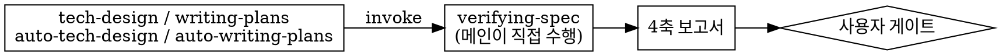
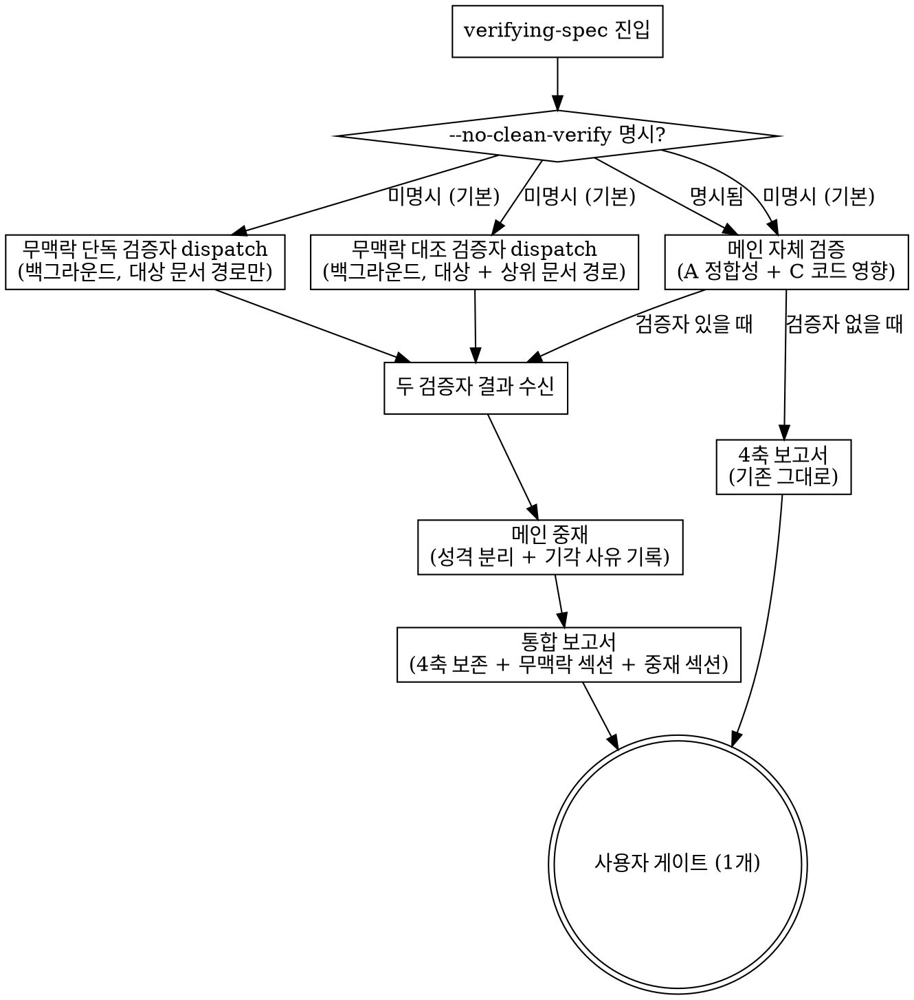

# 개발방향: 무맥락 검증자 병렬

> **다음 단계 안내**: 이 문서는 기술 설계서입니다 (아키텍처 / 컴포넌트 / 데이터 / 인터페이스 / 결정 / 위험 / 테스트 전략). `무맥락-검증자-병렬-requirements.md` (PRD) 를 기반으로 작성됩니다. 3개 트랙이면 다음 단계 `무맥락-검증자-병렬-implementation-plan.md` (단계별 계획) 의 입력이 됩니다 (`writing-plans` skill 또는 `/write-plan` 슬래시). 2개 확정 트랙 (frontmatter `depth: 2`) 이면 이 문서가 마지막 산출물입니다. 단계별 구현 task 는 여기 박지 마세요 — 그건 다음 산출물 (plan) 에 들어갑니다.

## 1. 아키텍처 개요

### 현재

호출 지점 4곳은 전부 "`verifying-spec` 을 실행한다" 고만 적혀 있고, 그 안에서 무슨 일이 일어나는지는 `verifying-spec` 본문이 결정한다.

### 변경 후

핵심은 세 가지다.

**첫째, 변경이 `verifying-spec` 안에 갇힌다.** 호출 지점 4곳(`tech-design` / `writing-plans` / `auto-tech-design` / `auto-writing-plans`)은 한 줄도 안 바뀐다. 자동 흐름 두 개도 별도 작업 없이 따라온다.

**둘째, 검증자를 둘로 나눠 읽기 순서를 물리적으로 보장한다.** 단독 검증자에게는 상위 문서 경로를 애초에 주지 않는다. 프롬프트로 "먼저 이것부터 읽어라" 라고 지시하는 방식은 지켰는지 확인할 방법이 없다. 두 검증자는 서로 의존하지 않아 동시에 띄운다.

**셋째, 기존 4축 보고서 구조를 그대로 두고 섹션을 더한다.** `verifying-spec` 바깥 5개 파일(`skills/tech-design/SKILL.md`, `skills/writing-plans/SKILL.md`, `skills/auto-tech-design/SKILL.md`, `skills/auto-writing-plans/SKILL.md`, `commands/fast-tasks.md`)이 "4축 보고서" 라는 표현으로 이 산출물을 가리키고 있다. 4축을 유지하면 그 표현들이 계속 정확하다.

### 실행 순서

1. `verifying-spec` 진입. 이번 슬래시 호출에 `--no-clean-verify` 가 있었는지 판정
2. 없으면 두 검증자를 백그라운드로 동시에 띄운다 (`Agent` 도구, `run_in_background: true`, 모델 미지정)
3. 메인은 기다리지 않고 즉시 자기 검증(A 정합성 + C 코드 영향)을 수행한다
4. 메인 검증이 끝나면 두 검증자의 완료 통보를 수합한다
5. 메인이 중재한다 — 성격 분리 + 기각 사유 기록
6. 통합 보고서 1개를 내고 사용자 게이트 1개로 넘어간다

## 2. 영향 받는 컴포넌트/파일

| 파일 | 변경 | 대응 요구사항 |
|---|---|---|
| `skills/verifying-spec/SKILL.md` | HARD-GATE 예외 조항, Procedure 확장, dot 갱신, Report Format 확장, Acceptance 확장, Anti-Patterns 갱신, `--no-clean-verify` 분기 | FR-1, FR-4, FR-5, FR-6, FR-7, FR-8 |
| `skills/verifying-spec/clean-solo-prompt.md` | 신규 — 단독 검증자 프롬프트 (대상 문서 경로만 주입, 읽기 전용 명시) | FR-2, FR-3(1단계) |
| `skills/verifying-spec/clean-cross-prompt.md` | 신규 — 대조 검증자 프롬프트 (대상 + 상위 문서 경로 주입, 읽기 전용 명시) | FR-2, FR-3(2단계), FR-4(재검 축) |
| `commands/tech-design.md` | `--no-clean-verify` 사용자 안내 추가 | FR-6 |
| `commands/write-plan.md` | 동일 | FR-6 |
| `commands/auto-tech-design.md` | 동일 | FR-6 |
| `commands/auto-write-plan.md` | 동일 | FR-6 |
| `CLAUDE.md` | 결합 메모 + 회귀 탐지 grep | 수용 기준 4 |
| `skills/js-super-sub-driven/tests/H16-clean-verify/README.md` | 신규 fixture | 수용 기준 5 |

### 변경하지 않는 파일 (명시)

- `skills/tech-design/SKILL.md`, `skills/writing-plans/SKILL.md`, `skills/auto-tech-design/SKILL.md`, `skills/auto-writing-plans/SKILL.md` — 이들은 `verifying-spec` 을 이름으로만 부른다. 본문 변경 0
- `skills/js-super-sub-driven/spec-reviewer-prompt.md` — 코드 실행 단계는 이번 범위 밖
- `skills/code-pretty/SKILL.md` — `verifying-spec` 통과 직후 도는 스킬이지만, 통과 판정 방식이 안 바뀌므로 영향 0
- `scripts/preflight.py` — 문서 존재 검사 helper. 본 피처와 무관
- 6 manifest — 워크트리 세션 규칙상 버전을 건드리지 않는다

## 3. 데이터 모델/스키마 변경 — N/A: 스킬 본문과 프롬프트 파일 변경이라 DB / 스키마 / 영구 저장 무관

## 4. 외부 인터페이스 — N/A: 외부로 노출되는 API 나 이벤트 없음. `--no-clean-verify` 는 슬래시 인자로, 기존 `--no-ask` 와 같은 방식의 내부 인터페이스

## 5. 핵심 결정 + 대안 비교

### D1. 2단계 읽기를 두 에이전트 분리로 강제

**결정** — 단독 검증자(대상 문서만)와 대조 검증자(대상 + 상위 문서)를 별도 보조 에이전트로 나눈다. 단독 검증자에게 상위 문서 경로를 주지 않는다.

**대안 비교**

| 안 | 순서 보장 | 비용 | 요구사항 영향 |
|---|---|---|---|
| **두 에이전트 분리 (채택)** | 물리적 — 경로가 없으면 못 읽는다 | 에이전트 2개. 각각은 단일안보다 작다 | FR-1 의 개수 명시 제거 필요 |
| 단일 에이전트 + 순서 지시 | 없음 — 지켰는지 확인 불가 | 에이전트 1개 | 없음 |
| 단일 에이전트 + 중간 산출물 강제 | 부분적 — 1단계 결과를 먼저 내게 하지만 상위 문서를 미리 봤는지는 여전히 모름 | 에이전트 1개 | 없음 |

**채택 이유** — FR-3 이 막으려는 실패("상위 문서를 먼저 읽어서 결과물 자체의 이상이 안 보이는 것")는 프롬프트 지시로는 검증이 안 된다. 지시 위반이 결과물에 흔적을 남기지 않기 때문이다. 경로를 안 주면 그 실패가 애초에 성립하지 않는다. 두 검증자는 서로의 출력에 의존하지 않아 동시에 띄울 수 있고, 따라서 벽시계 시간은 늘지 않는다.

**대가** — 호출이 하나 더 붙는다. 다만 단독 검증자는 상위 문서를 안 읽으므로 입력 토큰이 대조 검증자보다 작다. 요구사항 FR-1 의 "보조 에이전트 1개" 표현은 이 결정 때문에 개수 미명시로 수정했다 (`CH-20260815-002`).

### D2. 로직을 `verifying-spec` 본문 안에 넣는다

**결정** — dispatch / 중재 / 보고 절차 전부를 `skills/verifying-spec/SKILL.md` 에 넣는다. 호출 지점 4곳은 손대지 않는다.

**대안 비교**

| 안 | 호출 지점 변경 | 흐름 간 일관성 | 자동 흐름 반영 |
|---|---|---|---|
| **`verifying-spec` 본문 (채택)** | 0곳 | 정의상 보장 | 자동 |
| 호출 지점 4곳에 각각 dispatch | 4곳 | 한 곳만 갱신하면 흐름별로 동작이 갈림 | 별도 작업 필요 |

**채택 이유** — 네 호출 지점이 전부 `verifying-spec` 을 이름으로만 부른다. 절차를 안쪽에 넣으면 일관성이 구조적으로 보장되고, 나중에 호출 지점이 하나 더 생겨도 자동으로 따라온다. js-super 에서 반복된 회귀 유형(같은 룰을 여러 스킬 본문에 복제했다가 한쪽만 고쳐서 어긋남)을 애초에 만들지 않는다.

### D3. 플래그는 슬래시 원문 인식 방식 (`--no-ask` 패턴 답습)

**결정** — 사용자가 이번 슬래시 호출에 `--no-clean-verify` 토큰을 명시했는지를 메인이 대화에서 직접 보고 판단한다. 인자를 스킬 사이로 전달하는 배관을 만들지 않는다.

**대안 비교**

| 안 | 배관 | 선례 | 자동 흐름 |
|---|---|---|---|
| **슬래시 원문 인식 (채택)** | 없음 | `--no-ask` 8개 스킬에서 이미 사용 중 | 그대로 동작 |
| 인자 전달 배관 | `tech-design` → `verifying-spec` 전달 경로 신설 | 없음 | 자동 흐름에도 배관 필요 |
| 환경 변수 / 설정 파일 | 파일 읽기 추가 | 없음 | 세션 간 상태가 남아 예측 어려움 |

**채택 이유** — 이미 검증된 패턴이 있고 배관이 0이다. 메인 에이전트는 원래 사용자 입력 전문을 보고 있으므로 별도 전달이 필요 없다.

**대가** — 플래그 인식이 메인의 판단에 달려 있어 결정적이지 않다. 이 위험은 §6 에서 다룬다.

### D4. 무맥락 검증자는 C축(코드 영향)을 보지 않는다

**결정** — 무맥락 검증자의 판정 축은 FR-4 그대로 재검 축(누락 / 모순)과 새 축(문서 자체 문제) 둘이다. 코드 영향 분석은 메인 전담으로 둔다.

**대안** — 무맥락 검증자도 C축을 수행해서 메인과 대조하는 안. 배제한 이유는 C축이 파일 존재 확인과 심볼 검색 위주라 결과가 결정적이고, 맥락 유무로 결과가 갈리지 않기 때문이다. 대조 가치가 없는 축에 토큰을 쓰지 않는다.

### D5. 검증자 실패 시 — 명시하고 진행

**결정** — 보조 에이전트가 실패하거나 응답이 오지 않으면, 그 사실을 통합 보고서에 명시하고 메인 자체 검증 결과만으로 진행한다.

**대안 비교**

| 안 | 진행 | 사용자 인지 |
|---|---|---|
| **명시 후 진행 (채택)** | 진행 | 보고서에 실패 표시 |
| 실패 시 전체 중단 | 중단 | 인지 |
| 조용히 건너뛰기 | 진행 | 인지 못 함 |

**채택 이유** — 검증자 실패로 설계 흐름 전체를 막는 것은 과잉이다. 반대로 조용히 건너뛰면 사용자가 "무맥락 검증까지 돌았다" 고 오인한다. FR-6 에서 조건부 자동 게이팅을 배제한 것과 같은 이유다 — 안 돈 사실이 보여야 한다.

### D6. 보고서는 4축 보존 + 섹션 추가

**결정** — 기존 `## A. Consistency` / `## C. Code Impact` / `## 권장` 구조를 그대로 두고, 그 아래에 무맥락 검증 결과 섹션과 중재 결과 섹션을 더한다.

**대안** — 보고서를 재구성해서 메인 결과와 무맥락 결과를 축별로 섞어 나열하는 안. 배제한 이유는 두 가지다. 첫째, FR-4 와 FR-5 가 두 축의 지적이 구분되어야 한다고 요구한다. 섞으면 성격 분리가 불가능하다. 둘째, `verifying-spec` 바깥 5개 파일이 이 산출물을 "4축 보고서" 로 부르고 있어서, 4축을 헐면 그 표현들이 전부 부정확해진다.

### D7. 모델은 미지정 상속

**결정** — `Agent` 도구 호출 시 `model` 인자를 넘기지 않는다. 부모(메인 세션) 모델을 그대로 상속한다.

**대안** — `sonnet` 고정(코드 단계 검증자 D11 과 동일) 또는 `opus` 고정. FR-7 에서 이미 상속으로 결정됐고, 근거는 판정이 갈렸을 때 모델 등급 차이를 변명으로 쓸 수 없게 하는 것이다. 여기서는 구현 방식만 확정한다 — 고정 상수를 두지 않고 인자를 생략한다.

## 6. 위험/사이드이펙트 (preliminary)

| # | 카테고리 | 내용 | 완화 |
|---|---|---|---|
| R-1 | breaking | `verifying-spec` HARD-GATE 가 보조 에이전트 dispatch 를 금지하고 있다. 예외 문구를 안 새기면 이후 세션이 규칙 위반으로 판단해 이 기능을 삭제한다 | FR-8 이 이 위험을 막는 요구사항. HARD-GATE 본문에 "대체는 금지, 병렬 추가는 허용" 을 명시하고 회귀 grep 으로 고정 |
| R-2 | breaking | `verifying-spec` Acceptance 1번이 "Report includes all 4 axes" 로 고정돼 있다. 보고서를 확장하면서 이 문구를 안 고치면 스킬이 자기모순 상태가 된다 | Acceptance 를 "4축 + 무맥락 섹션 + 중재 섹션" 으로 같이 확장. D6 이 4축을 보존하므로 기존 문장을 지우지 않고 항목만 추가 |
| R-3 | side-effect | 자동 흐름(`auto-tech-design` / `auto-writing-plans`) 이 `verifying-spec` 을 부르므로 변경이 자동 전파된다. 두 스킬은 "AskUserQuestion 호출 X" 룰을 갖고 있다 | 본 피처는 사용자 질문을 추가하지 않는다 (FR-5 — 엇갈릴 때 메인이 중재, 사용자에게 안 물음). 룰 충돌 없음. 다만 자동 흐름의 Step 5 보고서 노출 형식이 확장된 보고서를 그대로 실을 수 있는지 확인 필요 |
| R-4 | race | 두 백그라운드 검증자의 완료 통보가 메인 자체 검증 도중 도착한다. 메인이 통보를 놓치거나 한쪽만 받은 상태로 보고서를 낼 수 있다 | 보고서 작성 전에 두 검증자의 상태를 명시적으로 확인하는 단계를 절차에 둔다. 미수신 검증자는 D5 에 따라 실패로 표기 |
| R-5 | side-effect | D3 의 플래그 인식이 메인 판단에 달려 있어 결정적이지 않다. 사용자가 `--no-clean-verify` 를 줬는데 메인이 놓치면 원치 않는 비용이 발생한다 | 기본이 켜짐이라 놓쳤을 때의 결과가 "안 돌아야 하는데 돌았다" 쪽이다. 조용한 누락(돌아야 하는데 안 돌았다)보다 덜 위험하다. 검증자 dispatch 시 한 줄 안내를 출력해 사용자가 즉시 알아채게 한다 |
| R-6 | side-effect | 문서 단계 보조 에이전트 호출이 0개에서 2개로 늘어난다 | FR-6 의 끄는 플래그. 단독 검증자는 상위 문서를 안 읽어 입력이 작다 |
| R-7 | side-effect | 무맥락 검증자의 "문서 자체 문제" 지적이 많아지면 보고서가 길어져 사용자가 안 읽는다 | 중재 섹션에서 메인이 처리를 명시하므로 사용자가 그 부분만 봐도 된다. 지적 개수 상한은 두지 않는다 — 상한을 두면 조용한 누락이 생긴다 |
| R-8 | side-effect | 두 검증자를 한 메시지에 묶지 않고 순차로 띄우면 대기 시간이 합산된다. NFR 지연 항목이 전제한 "느린 쪽에 수렴" 이 깨진다 | 두 dispatch 를 한 메시지에 묶어 동시에 띄우도록 절차에 명시. `js-super-sub-driven` 의 wave 병렬 dispatch 와 같은 방식 |

## 7. 테스트 전략

이 피처는 실행 코드가 아니라 스킬 본문과 프롬프트 파일이라, 검증은 정적 확인과 실제 흐름 실행 둘로 나뉜다.

### 정적 확인 (회귀 탐지 grep)

`CLAUDE.md` 결합 메모에 다음을 박는다. 항목마다 무엇이 깨졌는지 알 수 있게 기대값을 명시한다.

| 확인 | 대상 | 기대 |
|---|---|---|
| HARD-GATE 예외 문구 존재 | `skills/verifying-spec/SKILL.md` | 1건 이상 |
| 두 프롬프트 파일 존재 | `clean-solo-prompt.md`, `clean-cross-prompt.md` | 둘 다 존재 |
| 단독 검증자에 상위 문서 주입 금지 | `clean-solo-prompt.md` | 상위 문서 경로 주입 표현 0건 |
| 4축 보존 | `skills/verifying-spec/SKILL.md` | `A. Consistency` / `C. Code Impact` 헤더 유지 |
| 플래그 안내 | `commands/tech-design.md` 외 3개 | 각 1건 이상 |
| 호출 지점 무변경 | `skills/{tech-design,writing-plans,auto-tech-design,auto-writing-plans}/SKILL.md` | 이번 변경 diff 0 |

### fixture

`skills/js-super-sub-driven/tests/H16-clean-verify/README.md` 신규. 시나리오는 셋이다.

- 기본 호출 — 두 검증자가 뜨고 통합 보고서에 무맥락 섹션과 중재 섹션이 나타난다
- `--no-clean-verify` 호출 — 검증자가 안 뜨고 기존 4축 보고서만 나온다
- 검증자 실패 — 실패 사실이 보고서에 표기되고 흐름은 진행된다

### 실제 흐름 실행

수용 기준 6번대로 실제 피처 하나를 `/tech-design` 까지 완주시켜, 메인 보고서와 무맥락 검증 결과가 서로 다른 항목을 최소 1건 이상 지적하는지 확인한다. 양쪽 다 지적 0건이면 판정 불가로 보고 결함을 의도적으로 심은 문서로 다시 확인한다.

이 확인은 자기 참조가 된다 — 이 피처를 만든 뒤 다음 피처의 개발방향 단계에서 바로 검증된다.

---
## 변경이력
<!-- change-history skill auto-appends entries here, oldest first -->

### [2026-08-15 09:29] [개발방향-수정]
- **id**: CH-20260815-003
- **이유**: 신규 기술 설계 — 무맥락 검증자를 `verifying-spec` 본문 안에서 병렬 dispatch 하는 구조 확정
- **무엇이**: 무맥락-검증자-병렬-tech-design.md 전체 (§1 아키텍처, §2 영향 파일 9건, §5 핵심 결정 D1~D7, §6 위험 R-1~R-8, §7 테스트 전략). §3 데이터 모델과 §4 외부 인터페이스는 해당 없음으로 처리
- **영향범위**: 없음 (최초 생성). 검증 중 발견한 요구사항 측 모순은 CH-20260815-002 에서 선행 해소
- **연관 항목**: CH-20260815-001, CH-20260815-002
