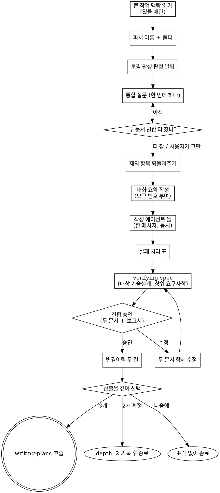

# 요구설계 병렬생성 구현계획서

> **다음 단계 안내**: 이 계획을 task-by-task 로 실행하려면 `js-super-sub-driven` (보조 에이전트 강제 모드, 권장) 또는 `executing-plans` (인라인 모드) 를 사용하세요. 각 step 은 체크박스 (`- [ ]`) 형식이라 진행 상황 추적이 가능합니다.

**Goal:** 소크라테스 대화를 한 번에 끝낸 뒤 요구사항서와 기술설계서를 보조 에이전트 두 개가 동시에 작성하는 새 흐름을 기존 흐름 옆에 추가한다.

**Architecture:** 사용자 입구는 명시 호출 전용 커맨드 `/brainstorm-design` 하나다. 커맨드는 메뉴에서 숨긴 새 스킬 `paired-spec-writing` 에 위임한다. 스킬은 대화·요약·승인·변경이력·깊이 선택을 메인이 직접 하고, 두 문서 작성만 같은 폴더의 지시문 두 개로 보조 에이전트에 맡긴다. 문서 형식 규칙은 기존 `brainstorming` / `tech-design` 스킬 본문을 작성 에이전트가 섹션 제목으로 찾아 읽는다.

**Tech Stack:** Markdown 스킬·커맨드 본문, Claude Code `Agent` / `Skill` / `AskUserQuestion` 도구

**Spec inputs:**
- 요구설계-병렬생성-requirements.md — 요구 1~13 (진입 · 통합 대화 · 동시 작성 · 문서별 검토 · 승인과 이후 진행)
- 요구설계-병렬생성-tech-design.md — §1 구성 ①~⑪, §2 영향 파일, §4 명령과 플래그, §5 결정 (구성 / 규칙 출처와 섹션 제목 표 / 요약 전달 / 대화 범위 / 호출 규칙과 실패 표 / 승인과 수정), §6 위험, §7 확인 방법

---

## 1. 단계별 작업

### Task 1: 요구사항 작성 에이전트 지시문

**Files:**
- Create: `skills/paired-spec-writing/requirements-writer-prompt.md`

**Model**: sonnet

**검증**: 파일이 생기고, 읽을 섹션 제목 세 개 (`## Document Schema` / `## 산출물 문서 스타일` / `## Self-Review`), 치환 자리 다섯 개 (`<BRAINSTORMING_SKILL_PATH>` / `<REQUIREMENTS_PATH>` / `<FEATURE_NAME>` / `<SLUG>` / `<SUMMARY>`), 보고 상태 `SECTION_MISSING` 이 문자열마다 하나 이상 들어 있고, 소문자 `<slug>` 자리는 남아 있지 않으며, "model 인자 없음" 줄이 있다.

- [ ] **Step 1: 검증 설명대로 확인 명령 작성 + FAIL 확인 (실행 단계 수행)**

Run: `test -f skills/paired-spec-writing/requirements-writer-prompt.md`
Expected: FAIL (파일 없음)

- [ ] **Step 2: 지시문 작성**

**수정 후** (new file: `skills/paired-spec-writing/requirements-writer-prompt.md`):
````markdown
# 요구사항 작성 에이전트 지시문

`paired-spec-writing` 이 대화 요약을 마친 뒤, 기술설계 작성 에이전트와 **같은 메시지에서** 이 지시문으로 보조 에이전트를 부른다.

**치환 규칙:** `<BRAINSTORMING_SKILL_PATH>` / `<REQUIREMENTS_PATH>` / `<FEATURE_NAME>` / `<SLUG>` / `<SUMMARY>` 다섯 자리만 채운다. 대화 원문, 메인의 중간 판단, 기술설계 작성 에이전트의 지시문은 넣지 않는다. `<SUMMARY>` 는 기술설계 작성 에이전트에게 넣는 것과 **한 글자도 다르지 않은** 텍스트여야 한다.

```
Agent tool (general-purpose):
  # model 인자 없음 — 메인 모델 상속
  description: "Write requirements <SLUG>"
  prompt: |
    너는 요구사항 문서 하나를 쓰는 작성자다. 사용자와의 대화는 이미 끝났고,
    그 결과가 맨 아래 "대화 요약" 에 있다.

    ## 먼저 지킬 것

    - 사용자에게 질문하지 않는다. 너에게는 사용자에게 묻는 도구가 없다
    - 어떤 스킬도 부르지 않는다. 아래 규칙 파일은 스킬로 실행하지 말고,
      지정한 섹션만 문서 작성 규칙으로 읽는다. 그 파일의 대화 절차 · 승인
      게이트 · 다음 단계 호출 문장은 너에게 해당하지 않는다
    - 요약에 없는 결정을 새로 만들지 않는다. 요약에서 비어 있는 것은
      "미정 — <이유>" 로 쓴다
    - 아래 출력 경로의 파일 하나만 쓴다. 같은 폴더에 다른 작성자가 기술설계서를
      동시에 쓰고 있다. 그 파일은 열지도 고치지도 않는다
    - `## 변경이력` footer 는 제목과 주석 한 줄만 두고 비운다. 이력은 사용자
      승인 뒤에 메인이 쓴다

    ## 규칙 파일

    <BRAINSTORMING_SKILL_PATH>

    읽을 섹션 (제목 앞부분 일치):
    - `## Document Schema`
    - `## 산출물 문서 스타일`
    - `## Self-Review`

    셋 중 하나라도 못 찾으면 파일을 쓰지 말고 멈춘다. 보고의 Status 를
    SECTION_MISSING 으로 하고 못 찾은 제목을 적는다.

    ## 출력

    경로: <REQUIREMENTS_PATH>
    제목: `# 요구사항: <FEATURE_NAME>`

    - 요약의 "요구 항목" 번호를 그대로 쓴다. 번호를 바꾸거나 합치거나 새로
      붙이지 않는다. 기술설계서가 같은 번호로 이 항목들을 가리킨다
    - 요약에 큰 작업 소속 표식이 있으면 제목 바로 아래, 다음 단계 안내 줄보다
      위에 그 한 줄을 그대로 넣는다. 없으면 넣지 않는다
    - 요약의 "고른 안 · 버린 안 · 이유" 는 문서에 남긴다
    - 요약의 "제외 항목" 은 전부 문서에 넣는다
    - 기술 세부 (라이브러리 · 파일 구성 · 함수 · 호출 방식) 는 넣지 않는다.
      요약의 기술설계 부분은 기술설계 작성자의 몫이다

    ## 자체 점검

    다 쓴 뒤 `## Self-Review` 의 항목으로 한 번 훑고 그 자리에서 고친다.
    "제외 항목 취합" 항목은 요약의 제외 항목 목록과 대조한다.

    ## 보고 형식 (이것만)

    Status: DONE | SECTION_MISSING
    Fixed: <점검에서 고친 것, 없으면 없음>
    Undecided: <미정으로 남긴 항목, 없으면 없음>

    ## 대화 요약

    <SUMMARY>
```
````

- [ ] **Step 3: 확인 명령 재실행 → PASS**

Run: `f=skills/paired-spec-writing/requirements-writer-prompt.md; for k in "## Document Schema" "## 산출물 문서 스타일" "## Self-Review" "<BRAINSTORMING_SKILL_PATH>" "<REQUIREMENTS_PATH>" "<FEATURE_NAME>" "<SLUG>" "<SUMMARY>" "SECTION_MISSING" "model 인자 없음"; do grep -qF "$k" $f || echo "빠짐: $k"; done; grep -c "<slug>" $f`
Expected: "빠짐" 줄 없음, 마지막 줄 0

- [ ] **Step 4: Commit**

```bash
git add skills/paired-spec-writing/requirements-writer-prompt.md
git commit -m "feat(paired-spec-writing): 요구사항 작성 에이전트 지시문"
```

---

### Task 2: 기술설계 작성 에이전트 지시문

**Files:**
- Create: `skills/paired-spec-writing/design-writer-prompt.md`

**Model**: sonnet

**검증**: 파일이 생기고, 읽을 섹션 제목 다섯 개 (`## Schema` / `## 산출물 문서 스타일` / `### 도면 형식` / `## 서술 수준 — 이름보다 역할` / `## Self-Review`) 가 들어 있으며, `## Adaptive Topics` 는 읽을 섹션 목록에 없고, 요구사항서를 읽지 말라는 문장이 있다.

- [ ] **Step 1: 검증 설명대로 확인 명령 작성 + FAIL 확인 (실행 단계 수행)**

Run: `test -f skills/paired-spec-writing/design-writer-prompt.md`
Expected: FAIL (파일 없음)

- [ ] **Step 2: 지시문 작성**

**수정 후** (new file: `skills/paired-spec-writing/design-writer-prompt.md`):
````markdown
# 기술설계 작성 에이전트 지시문

`paired-spec-writing` 이 대화 요약을 마친 뒤, 요구사항 작성 에이전트와 **같은 메시지에서** 이 지시문으로 보조 에이전트를 부른다.

**치환 규칙:** `<TECH_DESIGN_SKILL_PATH>` / `<TECH_DESIGN_PATH>` / `<FEATURE_NAME>` / `<SLUG>` / `<SUMMARY>` 다섯 자리만 채운다. `<SUMMARY>` 는 요구사항 작성 에이전트에게 넣는 것과 **한 글자도 다르지 않은** 텍스트여야 한다.

```
Agent tool (general-purpose):
  # model 인자 없음 — 메인 모델 상속
  description: "Write tech design <SLUG>"
  prompt: |
    너는 기술설계 문서 하나를 쓰는 작성자다. 사용자와의 대화는 이미 끝났고,
    그 결과가 맨 아래 "대화 요약" 에 있다.

    ## 먼저 지킬 것

    - 사용자에게 질문하지 않는다. 너에게는 사용자에게 묻는 도구가 없다
    - 어떤 스킬도 부르지 않는다. 아래 규칙 파일은 스킬로 실행하지 말고,
      지정한 섹션만 문서 작성 규칙으로 읽는다. 그 파일의 대화 절차 · 검증
      호출 · 승인 게이트 · 다음 단계 호출 문장은 너에게 해당하지 않는다
    - 요약에 없는 결정을 새로 만들지 않는다. 요약에서 비어 있는 것은
      "미정 — <이유>" 로 쓴다
    - 아래 출력 경로의 파일 하나만 쓴다. 같은 폴더의 요구사항서
      (<SLUG>-requirements.md) 는 다른 작성자가 지금 쓰고 있다. 읽지 않는다.
      요구 항목과 그 번호는 요약에 있다
    - 프론트매터를 쓰지 않는다. 산출물 깊이는 사용자 승인 뒤에 정해진다
    - `## 변경이력` footer 는 제목과 주석 한 줄만 두고 비운다

    ## 규칙 파일

    <TECH_DESIGN_SKILL_PATH>

    읽을 섹션 (제목 앞부분 일치):
    - `## Schema`
    - `## 산출물 문서 스타일`
    - `### 도면 형식`
    - `## 서술 수준 — 이름보다 역할`
    - `## Self-Review`

    다섯 중 하나라도 못 찾으면 파일을 쓰지 말고 멈춘다. 보고의 Status 를
    SECTION_MISSING 으로 하고 못 찾은 제목을 적는다.

    ## 출력

    경로: <TECH_DESIGN_PATH>
    제목: `# 개발방향: <FEATURE_NAME>`

    - 일곱 섹션 중 요약의 "토픽 활성 판정" 에서 비활성인 것은 그 섹션 제목 줄에
      "— N/A: <이유>" 한 줄로만 쓴다. 활성 판정을 네가 다시 하지 않는다
    - §2 영향 파일 표의 요구 항목 칸에는 요약의 요구 번호를 그대로 쓴다.
      요약의 모든 요구 번호가 §2 또는 §4 에 한 번 이상 나와야 한다
    - §5 의 결정마다 요약의 "고른 안 · 버린 안 · 이유" 를 옮긴다
    - 요약의 "제외 항목" 을 다시 범위 안으로 들이지 않는다
    - 요구 항목의 서술을 새 문장으로 바꿔 쓰지 않는다. 요구의 의미는 요구사항서가
      정한다

    ## 자체 점검

    다 쓴 뒤 `## Self-Review` 의 항목으로 한 번 훑고 그 자리에서 고친다.
    첫 항목의 "<slug>-requirements.md 의 요구 N" 은 요약의 요구 항목 번호로
    읽는다.

    ## 보고 형식 (이것만)

    Status: DONE | SECTION_MISSING
    Fixed: <점검에서 고친 것, 없으면 없음>
    Undecided: <미정으로 남긴 항목, 없으면 없음>

    ## 대화 요약

    <SUMMARY>
```
````

- [ ] **Step 3: 확인 명령 재실행 → PASS**

Run: `f=skills/paired-spec-writing/design-writer-prompt.md; for k in "## Schema" "## 산출물 문서 스타일" "### 도면 형식" "## 서술 수준 — 이름보다 역할" "## Self-Review" "<SLUG>" "SECTION_MISSING" "읽지 않는다"; do grep -qF "$k" $f || echo "빠짐: $k"; done; grep -c "Adaptive Topics" $f; grep -c "<slug>" $f`
Expected: "빠짐" 줄 없음, 이어서 0, 0

- [ ] **Step 4: Commit**

```bash
git add skills/paired-spec-writing/design-writer-prompt.md
git commit -m "feat(paired-spec-writing): 기술설계 작성 에이전트 지시문"
```

---

### Task 3: `paired-spec-writing` 스킬 본문

**Files:**
- Create: `skills/paired-spec-writing/SKILL.md`

**Model**: opus

**검증**: 프론트매터 안에 `user-invocable: false` 가 있고 `disable-model-invocation` 은 없다. 본문에 "한 메시지에" · "SECTION_MISSING" · "verifying-spec" · "두 문서 승인" · "[요구사항-수정]" · "[개발방향-수정]" · 깊이 선택 세 선택지 라벨이 문자열마다 하나 이상 있고, 기존 스킬을 부르는 호출 이름 (`js-super:brainstorming` / `js-super:tech-design`) 은 한 번도 나오지 않는다.

- [ ] **Step 1: 검증 설명대로 확인 명령 작성 + FAIL 확인 (실행 단계 수행)**

Run: `test -f skills/paired-spec-writing/SKILL.md`
Expected: FAIL (파일 없음)

- [ ] **Step 2: 스킬 본문 작성**

**수정 후** (new file: `skills/paired-spec-writing/SKILL.md`):
````markdown
---
name: paired-spec-writing
description: /brainstorm-design 커맨드 명시 호출로만 진입 — 자유 요청에서 자동 선택 금지 (기본 진입은 brainstorming). 소크라테스 대화를 한 번에 끝내 요구사항과 기술설계 양쪽 내용을 모은 뒤, <slug>-requirements.md 와 <slug>-tech-design.md 를 보조 에이전트 두 개가 동시에 작성한다. 이어서 verifying-spec → 두 문서 결합 승인 한 번 → 변경이력 두 건 → 산출물 깊이 선택.
user-invocable: false
---

# Paired Spec Writing → requirements + tech-design (동시 작성)

기존 흐름은 요구사항 대화 → 요구사항서 → 기술설계 대화 → 기술설계서 순서로 문서마다 대화를 따로 한다. 이 스킬은 대화를 한 번으로 합치고, 대화가 끝나면 두 문서를 보조 에이전트 둘이 동시에 쓴다. 기존 `/brainstorm` → `/design-tech` 흐름은 그대로 있고, 이 스킬은 그 옆에 있다.

산출물 두 개의 형식은 기존 흐름과 똑같다. 다음 단계 (`writing-plans` · `verifying-spec` · `change-propagation`) 는 두 흐름의 문서를 구분하지 않는다.

## 사용자 질문 룰 — 항상 AskUserQuestion

이 흐름 안에서 사용자에게 묻는 것은 모두 `AskUserQuestion` 도구로 한다. 산문으로 "~ 할까요?" 를 던지지 않는다. 알람 훅이 도구 호출만 잡는다.

- 소크라테스 자유 응답이 필요한 질문은 question 본문에 "자유롭게 답해주세요. 별도 옵션 선택 불필요" 를 적고 dummy option `[알겠음]` 하나만 둔다. 응답은 다음 turn 의 산문으로 받는다
- 사용자가 "Other" 로 모호하게 답하거나 "모르겠음" 류로 답하면 그 질문만 단독으로 다시 부르고 산문 설명을 덧붙인다. 다음 단계로 자동 진행하지 않는다

<HARD-GATE>
- 두 문서는 보조 에이전트 둘이 쓴다. 메인은 실패 처리 표가 허락한 경우에만 직접 쓴다
- 기존 `brainstorming` / `tech-design` 스킬을 Skill 도구로 부르지 않는다. 그 두 스킬의 본문은 규칙 원본으로 **읽기만** 한다
- 사용자 승인 전에는 변경이력을 쓰지 않는다. 승인 없이 다음 단계 스킬을 부르지 않는다
- 코드를 쓰지 않는다
</HARD-GATE>

## Checklist

1. **큰 작업 맥락 읽기** — 진행 중인 큰 작업이 있을 때만. 없으면 무출력
2. **피처 이름 확인과 폴더 만들기** — 질문 하나
3. **기술설계 토픽 판정 알림** — 활성 토픽 한 줄 알림
4. **통합 질문 대화** — 한 번에 하나, 두 문서의 빈칸이 다 찰 때까지
5. **제외 항목 되돌려주기** — 모아서 한 번 보여주고 추가만 받기
6. **대화 요약 작성** — 두 작성자가 똑같이 받을 한 덩어리
7. **두 문서 동시 작성** — 보조 에이전트 두 개를 한 메시지로
8. **작성 결과 확인** — 실패 처리 표대로
9. **사양 정합성 검증** — 기술설계서를 요구사항서와 대조
10. **두 문서 한 번에 승인받기** — 수정 요청이면 두 문서를 함께 고치고 재검증
11. **변경이력 두 건 기록** — 요구사항서 · 기술설계서 각각
12. **산출물 깊이 선택** — 구현계획서까지 / 두 문서로 종료 / 나중에

다음 스킬을 부르기 전에 위 항목의 task 를 모두 완료로 바꾼다.

## 규칙 원본 경로

이 스킬은 불릴 때 자기 폴더 경로 (Base directory) 를 받는다. 기존 두 스킬 본문의 절대 경로는 그 한 단계 위에서 만든다.

| 이름 | 경로 |
|---|---|
| 요구사항 규칙 | `<Base directory>/../brainstorming/SKILL.md` |
| 기술설계 규칙 | `<Base directory>/../tech-design/SKILL.md` |
| 요구사항 작성 지시문 | `<Base directory>/requirements-writer-prompt.md` |
| 기술설계 작성 지시문 | `<Base directory>/design-writer-prompt.md` |

메인이 규칙 원본에서 읽는 섹션은 셋이다 — 요구사항 규칙의 `## 큰 작업 맥락` · `## Socratic Procedure`, 기술설계 규칙의 `## Adaptive Topics`. 결합 승인과 깊이 선택 게이트는 원본에서 읽지 않고 이 스킬 10 · 12 단계에 옮겨 두었다. 작성 에이전트가 읽을 섹션은 각 지시문에 적혀 있다.

## Process Flow



## Process (detail)

**1. 큰 작업 맥락 읽기**

요구사항 규칙의 `## 큰 작업 맥락` 섹션을 그대로 따른다. 진행 중인 큰 작업이 없으면 아무 출력 없이 넘어간다. 있고 이번 피처가 속하면 소속 표식 한 줄 (`> **큰 작업**: <폴더 이름>`) 을 요약에 넣기로 기억한다.

**2. 피처 이름 확인과 폴더 만들기**

인자에서 `--no-clean-verify` 토큰을 먼저 떼어 기억해 둔다 (9 단계에서 쓴다). 남은 문자열이 주제다. 주제가 왔으면 그것으로 피처 이름 후보를 만들어 한 번 확인받는다. 이름에서 slug (공백 → 하이픈) 를 만들고 `docs/features/<오늘 날짜>-<slug>/` 폴더를 만든다. 두 산출물의 절대 경로를 여기서 정한다.

**3. 기술설계 토픽 판정 알림**

기술설계 규칙의 `## Adaptive Topics` 판정 규칙을 사용자의 첫 입력에 적용한다. 요구사항서가 아직 없으므로 첫 입력과 프로젝트 탐색 결과로 판단한다. 한 줄로 알린다.

```
ℹ️ 기술설계 활성 토픽은 1, 2, 5, 6 과 <조건부 활성> 입니다. <비활성 토픽> 은 비활성입니다 (이유: ...). 대화 중 달라지면 다시 알립니다.
```

대화에서 조건부 토픽의 판단 근거가 바뀌면 그 자리에서 판정을 고치고 한 줄로 다시 알린다.

**4. 통합 질문 대화**

요구사항 규칙의 `## Socratic Procedure` 블록 1 (질문) · 블록 2 (대안) 를 따른다. 한 번에 하나만 묻고, 방향을 정할 지점마다 2~3안을 고정 비교축 셋 (무엇이 달라지는가 · 무엇을 포기하는가 · 되돌리는 비용) 으로 보이고 추천을 먼저 말한다. 사용자가 모른다고 하면 그 절차의 3단 사다리를 쓴다.

커버 목록을 두 문서 분량으로 넓힌다.

| 묶음 | 채울 것 |
|---|---|
| 요구사항 | 무엇을 만드는가 · 왜 필요한가 · 성공 판정 기준 · 하지 않는 것 · 제약과 의존 |
| 기술설계 | 아키텍처 방향 · 영향 범위 · 핵심 결정 (대안 비교) · 위험 · 활성인 조건부 토픽 (데이터 모델 / 외부 인터페이스 / 테스트 전략) |

질문 개수 상한은 없다. 두 묶음이 다 차면 멈춘다. 이미 답이 나온 항목은 다시 묻지 않는다. 사용자가 먼저 그만하자고 하면 채워진 것까지만 요약하고 빈칸은 "미정 — <이유>" 로 넘긴다.

대화가 독립된 여러 피처로 드러나면 계속하기 전에 나누자고 제안한다.

**5. 제외 항목 되돌려주기**

요구사항 규칙 블록 3 의 제외 항목 취합 규칙대로, 대화 중 나온 제외를 모아 한 번 보여주고 추가할 것만 받는다. 빈 상태에서 "범위 밖이 뭔가요" 라고 묻지 않는다.

**6. 대화 요약 작성**

두 작성자가 받을 단 하나의 텍스트다. 두 지시문에 **똑같이** 붙인다. 형식은 아래로 고정한다.

```
# 대화 요약: <피처 이름>

## 큰 작업 소속 표식
<"> **큰 작업**: <폴더 이름>" 한 줄, 없으면 "없음">

## 배경 — 왜 필요한가
## 무엇을 만드는가
## 성공 판정 기준

## 요구 항목
요구 1: <시스템이 해야 하는 것 한 문장>
요구 2: ...

## 결정
| 결정 지점 | 고른 안 | 버린 안 | 고른 이유 |

## 제외 항목
| 항목 | 이유 |

## 제약과 의존

## 기술설계
### 토픽 활성 판정
<활성 / 비활성 토픽과 비활성 이유>
### 아키텍처 방향
### 영향 범위
### 토픽별 결정
### 위험
### (활성인 조건부 토픽)

## 미정
<항목 — 이유, 없으면 "없음">
```

요구 항목 번호는 메인이 여기서 매긴다. 기술설계 작성자가 요구사항서 없이도 §2 표에 번호를 적을 수 있어야 하기 때문이다.

**7. 두 문서 동시 작성**

- 두 `Agent` 호출을 **한 메시지에** 묶는다. 나눠 부르면 대기 시간이 합쳐져 동시 작성의 의미가 없다
- 지시문은 `requirements-writer-prompt.md` · `design-writer-prompt.md` 의 코드 블록을 쓰고, 각 파일의 치환 규칙대로 자리만 채운다
- `model` 인자를 넘기지 않는다. 메인 모델을 상속한다
- 두 에이전트의 결과를 모두 받은 뒤 다음 단계로 간다

호출 직후 한 줄 알린다.

```
ℹ️ 요구사항서와 기술설계서를 보조 에이전트 두 개가 동시에 쓰고 있습니다.
```

**8. 작성 결과 확인**

두 보고의 Status 와 파일 존재를 확인한다.

| 상황 | 처리 |
|---|---|
| Status DONE + 파일 있음 | 정상 |
| 오류로 끝남 / 파일을 쓰지 않음 / 보고 세 항목이 빠짐 | 그 한쪽만 한 번 다시 부른다. 두 번째도 같으면 메인이 해당 규칙 원본의 형식 · 문서 스타일 · 자체 점검 섹션대로 직접 쓴다 |
| Status SECTION_MISSING | 재시도하지 않는다 (다시 불러도 같다). 메인이 규칙 원본 파일 전체를 읽고, 못 찾은 제목과 역할이 같은 섹션 (이름이 바뀐 섹션) 을 찾아 그 규칙으로 직접 쓴다. 대신 쓴 섹션 제목을 승인 게이트에 적는다 — 결합 메모의 제목 목록을 고칠 신호다. 같은 역할의 섹션도 없으면 문서를 쓰지 않고 승인 게이트에서 그 사실을 알린다 |

실패와 처리는 어느 경우든 승인 게이트 메시지에 한 줄씩 적는다. 두 보고의 Undecided 항목도 승인 게이트에 싣는다.

**9. 사양 정합성 검증**

`verifying-spec` 스킬을 부른다. 대상은 기술설계서, 상위 문서는 요구사항서다. 사용자가 이번 호출에 `--no-clean-verify` 를 명시했으면 그대로 전달한다.

이 검증만 두 문서가 끝난 뒤에 돈다 — 기술설계서를 요구사항서와 대조하는 일이라 요구사항서가 있어야 한다. 두 문서의 결정이 어긋났는지도 여기서 걸린다. 검증 스킬 끝의 "진행 / 수정" 은 따로 묻지 않고 아래 결합 승인으로 합친다.

**10. 두 문서 한 번에 승인받기**

두 문서 RAW 전체와 검증 보고서를 한 메시지에 싣는다. 문서별로 끊어 승인받지 않는다.

```json
{
  "question": "<slug>-requirements.md + <slug>-tech-design.md (+ 검증 보고서) 승인하고 진행?",
  "header": "두 문서 승인",
  "multiSelect": false,
  "options": [
    {"label": "예 — 승인", "description": "승인하고 변경이력 두 건 + 산출물 깊이 선택으로 진행"},
    {"label": "아니오 — 수정", "description": "피드백을 받아 두 문서를 함께 고친 뒤 다시 보여줌"}
  ]
}
```

수정 요청은 메인이 직접 고친다. 한 문서의 결정을 고치면 다른 문서의 같은 결정도 함께 고친다. 어느 문서든 바뀌었으면 9 를 다시 돌린 뒤 두 문서와 새 보고서를 다시 한 번에 보여준다. "어디를 고칠까요" 라고 되묻지 않는다.

**11. 변경이력 두 건 기록**

`change-history` 스킬로 두 건을 쓴다.

| 문서 | 태그 | 이유 | 무엇이 |
|---|---|---|---|
| 요구사항서 | `[요구사항-수정]` | 신규 피처 — 통합 대화 후 동시 작성 | 요구사항서 전체 (요구 1..N) |
| 기술설계서 | `[개발방향-수정]` | 신규 피처 — 통합 대화 후 동시 작성 | 기술설계서 전체 (§1~§7) |

두 번째 건의 연관 항목에 첫 번째 건의 CH-id 를 적는다.

**12. 산출물 깊이 선택**

기존 기술설계 흐름의 깊이 선택과 같은 질문 · 같은 동작이다.

```json
{
  "question": "두 문서가 확정됐습니다. 산출물을 어디까지 만들까요?",
  "header": "산출물 깊이",
  "multiSelect": false,
  "options": [
    {"label": "구현계획서까지 진행 (3개)", "description": "/write-plan 자동 invoke — 기존 기본 흐름"},
    {"label": "여기서 종료 (2개 확정)", "description": "frontmatter depth: 2 기록 — 이 피처는 tech-design 까지"},
    {"label": "나중에 결정", "description": "표식 없이 종료 — 나중에 /write-plan 수동 실행"}
  ]
}
```

- "구현계획서까지 진행" → `writing-plans` 스킬을 Skill 도구로 부른다
- "여기서 종료" → 기술설계서 맨 위에 프론트매터 (`depth: 2` + `depth_reason: 사용자 선택`) 를 쓰고, `change-history` 로 `[개발방향-수정]` 한 건 (이유: 2-doc 확정) 을 남긴 뒤 `ℹ️ 이 피처는 2개 문서로 확정됐습니다. 구현이 필요해지면 /write-plan 으로 승격하세요.` 를 출력하고 멈춘다. 요구사항서 머리에 소속 표식이 있으면 `ℹ️ 큰 작업에 속한 피처입니다. 구현이 끝나면 /epic-next 로 파트를 마무리하세요.` 를 한 줄 더 붙인다
- "나중에 결정" → `ℹ️ 알겠습니다. /write-plan 은 나중에 직접 실행해주세요.` 를 출력하고 멈춘다

## Anti-Patterns

| Wrong | Right |
|---|---|
| 두 작성 호출을 두 메시지로 나눔 | 한 메시지에 두 `Agent` 호출 |
| 두 지시문에 서로 다른 요약을 붙임 | 한 요약을 똑같이 붙인다. 결정 일치의 1차 장치다 |
| 작성 에이전트에 `model` 인자 지정 | 생략 — 메인 모델 상속 |
| 기존 `brainstorming` / `tech-design` 스킬을 Skill 도구로 호출 | 본문을 규칙 원본으로 읽기만 한다 |
| 요구 번호를 작성 에이전트가 매기게 함 | 메인이 요약에서 매긴다. 두 문서가 같은 번호를 쓴다 |
| 문서별로 따로 승인 | 두 문서 + 보고서를 한 번에 |
| 요구사항만 고쳤다고 재검증 생략 | 어느 문서든 바뀌면 재검증 |
| 승인 전에 변경이력 기록 | 승인 뒤 두 건 |
| SECTION_MISSING 인데 재시도 | 재시도하지 않고 메인이 직접 쓴다 |

## Related Skills

- `brainstorming` — 요구사항 규칙 원본 (읽기만)
- `tech-design` — 기술설계 규칙 원본 (읽기만)
- `verifying-spec` — 9 단계
- `change-history` — 11 단계
- `writing-plans` — 12 단계에서 3개 선택 시
````

- [ ] **Step 3: 확인 명령 재실행 → PASS**

Run: `f=skills/paired-spec-writing/SKILL.md; awk '/^---$/{c++; next} c==1' $f | grep -c "user-invocable: false"; grep -c "disable-model-invocation" $f; for k in "한 메시지에" "SECTION_MISSING" "verifying-spec" "두 문서 승인" "[요구사항-수정]" "[개발방향-수정]" "구현계획서까지 진행 (3개)" "여기서 종료 (2개 확정)" "나중에 결정"; do grep -qF "$k" $f || echo "빠짐: $k"; done; grep -c "js-super:brainstorming\|js-super:tech-design" $f`
Expected: 1 / 0 / "빠짐" 줄 없음 / 0

- [ ] **Step 4: Commit**

```bash
git add skills/paired-spec-writing/SKILL.md
git commit -m "feat(paired-spec-writing): 통합 대화 + 두 문서 동시 작성 스킬"
```

---

### Task 4: `/brainstorm-design` 커맨드

**Files:**
- Create: `commands/brainstorm-design.md`

**Model**: sonnet

**검증**: 파일 프론트매터에 `disable-model-invocation: true` 가 있고, 본문이 `js-super:paired-spec-writing` 을 Skill 도구로 부르라고 적으며, `skills/brainstorm-design/` 디렉토리는 없다 (이름 충돌 없음).

- [ ] **Step 1: 검증 설명대로 확인 명령 작성 + FAIL 확인 (실행 단계 수행)**

Run: `test -f commands/brainstorm-design.md`
Expected: FAIL (파일 없음)

- [ ] **Step 2: 커맨드 작성**

**수정 후** (new file: `commands/brainstorm-design.md`):
````markdown
---
description: 요구사항과 기술설계 대화를 한 번에 끝내고 두 문서를 보조 에이전트 두 개가 동시에 작성합니다.
disable-model-invocation: true
---

# /brainstorm-design

이 슬래시는 Skill 도구로 `js-super:paired-spec-writing` skill 을 호출합니다 (슬래시 이름과 skill 이름이 다릅니다 — 겹치면 커맨드가 skill 을 가려서 호출이 실패합니다). 인자로 받은 주제를 그대로 넘깁니다.

`/brainstorm` → `/design-tech` 을 차례로 돌리는 대신 쓰는 흐름입니다. 기존 두 명령은 그대로 있습니다.

## 하는 일

1. 요구사항과 기술설계에 필요한 질문을 한 번의 대화로 묻습니다. 질문 수에 상한이 없어 기존보다 길 수 있습니다.
2. 대화가 끝나면 요구사항서와 기술설계서를 보조 에이전트 두 개가 동시에 씁니다.
3. 기술설계서를 요구사항서와 대조하는 검증을 돌립니다.
4. 두 문서와 검증 보고서를 한 번에 보여주고 한 번 승인받습니다.
5. 승인 뒤 산출물 깊이를 고릅니다 — 구현계획서까지 진행 / 두 문서로 종료 / 나중에 결정.

산출물은 `docs/features/<오늘날짜>-<slug>/` 의 `<slug>-requirements.md` 와 `<slug>-tech-design.md` 입니다. 형식은 기존 흐름과 같아서 `/write-plan` 이 그대로 읽습니다.

## 사용법

`/brainstorm-design 사용자 잔액 출금`

## `--no-clean-verify` 플래그

검증 단계에서 맥락 없는 보조 에이전트 2개를 병렬로 띄우는 것을 끕니다:

`/brainstorm-design <주제> --no-clean-verify`

기본은 켜져 있습니다. 끄면 메인 자체 검증만 돕니다. 플래그 위치는 자유입니다.
````

- [ ] **Step 3: 확인 명령 재실행 → PASS**

Run: `grep -c "disable-model-invocation: true" commands/brainstorm-design.md; grep -c "js-super:paired-spec-writing" commands/brainstorm-design.md; test ! -d skills/brainstorm-design && echo OK`
Expected: 1 / 1 이상 / OK

- [ ] **Step 4: Commit**

```bash
git add commands/brainstorm-design.md
git commit -m "feat(commands): /brainstorm-design 추가"
```

---

### Task 5: 사람이 돌리는 시나리오 H29 + 인덱스

**Files:**
- Create: `skills/js-super-sub-driven/tests/H29-paired-spec/README.md`
- Modify: `skills/js-super-sub-driven/tests/README.md:67`
- Modify: `skills/js-super-sub-driven/tests/README.md:81`

**Model**: sonnet

**검증**: H29 README 가 생기고 시나리오 제목이 여섯 개이며, 인덱스 표에 `H29-paired-spec` 행이 있고 절 제목 범위가 `H14~H29` 로 바뀌었으며, 테스트 폴더 전체에 번호 중복이 없다.

- [ ] **Step 1: 검증 설명대로 확인 명령 작성 + FAIL 확인 (실행 단계 수행)**

Run: `test -f skills/js-super-sub-driven/tests/H29-paired-spec/README.md`
Expected: FAIL (파일 없음)

- [ ] **Step 2: H29 시나리오 작성**

**수정 후** (new file: `skills/js-super-sub-driven/tests/H29-paired-spec/README.md`):
````markdown
# H29 — 대화 한 번으로 요구사항서와 기술설계서가 동시에 만들어지는가

`/brainstorm-design` 을 사람이 직접 돌려 확인한다. 임시 저장소에서 돌리고 저장소에는 아무것도 커밋하지 않는다.

## 준비 (공통)

임시 저장소를 만들어 커밋 하나를 두고, 파이썬 파일 하나 (`app.py`) 를 넣는다. 주제는 "app.py 에 CSV 내보내기 추가" 처럼 작은 것으로 한다.

## 시나리오 1 — 정상 흐름

**실행**: `/brainstorm-design app.py 에 CSV 내보내기 추가`

**기대** (순서대로):

1. 피처 이름을 한 번 묻고 폴더가 생긴다
2. 기술설계 활성 토픽 알림 한 줄
3. 질문이 한 번에 하나씩 나온다. 요구사항 질문과 기술설계 질문 (대안 비교 포함) 이 한 대화에 섞여 나온다
4. 제외 항목을 모아 한 번 보여준다
5. "보조 에이전트 두 개가 동시에 쓰고 있습니다" 알림. 도구 호출 기록에서 두 `Agent` 호출이 한 메시지에 있고 `model` 인자가 없다
6. 검증 보고서 (무맥락 검증 섹션 포함) 가 나온다
7. 두 문서 RAW 와 보고서가 한 메시지에 실리고 승인 질문이 **한 번** 나온다
8. 승인 뒤 요구사항서에 `[요구사항-수정]`, 기술설계서에 `[개발방향-수정]` 이 각 한 건
9. 산출물 깊이 질문이 세 선택지로 나온다

**산출물 확인**: 요구사항서에 `## 요구 항목` 과 `**요구 N**:` 이 있다. 기술설계서 §2 표의 요구 번호가 요구사항서의 번호와 일치하고 빠진 번호가 없다. 기술설계서에 프론트매터가 없다 (깊이 선택 전).

**실패로 볼 것**: 문서 작성 단계에서 사용자에게 질문이 나옴 / 승인 질문이 두 번 / 두 문서의 요구 번호 불일치.

## 시나리오 2 — 수정 요청

**실행**: 시나리오 1 의 승인 질문에서 "아니오 — 수정" 을 고르고 "요구 하나를 빼 주세요" 라고 답한다.

**기대**: 요구사항서에서 그 항목이 빠지고, 기술설계서 §2 에서도 같은 번호가 빠진다. 검증이 다시 돈 뒤 두 문서와 새 보고서가 다시 한 번에 나온다.

**실패로 볼 것**: 요구사항서만 고치고 재검증 없이 승인 질문.

## 시나리오 3 — 두 문서로 종료

**실행**: 깊이 질문에서 "여기서 종료 (2개 확정)".

**기대**: 기술설계서 맨 위에 `depth: 2` 프론트매터, `[개발방향-수정]` 한 건 추가, 2개 확정 안내 한 줄. `writing-plans` 가 불리지 않는다.

## 시나리오 4 — 큰 작업 소속

**준비**: `/epic 테스트 큰 작업` 으로 진행 중인 큰 작업을 하나 만든다.

**기대**: 시작할 때 큰 그림과 미해소 이월 항목이 보인다. 요구사항서 머리에 `> **큰 작업**:` 한 줄이 있고, 기술설계서에는 없다.

**음성 사례**: 큰 작업이 없는 저장소에서는 시작할 때 큰 작업 관련 출력이 한 줄도 없다.

## 시나리오 5 — 무맥락 검증 끄기

**실행**: `/brainstorm-design <주제> --no-clean-verify`

**기대**: 검증 보고서의 무맥락 검증 섹션이 "--no-clean-verify 로 건너뜀" 한 줄이다.

## 시나리오 6 — 기존 흐름 불변 (음성 사례)

**실행**: 같은 저장소에서 `/brainstorm <다른 주제>`

**기대**: 기존 흐름대로 요구사항서 하나만 만들고 기술설계 단계로 넘어간다. 보조 에이전트 동시 작성이 일어나지 않는다.
````

- [ ] **Step 3: 인덱스 절 제목 범위 갱신**

**원본** (`skills/js-super-sub-driven/tests/README.md:67`):
```markdown
## v2.9.0 이후 fixtures (H14~H28)
```

**수정 후**:
```markdown
## v2.9.0 이후 fixtures (H14~H29)
```

- [ ] **Step 4: 인덱스 표에 H29 행 추가**

**원본** (`skills/js-super-sub-driven/tests/README.md:81`):
```markdown
| H28-epic-close | 파트 마무리 — 에픽 없을 때 무출력 / 갱신·커밋 → 선택 → 워크트리 (`__ep_partN_`) → 안내 / 자식 인사 → 인수인계 → 브레인스토밍 / gitignore 복사 / 2개 문서 트랙 / 부모 부재 |
```

**수정 후**:
```markdown
| H28-epic-close | 파트 마무리 — 에픽 없을 때 무출력 / 갱신·커밋 → 선택 → 워크트리 (`__ep_partN_`) → 안내 / 자식 인사 → 인수인계 → 브레인스토밍 / gitignore 복사 / 2개 문서 트랙 / 부모 부재 |
| H29-paired-spec | `/brainstorm-design` — 통합 대화 → 두 문서 동시 작성 (한 메시지) → 검증 → 결합 승인 한 번 → 변경이력 두 건 → 깊이 선택 / 수정 시 두 문서 동기 + 재검증 / 소속 표식은 요구사항서에만 / 기존 `/brainstorm` 불변 |
```

- [ ] **Step 5: 확인 명령 재실행 → PASS**

Run: `grep -c "^## 시나리오" skills/js-super-sub-driven/tests/H29-paired-spec/README.md; grep -c "H29-paired-spec\|H14~H29" skills/js-super-sub-driven/tests/README.md; ls skills/js-super-sub-driven/tests | grep -oE '^H[0-9]+' | sort | uniq -d | wc -l`
Expected: 6 / 2 / 0

- [ ] **Step 6: Commit**

```bash
git add skills/js-super-sub-driven/tests/H29-paired-spec/README.md skills/js-super-sub-driven/tests/README.md
git commit -m "test(H29): /brainstorm-design 사람 실행 시나리오"
```

---

### Task 6: README 워크플로 표

**Files:**
- Modify: `README.md:512`
- Modify: `README.md:526`

**Model**: sonnet

**검증**: README 워크플로 표에서 `/design-tech` 행 바로 아래에 `/brainstorm-design` 행이 있고, `/slice` 안내 문단 뒤에 `/brainstorm-design` 사용 안내 문단 하나가 있다.

- [ ] **Step 1: 검증 설명대로 확인 명령 작성 + FAIL 확인 (실행 단계 수행)**

Run: `grep -c "brainstorm-design" README.md`
Expected: 0 (FAIL)

- [ ] **Step 2: 행 추가**

**원본** (`README.md:512`):
```markdown
| `/design-tech` | `기술설계.md` | 요구사항 기반 기술 설계 |
```

**수정 후**:
```markdown
| `/design-tech` | `기술설계.md` | 요구사항 기반 기술 설계 |
| `/brainstorm-design <주제>` | `요구사항.md` + `기술설계.md` | 두 단계의 대화를 한 번에 끝내고 두 문서를 보조 에이전트 두 개가 동시에 작성. 승인은 한 번 |
```

- [ ] **Step 3: 사용 안내 문단 추가**

**원본** (`README.md:526`):
```markdown
> 그 다음 `/check-code` 와 같은 검사 게이트를 최대 세 바퀴 돌며 고칩니다. 요구사항 · 설계 · 계획 문서는 만들지 않고, 남는 것은 `docs/slices/YYYY-MM.md` 의 12 줄짜리 장부 한 블록뿐입니다. 사람이 오는 자리는 세 곳입니다. 요청이 모호할 때, 슬라이스가 끝났을 때, 슬라이스 세 개마다 아키텍처를 볼지 물을 때입니다. 그 밖에 프로젝트당 한 번, 뮤테이션 도구가 없으면 설치할지 묻습니다. 어느 쪽이 손에 맞는지는 둘 다 써 본 뒤에 정하시면 됩니다.
```

**수정 후**:
```markdown
> 그 다음 `/check-code` 와 같은 검사 게이트를 최대 세 바퀴 돌며 고칩니다. 요구사항 · 설계 · 계획 문서는 만들지 않고, 남는 것은 `docs/slices/YYYY-MM.md` 의 12 줄짜리 장부 한 블록뿐입니다. 사람이 오는 자리는 세 곳입니다. 요청이 모호할 때, 슬라이스가 끝났을 때, 슬라이스 세 개마다 아키텍처를 볼지 물을 때입니다. 그 밖에 프로젝트당 한 번, 뮤테이션 도구가 없으면 설치할지 묻습니다. 어느 쪽이 손에 맞는지는 둘 다 써 본 뒤에 정하시면 됩니다.

> **`/brainstorm-design` 은 `/brainstorm` → `/design-tech` 을 한 번에 하는 흐름입니다.** 두 명령은 그대로 있습니다. 요구사항과 기술설계에 필요한 질문을 한 대화에서 모두 묻고, 대화가 끝나면 두 문서를 보조 에이전트 두 개가 동시에 씁니다. 두 문서와 검증 보고서를 한 번에 보여주고 한 번 승인받은 뒤, 기존과 같은 산출물 깊이 선택으로 이어집니다.
```

- [ ] **Step 4: 확인 명령 재실행 → PASS**

Run: `grep -c "brainstorm-design" README.md`
Expected: 2

- [ ] **Step 5: Commit**

```bash
git add README.md
git commit -m "docs(readme): /brainstorm-design 행 추가"
```

---

### Task 7: CLAUDE.md 결합 메모 — 메뉴 숨김 목록 갱신 + 새 섹션

**Files:**
- Modify: `CLAUDE.md:2692`
- Modify: `CLAUDE.md:2706`
- Modify: `CLAUDE.md:2730-2731`
- Modify: `CLAUDE.md:2748`
- Modify: `CLAUDE.md:2881`

**Model**: sonnet

**검증**: 메뉴 숨김 섹션의 제목이 14 스킬 / 13 커맨드로 바뀌고 표에 `/epic-next` · `/brainstorm-design` 행이 있으며, 두 개수 검사의 기대값이 14 이고 첫 검사 목록에 `skills/paired-spec-writing/SKILL.md` 가 들어 있다. 두 검사를 실제로 돌리면 14 가 나온다. 파일 끝에 새 결합 메모 섹션이 있고 그 섹션의 검사 명령이 모두 기대값대로 나온다.

- [ ] **Step 1: 검증 설명대로 확인 명령 작성 + FAIL 확인 (실행 단계 수행)**

Run: `grep -cF "## 요구설계 병렬생성 결합" CLAUDE.md`
Expected: 0 (FAIL)

- [ ] **Step 2: 메뉴 숨김 섹션 제목**

**원본** (`CLAUDE.md:2692`):
```markdown
### 적용한 12 스킬 (커맨드 11개가 감싼다)
```

**수정 후**:
```markdown
### 적용한 14 스킬 (커맨드 13개가 감싼다)
```

- [ ] **Step 3: 메뉴 숨김 표에 두 행 추가**

**원본** (`CLAUDE.md:2706`):
```markdown
| `/auto-execute-plan` | `auto-executing-plans` |
```

**수정 후**:
```markdown
| `/auto-execute-plan` | `auto-executing-plans` |
| `/epic-next` | `epic-close` |
| `/brainstorm-design` | `paired-spec-writing` |
```

- [ ] **Step 4: 첫 개수 검사 목록과 기대값**

**원본** (`CLAUDE.md:2730-2731`):
```markdown
grep -lF "user-invocable: false" skills/brainstorming/SKILL.md skills/tech-design/SKILL.md skills/writing-plans/SKILL.md skills/executing-plans/SKILL.md skills/js-super-sub-driven/SKILL.md skills/setting-up-worktrees/SKILL.md skills/worktree-merge-back/SKILL.md skills/worktree-remove/SKILL.md skills/auto-brainstorming/SKILL.md skills/auto-tech-design/SKILL.md skills/auto-writing-plans/SKILL.md skills/auto-executing-plans/SKILL.md skills/epic-close/SKILL.md | wc -l
# expected: 13
```

**수정 후**:
```markdown
grep -lF "user-invocable: false" skills/brainstorming/SKILL.md skills/tech-design/SKILL.md skills/writing-plans/SKILL.md skills/executing-plans/SKILL.md skills/js-super-sub-driven/SKILL.md skills/setting-up-worktrees/SKILL.md skills/worktree-merge-back/SKILL.md skills/worktree-remove/SKILL.md skills/auto-brainstorming/SKILL.md skills/auto-tech-design/SKILL.md skills/auto-writing-plans/SKILL.md skills/auto-executing-plans/SKILL.md skills/epic-close/SKILL.md skills/paired-spec-writing/SKILL.md | wc -l
# expected: 14
```

- [ ] **Step 5: 프론트매터 위치 검사 기대값**

**원본** (`CLAUDE.md:2748`):
```markdown
# expected: 13
```

**수정 후**:
```markdown
# expected: 14
```

- [ ] **Step 6: 새 결합 메모 섹션 추가 (파일 끝)**

**원본** (`CLAUDE.md:2881`):
```markdown
- `/slice` 의 S-10 (상호 호출 금지) 유지 — 스크립트를 부르는 것이지 스킬을 부르는 것이 아니다
```

**수정 후**:
````markdown
- `/slice` 의 S-10 (상호 호출 금지) 유지 — 스크립트를 부르는 것이지 스킬을 부르는 것이 아니다

## 요구설계 병렬생성 결합 (`/brainstorm-design`)

요구사항 대화와 기술설계 대화를 한 번으로 합치고, 대화가 끝나면 두 문서를 보조 에이전트 둘이 동시에 쓰는 흐름. 기존 `/brainstorm` → `/design-tech` 옆에 둔다 (교체 아님 — 품질 확인 후 별도 판단, 사용자 결정). spec: `docs/features/2026-09-24-요구설계-병렬생성/`.

### 핵심 룰

- **커맨드 + 숨긴 스킬** — `commands/brainstorm-design.md` (`disable-model-invocation: true`) 가 `skills/paired-spec-writing/` (`user-invocable: false`) 에 위임한다. 스킬로 둔 이유는 자기 폴더의 지시문 두 파일을 확실히 읽기 위해서다 — 슬래시 커맨드 환경에서는 플러그인 경로가 안 채워진다
- **문서 형식 규칙은 사본 없이 원본을 읽는다** — 작성 에이전트가 기존 `brainstorming` / `tech-design` 스킬 본문을 섹션 제목으로 찾아 읽는다. 그래서 두 스킬의 아래 제목을 바꾸면 이 흐름의 지시문 (`requirements-writer-prompt.md` / `design-writer-prompt.md`) 과 스킬 본문도 함께 고쳐야 한다. 못 찾으면 에이전트는 SECTION_MISSING 으로 멈추고 메인이 직접 쓴다 (조용히 추측하지 않음)

| 규칙 원본 | 이 흐름이 읽는 섹션 제목 | 읽는 쪽 |
|---|---|---|
| `skills/brainstorming/SKILL.md` | `## Document Schema` · `## 산출물 문서 스타일` · `## Self-Review` | 요구사항 작성 에이전트 |
| 같은 파일 | `## 큰 작업 맥락` · `## Socratic Procedure` | 메인 |
| `skills/tech-design/SKILL.md` | `## Schema` · `## 산출물 문서 스타일` · `### 도면 형식` · `## 서술 수준 — 이름보다 역할` · `## Self-Review` | 기술설계 작성 에이전트 |
| 같은 파일 | `## Adaptive Topics` | 메인 |

- **두 작성자는 같은 요약을 받는다** — 요구 번호는 메인이 요약에서 매긴다. 두 문서의 결정 일치는 이 한 요약이 1차 장치, `verifying-spec` 대조가 2차 장치다
- **두 작성 호출은 한 메시지, `model` 인자 없음** — 나누면 대기가 합쳐지고, 고정 모델은 sonnet 하한 룰과 판정 불일치 변명 문제를 부른다
- **검토의 순서** — 자체 점검은 각 작성 에이전트 안에서 동시에, `verifying-spec` 만 두 문서가 끝난 뒤 (요구사항서가 있어야 대조 가능). 요구사항서에 추가 검증을 붙이지 않는다 (기존 흐름과 같음)
- **승인 한 번, 변경이력 두 건, 깊이 선택은 기존 게이트와 같은 의미** — 산출물 깊이 결합 (`depth: 2` 표식) 규약을 그대로 쓴다
- **`--no-ask` 미지원** — 그 플래그의 적용 범위는 "--no-ask 플래그 ↔ 8 skill body 결합" 의 개수 검사로 고정돼 있다. 넣으려면 그 섹션과 함께 고친다
- **자동 흐름 비적용** — auto-* 에는 넣지 않는다

### 회귀 패턴

| 누락 / 변경 | 증상 |
|---|---|
| 기존 두 스킬의 위 섹션 제목 변경 | 작성 에이전트가 SECTION_MISSING — 매번 메인이 직접 써서 동시 작성 의미 소실 |
| 두 지시문에 다른 요약 | 두 문서의 결정·번호 불일치 |
| 스킬에서 `user-invocable: false` 제거 | 같은 기능이 메뉴에 두 번 |
| 커맨드에서 `disable-model-invocation` 제거 | 대화 중 자동 발동 |
| 기존 두 스킬 본문에 이 흐름의 분기 삽입 | "옆에 둔다" 결정 붕괴 — 두 흐름이 섞임 |
| 요구사항만 고친 뒤 재검증 생략 | 대조 결과가 낡은 채 승인 |

### 회귀 catch grep

```bash
test -f commands/brainstorm-design.md && test -f skills/paired-spec-writing/SKILL.md && test -f skills/paired-spec-writing/requirements-writer-prompt.md && test -f skills/paired-spec-writing/design-writer-prompt.md && echo OK
# expected: OK
```

```bash
grep -c "disable-model-invocation: true" commands/brainstorm-design.md
# expected: 1
```

```bash
grep -c "js-super:paired-spec-writing" commands/brainstorm-design.md
# expected: 1
```

```bash
test ! -d skills/brainstorm-design && test ! -f commands/paired-spec-writing.md && echo NO_COLLISION
# expected: NO_COLLISION
```

```bash
grep -cE "^## Document Schema|^## 산출물 문서 스타일|^## Self-Review|^## 큰 작업 맥락|^## Socratic Procedure" skills/brainstorming/SKILL.md
# expected: 5
```

```bash
grep -cE "^## Schema|^## 산출물 문서 스타일|^### 도면 형식|^## 서술 수준 — 이름보다 역할|^## Self-Review|^## Adaptive Topics" skills/tech-design/SKILL.md
# expected: 6
```

```bash
grep -l "paired-spec-writing\|brainstorm-design" skills/brainstorming/SKILL.md skills/tech-design/SKILL.md | wc -l
# expected: 0
```

```bash
grep -cF "한 메시지에" skills/paired-spec-writing/SKILL.md
# expected: >= 1
```

```bash
grep -c "Adaptive Topics" skills/paired-spec-writing/design-writer-prompt.md
# expected: 0
```

```bash
test -f skills/js-super-sub-driven/tests/H29-paired-spec/README.md && echo OK
# expected: OK
```

### 영향 범위

- 신규 5 (커맨드 1 + 스킬 본문 1 + 지시문 2 + fixture H29) + 수정 3 (`README.md` 표 1행 · fixture 인덱스 · 본 파일의 메뉴 숨김 목록과 본 섹션)
- `brainstorming` / `tech-design` / `verifying-spec` / `change-history` / `writing-plans` / auto-* / `scripts/` / `hooks/` 변경 0
- 기존 피처 문서 소급 없음. 버전 bump 는 main 전용 룰에 따라 main 에서
````

- [ ] **Step 7: 확인 명령 재실행 → PASS**

Run: `grep -cF "## 요구설계 병렬생성 결합" CLAUDE.md; grep -lF "user-invocable: false" skills/brainstorming/SKILL.md skills/tech-design/SKILL.md skills/writing-plans/SKILL.md skills/executing-plans/SKILL.md skills/js-super-sub-driven/SKILL.md skills/setting-up-worktrees/SKILL.md skills/worktree-merge-back/SKILL.md skills/worktree-remove/SKILL.md skills/auto-brainstorming/SKILL.md skills/auto-tech-design/SKILL.md skills/auto-writing-plans/SKILL.md skills/auto-executing-plans/SKILL.md skills/epic-close/SKILL.md skills/paired-spec-writing/SKILL.md | wc -l; for f in skills/*/SKILL.md; do awk '/^---$/{c++; next} c==1 && /^user-invocable: false$/{found=1} END{exit found?0:1}' "$f" && echo "$f"; done | wc -l`
Expected: 1 / 14 / 14. 새 섹션의 검사 명령 열 개도 각 기대값대로.

- [ ] **Step 8: Commit**

```bash
git add CLAUDE.md
git commit -m "docs(claude-md): 요구설계 병렬생성 결합 메모 + 메뉴 숨김 목록 14"
```

---

## 2. 위험 코드 지점

| 기술설계 위험 | 위치 | 대응 |
|---|---|---|
| 기존 스킬 섹션 이름이 바뀜 | `skills/paired-spec-writing/requirements-writer-prompt.md` · `design-writer-prompt.md` 의 "읽을 섹션" 목록 | Task 1·2 의 SECTION_MISSING 멈춤 규칙 + Task 7 의 제목 존재 검사 두 건 |
| 작성 에이전트가 기존 스킬의 대화 절차를 따라 함 | 두 지시문 첫머리 "먼저 지킬 것" | Task 1·2 — 금지 문장을 지시문 맨 앞, 요약을 맨 뒤에 둔다 |
| 두 문서의 결정 불일치 | `skills/paired-spec-writing/SKILL.md` 6·9 단계 | Task 3 — 한 요약 동일 전달 + `verifying-spec` 대조 + 수정 시 재검증 |
| 명령과 스킬 이름 충돌 | `commands/brainstorm-design.md` ↔ `skills/paired-spec-writing/` | Task 4 검증 + Task 7 NO_COLLISION 검사 |
| 스킬이 메뉴에 노출 | `skills/paired-spec-writing/SKILL.md` 프론트매터 | Task 3 검증 + Task 7 개수 검사 13 → 14 |
| 대화 요약이 커서 지시문이 길어짐 | 두 지시문의 `<SUMMARY>` 위치 | Task 1·2 — 요약을 맨 끝에 둔다 |

## 3. 영향 범위 요약

| 구분 | 파일 |
|---|---|
| 신규 | `commands/brainstorm-design.md`, `skills/paired-spec-writing/SKILL.md`, `skills/paired-spec-writing/requirements-writer-prompt.md`, `skills/paired-spec-writing/design-writer-prompt.md`, `skills/js-super-sub-driven/tests/H29-paired-spec/README.md` |
| 수정 | `README.md`, `skills/js-super-sub-driven/tests/README.md`, `CLAUDE.md` |
| 변경 0 | `skills/brainstorming/`, `skills/tech-design/`, `skills/verifying-spec/`, `skills/change-history/`, `skills/writing-plans/`, auto-* 스킬 넷, `scripts/`, `hooks/`, 6 manifest |

---
## 변경이력
<!-- change-history skill auto-appends entries here, oldest first -->

### [2026-09-24 19:34] [구현계획서-수정]
- **id**: CH-20260924-003
- **이유**: 신규 피처 auto-writing-plans 결과 + 사양 정합성 검증 지적 7건 반영
- **무엇이**: 요구설계-병렬생성-implementation-plan.md 전체 (Task 1~7 + §2 위험 코드 지점 + §3 영향 범위). 검증 반영분 — README 사용 안내 문단 step 추가, SECTION_MISSING 대체 규칙, 플래그 토큰 분리, 지시문 <SLUG> 치환 자리, 메인이 읽는 섹션 수 정정, Task 1·2·3 확인 명령을 문자열별 검사로 교체
- **영향범위**: 없음 (최초 생성)
- **연관 항목**: CH-20260924-001, CH-20260924-002

### [2026-09-24 19:38] [코드-수정] (batch: tasks 1..7)
- **id**: CH-20260924-004
- **이유**: 서브에이전트 모드 task batch 종합 (end-of-run consolidation)
- **무엇이**: CLAUDE.md, README.md, commands/brainstorm-design.md, skills/js-super-sub-driven/tests/H29-paired-spec/README.md, skills/js-super-sub-driven/tests/README.md, skills/paired-spec-writing/SKILL.md, skills/paired-spec-writing/design-writer-prompt.md, skills/paired-spec-writing/requirements-writer-prompt.md
- **영향범위**: 누적 (task별 세부 참조)
- **위험 카테고리**: none
- **task별 세부 (7건)**:
  - Task 1: `skills/paired-spec-writing/requirements-writer-prompt.md:1-68` — 신규 지시문 (`none`) — commits: `114d8ca`
  - Task 2: `skills/paired-spec-writing/design-writer-prompt.md:1-72` — 신규 지시문 (`none`) — commits: `d46a9bd`
  - Task 3: `skills/paired-spec-writing/SKILL.md:1-281` — 신규 스킬 (`none`) — commits: `784d62e`
  - Task 4: `commands/brainstorm-design.md:1-32` — 신규 커맨드 (`none`) — commits: `fa8a049`
  - Task 5: `skills/js-super-sub-driven/tests/H29-paired-spec/README.md:1-61` — 신규 fixture (`none`) — commits: `8b72914`
  - Task 5: `skills/js-super-sub-driven/tests/README.md:67,81-82` — H29 인덱스 행 + 범위 제목 (`none`) — commits: `8b72914`
  - Task 6: `README.md:512-529` — /brainstorm-design 행 + 안내 문단 (`none`) — commits: `94904d1`
  - Task 7: `CLAUDE.md:2692-2881 (edits) + 2882-2976 (new section appended)` — 메뉴 숨김 목록 14 + 새 결합 메모 섹션 (`none`) — commits: `18ac62d`
- **연관 commits**: 55d3db0..18ac62d
- **변경 전/후 코드**: 생략 — `git show <SHA>` 로 조회
- **비고**: Task 2 확인 명령의 기대값 `grep -c "<slug>"` = 0 은 계획서 오류다. 지시문이 기존 기술설계 스킬의 자체 점검 문구를 인용한 한 줄에 소문자 `<slug>` 가 남는 것이 의도이며, 파일은 계획서 블록과 byte 일치. spec 검토는 보조 에이전트 대신 메인이 계획서 블록과 파일을 byte 대조로 확인했다 (7 task 모두 일치)

### [2026-09-24 20:18] [코드-수정]
- **id**: CH-20260924-006
- **이유**: CH-20260924-005 의 설계 변경 반영
- **무엇이**: skills/paired-spec-writing/SKILL.md (질문 룰 예외, 4 단계 기술 질문 범위, 5.5 단계 신설, 요약 형식 두 결정 표, 9 단계 사실 결함 반영, 10 단계 승인 메시지 목록, 흐름도, 안티 패턴 6행), requirements-writer-prompt.md (동작 결정 표만 옮김), design-writer-prompt.md (REPO_ROOT 치환 자리, 코드 사실 확인, Mismatch 보고)
- **영향범위**: CLAUDE.md 결합 메모의 회귀 검사 그대로 통과 (섹션 제목 목록 변경 없음)
- **위험 카테고리**: none
- **연관 항목**: CH-20260924-005
