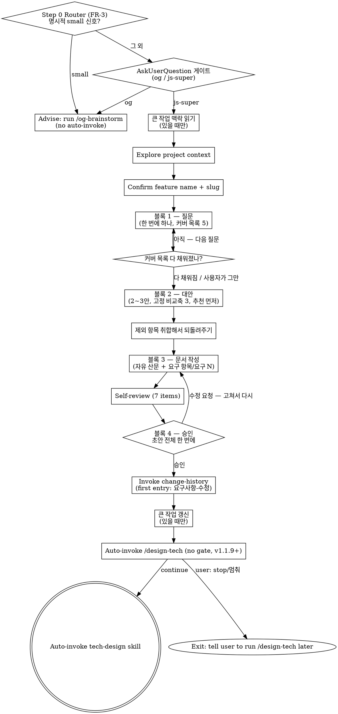

# Brainstorming → <slug>-requirements.md (Socratic)

## 사용자 질문 룰 (v2.0.3+) — 항상 AskUserQuestion

이 skill 흐름 안에서 사용자에게 질문할 일이 생기면 **반드시** `AskUserQuestion`
도구로 호출한다. 산문으로 "~ 할까요?" 한 줄 던지지 마라.

### Why

Notification 훅 (`elicitation_dialog` 매처) 이 알람을 발화하려면 도구 호출이
실제로 일어나야 함. 산문 질문은 훅이 못 잡아서 사용자가 놓침 (v1.1.8 신고 재발).

### How to apply

- clarifying / Socratic / 모호점 확인 / 게이트 / 모드 선택 — 모두 포함
- 단답 yes/no 도 prose X → `AskUserQuestion` options `[yes, no]` 사용
- 다중 선택은 enum options 또는 multi-question batching (의미 결합 시 max 4 questions[])
- **Socratic 자유 응답**: AskUserQuestion 의 question 본문에 "자유롭게 답해주세요. 별도 옵션 선택 불필요" + dummy option `[알겠음]` 1개 → 트리거만 발화, 응답은 다음 turn prose
- **예외**: 본문 자체의 알람-friendly 안내문 (`ℹ️ Auto-proceeding ...`) 는 질문 아니라 안내 — 도구 호출 불필요

### Other / 모호 응답 처리 (v2.1.1+)

사용자가 "Other" 자유 응답 또는 "모르겠음 / 이해 안 됨" 류 답변 catch 시 → **그 질문만 단독 재호출 + prose 설명 추가**. 다음 단계 자동 진행 X (anchor 질문 강제 X 룰은 명확 yes/no 답변에만 적용).

js-superpowers' brainstorming is restricted to **planning-level requirements output**. Technical design and implementation plans are handled by `tech-design` and `writing-plans` skills respectively.

The dialogue is Socratic: one question at a time, alternatives with tradeoffs before any decision, and a single review of the finished draft. There is no mode gate — every feature goes through the same path.

The output is free-form prose. Only three things are fixed: the H1 title, a `## 요구 항목` section whose items carry `요구 N` anchors, and the `## 변경이력` footer. Everything else takes whatever shape the dialogue produced. Downstream skills (`tech-design`, `verifying-spec`, `writing-plans`, `change-propagation`) read the `요구 N` anchors, so that section is the one contract this doc must honour. Prose style is governed by the "산출물 문서 스타일" section below.

<HARD-GATE>
This skill produces requirements only — NOT <slug>-tech-design.md, NOT code, NOT implementation plans. Technical decisions belong to the next step.

After <slug>-requirements.md is approved AND change-history is logged, **automatically invoke** the `tech-design` skill via the Skill tool (v1.1.9+ — the separate "proceed?" gate has been removed). Output a one-line interrupt-notice `ℹ️ /design-tech 단계로 자동 넘어갑니다. 멈추려면 "stop" 입력해주세요.` so the user can pause if needed. If they explicitly type "stop"/"멈춰"/"잠깐", exit cleanly with `ℹ️ 알겠습니다. /design-tech 은 나중에 직접 실행해주세요.`. The original combined approval gate (#8) already captured the user's intent; a separate proceed gate just adds friction.
</HARD-GATE>

### 예외 — `--no-ask` 플래그 (v2.5+)

사용자가 슬래시 명령에 `--no-ask` 토큰을 **명시** 한 경우에만 진입. 메인 자체 판단으로 활성화 X.

- 모든 사용자 질문을 prose (메인 turn 자유 텍스트) 로 처리
- `AskUserQuestion` 도구 호출 **0 보장**
- 게이트 자체는 살아 있음 — 사용자 prose 응답 기다림
- 알람 fire X (사용자가 명시 invoke 했으니 인지 가정)

#### skill 진입 시 1회 boilerplate

skill 진입 직후 다음 한 줄을 prose 로 출력:

> ℹ️ `--no-ask` 모드 진입 — AskUserQuestion 도구 호출 X, 응답 알람 X. 백그라운드 작업 중이면 응답 시점을 직접 체크해주세요.

#### 위험 명령 진입 직전 보강

critical 7 케이스 (파일 삭제 / `git push --force` / DB migration / mass commit / 외부 메시지 등) 실행 직전에는 다음 한 줄을 prose 로 출력:

> ⚠️ 위험 명령 진입 — 응답 기다림. 백그라운드 작업 중이면 직접 catch 해주세요.

`⚠️` 마커 + 별도 줄로 일반 prose 보다 두드러지게.

## Checklist

You MUST create a TaskCreate task for each of these items and complete them in order:

0. **Entry Router (v1.1.15+, FR-3 · v2.8.1+ og 커맨드 전용화)** — 사용자 입력에 명시적 small 신호 감지 시 `/og-brainstorm` 실행 안내 한 줄 (자동 invoke 아님 — og 는 커맨드 전용). 그 외 → AskUserQuestion 게이트. 자세한 룰은 "Entry Router" 섹션 참조.
0.5. **큰 작업 맥락 읽기** — `docs/epics/` 에 진행 중인 큰 작업이 있으면 큰 그림과 미해소 이월 항목을 읽어 사용자에게 보여준다. 없으면 아무 말 없이 건너뛴다. 자세한 룰은 "큰 작업 맥락" 섹션 참조.
1. **프로젝트 컨텍스트 탐색** — files, docs, recent commits
2. **피처 이름/슬러그 확인** — one question, then create `docs/features/YYYY-MM-DD-<slug>/`
3. **질문으로 좁히기** — 한 번에 하나씩. 커버 목록 다섯 가지가 채워지면 멈춘다. 자세한 룰은 "Socratic Procedure" 의 블록 1 참조.
4. **대안 비교와 방향 결정** — 2~3안을 고정 비교축으로 제시하고 추천을 먼저 말한다. 블록 2 참조.
5. **요구사항 문서 작성** — 자유 산문. `## 요구 항목` 섹션과 `요구 N` 만 필수. "산출물 문서 스타일" 을 지킨다. 제외 항목 취합 룰 포함. 블록 3 참조.
6. **자체 점검** — 여섯 항목 단일 목록. "Self-Review" 참조.
7. **사용자 검토** — 초안 전체를 한 번에 보여주고 승인받는다. 수정 요청이 오면 고쳐서 다시 보여준다.
8. **변경이력 기록** — append first `[요구사항-수정]` entry via `change-history` skill
8.5. **큰 작업 갱신** — 큰 작업이 있으면 큰 그림 갱신 판정 · 이월 항목 기록 · 예상 빗나감 판정을 수행한다. 바뀐 것이 없으면 파일을 고치지 않는다. "큰 작업 맥락" 섹션 참조.
9. **개발방향 단계 자동 진행** — Right after the change-history entry is logged, auto-invoke `tech-design` via the Skill tool with a one-line interrupt-notice. On user "stop"/"멈춰"/"잠깐" → exit cleanly with notice telling the user to run /design-tech later.

If you find yourself skipping ahead, stop and create the missing task.

**Before invoking the next skill via Skill tool, mark ALL checklist TaskCreate items as completed (in_progress → completed). The Skill tool transition does NOT auto-complete prior tasks. (v1.1.15+, FR-2)**

## Anti-Pattern: "This is too simple to need a requirements doc"

Every project goes through this process. A single-function utility, a config change — all of them. "Simple" projects are where unexamined assumptions cause the most wasted work. The doc can be short (a few sentences and one 요구 항목), but you MUST write it and get user approval.

## Output

Save path: `docs/features/YYYY-MM-DD-<slug>/<slug>-requirements.md`
- date = the day this brainstorming session started (immutable ID, NOT today's date on later edits)
- slug = feature name from the user's first answer (spaces → hyphens)
- A feature with the same name 6 months later gets a different folder (no collision)

## Document Schema (<slug>-requirements.md)

자유 산문이다. 섹션 이름과 개수는 대화에서 나온 대로 쓴다. 고정된 것은 셋뿐이다 — H1 제목, `## 요구 항목` 섹션, `## 변경이력` footer.

```markdown
# 요구사항: <feature-name>

> **다음 단계 안내**: 이 문서는 요구사항 (기획 단계) 입니다. 다음 단계로 `tech-design` skill (또는 `/design-tech` 슬래시) 을 호출해서 `<slug>-tech-design.md` (기술 설계서) 를 만드세요. 기술 결정이나 구현 세부사항은 여기 박지 마세요 — 그건 다음 산출물 (tech-design, 3개 트랙이면 plan 까지) 에 들어갑니다.

<대화에서 나온 섹션들. 예: ## 배경 / ## 핵심 결정 / ## 인터랙션 흐름 / ## 우려와 해결>

## 요구 항목

**요구 1**: <시스템이 무엇을 해야 하는지 한 문장>
**요구 2**: ...

<필요하면 더: ## 범위 밖 / ## 수용 기준 / ## 다음 단계>

---
## 변경이력
<!-- change-history skill auto-appends entries here, oldest first -->
```

`## 요구 항목` 규칙:

- 섹션 이름은 `## 요구 항목` 으로 고정한다. 다른 이름을 쓰면 다운스트림이 못 찾는다.
- 항목마다 `**요구 N**:` 을 붙인다. 굵게까지 포함한 형태가 약속이다. 번호는 1부터 순서대로, 문서 안에서 유일해야 한다.
- 항목이 많으면 소제목으로 묶어도 된다 (`### 제거` / `### 신설` 등). 번호는 묶음을 가로질러 이어진다.
- 요구 항목이 하나뿐이어도 섹션과 번호를 쓴다. 다운스트림은 셀 수 있는 단위를 필요로 한다.

모드를 표기하는 줄은 쓰지 않는다. 경로가 하나뿐이라 표기할 모드가 없다.

## 산출물 문서 스타일

이 규칙은 이 skill 이 만드는 산출물 문서에 적용된다. 이 skill 본문 자체는 대상이 아니다.

**위에서 아래로 읽힌다.** 용어는 처음 쓰는 자리에서 뜻을 밝힌다. 뒤 섹션을 먼저 읽어야 이해되는 문장을 쓰지 않는다. 앞 섹션이 뒤 섹션의 결론에 기대고 있으면 순서를 바꾼다.

**간결한 자연어로 쓴다.** 한 문장에 하나를 말한다. 비유를 쓰지 않는다 — 무엇에 빗대지 말고 그것이 무엇인지 그대로 쓴다. 배경 반복, 다짐, 같은 말 되풀이는 넣지 않는다.

**나열과 비교와 구조는 표나 도면으로 보인다.** 항목이 셋 이상이면 표로 만든다. 구성 요소들의 관계나 배치를 설명해야 하면 도면을 그린다. 산문은 배경과 판단 근거에 쓴다.

**항목 코드를 만들지 않는다.** 본문에 알파벳-숫자 코드를 붙이지 않는다. 무언가를 가리켜야 하면 짧은 한국어 제목을 쓴다. 유일한 예외는 요구 항목 번호 (`요구 N`) 다 — 다음 단계 문서들이 이 번호로 항목을 찾는다.

도면 안에 붙이는 번호 (①②③) 는 표에서 설명하기 위한 도면 표기법이지 항목 코드가 아니다. 금지 대상이 아니다.

## Process Flow



## Process (detail)

**0.5. 큰 작업 맥락 읽기**
- `docs/epics/` 가 없거나 진행 중인 큰 작업이 없으면 아무 출력 없이 다음 단계로 간다
- 있으면 큰 그림의 착수 가능 · 기다림 · 모름과 이월 노트의 미해소 항목을 사용자에게 보여준다
- 이월 항목은 지금 앞당겨 처리할지 판단하는 데 쓴다. 순서대로 꺼내는 대기열이 아니다
- 예상도는 읽지 않는다
- **이번 피처가 이 큰 작업에 속하면 5단계에서 쓸 요구사항 문서 머리에 소속 표식 한 줄을 넣기로 기억해둔다** — `> **큰 작업**: <큰 작업 폴더 이름>`. 이 줄이 없으면 그 피처는 목록에서 조용히 빠진다

**1. Explore project context**
- Skim existing files/docs/recent commits
- Scope check: if the request bundles multiple independent subsystems, propose decomposition before continuing — never bundle multiple features into one requirements doc.

**2. Confirm feature name + slug** (1 question)
- Ask: "What should we call this feature?" (e.g., '잔액 출금', '회원 보너스 지급')
- Compute slug from the answer (replace spaces with hyphens)
- Create folder: `docs/features/YYYY-MM-DD-<slug>/`

**3~5. Socratic dialogue** — "Socratic Procedure" 의 블록 1~3 을 따른다. 질문으로 좁히고, 대안을 비교하고, 문서를 쓴다. 제외 항목 취합 룰은 블록 3 안에 있다.

**6. Self-review** — "Self-Review" 의 여섯 항목.

**7. Show the RAW doc + user review gate**
- Show the full RAW `<slug>-requirements.md`; await approval or change requests
- If changes requested, revise per feedback → re-show RAW
- On approval → continue to step 8 (change-history)

**Gate #8 — 산출물(RAW) 승인**

**Tool form (preferred)**

Call `AskUserQuestion`:

```json
{
  "question": "<slug>-requirements.md 승인? (RAW 산출물 검토)",
  "header": "요구사항 승인",
  "multiSelect": false,
  "options": [
    {"label": "예 — 승인", "description": "승인하고 change-history 진행"},
    {"label": "아니오 — 수정", "description": "사용자 피드백 받아 수정 후 재제시"}
  ]
}
```

**Prose fallback**

When `AskUserQuestion` is unavailable, ask in prose:

> Approve `<slug>-requirements.md`? — `yes` / `no`

**8. Invoke change-history skill** (first entry: initial creation)
- Tag: `[요구사항-수정]` (use the entry type even on first creation)
- 이유: 신규 피처 brainstorming 결과
- 무엇이: <slug>-requirements.md 전체 (요구 1..N + 대화에서 나온 섹션들)
- 영향범위: 없음 (최초 생성)

**8.5. 큰 작업 갱신**

큰 작업이 없으면 이 단계 전체를 건너뛴다. 있으면 셋을 차례로 한다.

- **큰 그림 갱신 판정** — 항목이 없어졌거나 새로 생겼거나 순서가 뒤집혔을 때만 고쳐 쓴다. 표현을 다듬는 수정은 하지 않는다. 바뀐 것이 없으면 파일을 건드리지 않고 "큰 그림 변경 없음" 한 줄만 알린다
- **이월 항목 기록** — 대화 중 모아둔 후보를 목록으로 보여주고 남길 것만 이월 노트 끝에 붙인다. 종류 (미룸 / 주의 / 기각 / 유보) 와 나온 곳을 함께 적는다
- **예상 빗나감 판정** — 예상이 빗나갔을 때만 예상도 끝에 새 시점 블록을 붙인다. 무엇이 어떻게 빗나갔는지와 그렇게 판단한 근거를 함께 적고, 근거를 적을 수 없으면 기록하지 않는다

착수 가능한 피처가 둘 이상이고 서로 건드리는 곳이 겹치지 않아 보이면 나란히 갈라내 동시에 진행하도록 제안한다. 판단 근거는 대화 내용이고, 코드를 뒤져 실제 충돌을 계산하지 않는다. 제안까지가 범위이고 워크트리는 만들지 않는다.

**9. Auto-proceed to tech-design (v1.1.9+ — no gate)**

After change-history entry is logged, **automatically invoke** the `tech-design` skill (or `js-super:tech-design` depending on harness namespace). NO user gate here.

Output a one-line notice `ℹ️ /design-tech 단계로 자동 넘어갑니다. 멈추려면 "stop" 입력해주세요.` so the user has a chance to interrupt mid-transition if they really want to pause.

If the user explicitly types "stop"/"멈춰"/"잠깐" after the notice, exit cleanly with `ℹ️ 알겠습니다. /design-tech 은 나중에 직접 실행해주세요.` Otherwise auto-invoke.

Rationale: gate #8 (RAW 산출물 승인) 에서 이미 사용자 의도가 다음 단계 진행으로 잡혔어요. 별도 "다음 단계 갈까요?" 게이트는 마찰만 더할 뿐이라 v1.1.9+ 에서 제거됐고, 대신 한 줄 안내로 사용자가 멈출 기회를 줍니다.

## Entry Router (v1.1.15+, FR-3 · v2.8.1+ og 커맨드 전용화 반영)

js-super:brainstorming 진입 시 1순위 발화. `/brainstorm` slash command 진입 / 자연어 진입 ("…를 만들어 / 브레인스토밍 시작해") 모두 동일 path.

**중요 (v2.8.1+):** og 흐름은 커맨드 전용(`/og-brainstorm`, `disable-model-invocation`)으로 분리됐다. 라우터는 og 를 **자동 invoke 하지 않는다** — 감지 시 사용자에게 `/og-brainstorm` 실행을 **안내**만 한다.

### 라우팅 룰

**1. 명시적 small 신호 감지 → `/og-brainstorm` 실행 안내 (자동 invoke 아님)**

다음 중 하나라도 사용자 입력에 명시되면 small 판정:

- **small 키워드**: `간단`, `잠깐`, `한 줄`, `단순`, `og로`, `og-`, `가볍게`
- **단일 파일/단일 함수 변경 명시**: 예 — "`README.md` 한 줄 수정", "`utils.py:foo` 만 수정"
- **메타 워크플로우 / 순수 config 변경 명시**: 예 — "`.gitignore` 추가", "tsconfig 옵션 한 개 추가"

→ 한 줄 안내 노출 후 사용자 응답 대기 (자동 전환 X):

```
ℹ️ '<감지된 신호>' — 가벼운 원본 흐름을 원하면 `/og-brainstorm` 을 직접 실행해주세요. 그대로 답하면 js-super 풀 트랙으로 진행합니다.
```

사용자가 `/og-brainstorm` 을 실행하면 그 커맨드가 처리. 그 외 응답이면 본 skill 의 Checklist 1번 (Explore) 으로 진입.

**2. 그 외 모두 → AskUserQuestion 게이트**

명시적 small 신호 부재 (= 의도파악력 약한 케이스 포함). AI 가 "이건 분명 large 다" 판정할 필요 X. AskUserQuestion 호출:

```json
{
  "question": "이 피처를 가벼운 원본 흐름(/og-brainstorm) 으로 할까요, js-super 풀 트랙으로 할까요?",
  "header": "진입 모드",
  "multiSelect": false,
  "options": [
    {"label": "/og-brainstorm 안내", "description": "가벼운 단발 / upstream 원본 — 직접 실행하도록 안내"},
    {"label": "js-super:brainstorming", "description": "js-super 풀 트랙 (2~3 MD — 깊이는 tech-design 승인 시 선택) / 변경이력 + 위험 주석"}
  ]
}
```

사용자 선택 → og 면 `/og-brainstorm` 실행 안내 후 대기 / js-super 면 본 skill Checklist 1번 진입.

### 의도파악력 약해도 됨

AI 가 small/large 분명 판정할 필요 없음. 명시적 small 신호 catch 만 정확하면 나머지는 게이트로 사용자 결정. false positive 안 발생.

## Socratic Procedure

네 블록으로 진행한다. 앞 블록이 끝나야 다음으로 간다.

### 블록 1 — 질문

한 번에 하나만 묻는다. 여러 개를 한 메시지에 담지 않는다. 고를 수 있는 형태로 물을 수 있으면 그렇게 한다.

**커버 목록** — 다음 다섯 가지를 채우는 것이 목표다.

1. 무엇을 만드는가 — 대상과 범위
2. 왜 필요한가 — 해결하려는 문제
3. 성공을 어떻게 아는가 — 판정 가능한 기준
4. 무엇을 하지 않는가 — 명시적 제외
5. 무엇이 걸림돌인가 — 제약과 의존

**종료 판정** — 다섯 가지가 다 채워지면 멈춘다. 개수 상한은 없다. 가벼운 사안이면 두세 개로 끝나고 무거운 사안이면 길어진다. 사용자가 먼저 "그만" 이라고 하면 채워진 것까지만 쓰고, 빈 항목은 문서에 `미정 — <이유>` 로 남긴다.

이미 답이 나온 항목을 다시 묻지 않는다. 사용자의 첫 입력이나 앞선 답변에 들어 있으면 그것으로 채우고 넘어간다.

**사용자가 모르겠다고 할 때** — 순서대로 내려간다. 위 단계에서 풀리면 아래로 안 간다.

1. 같은 질문을 더 쉬운 말로 바꿔 다시 묻는다. 전문 용어를 빼고 구체적인 상황으로 바꾼다.
2. 그래도 막히면 선택지를 만들어 고르게 한다. 각 선택지가 무엇을 뜻하는지 한 줄씩 붙인다.
3. 그래도 막히면 기본값을 제안하고 "이대로 갈지" 만 확인한다. 그 기본값이 무엇을 전제하는지 한 줄 덧붙인다. 나중에 되짚을 수 있어야 한다.

### 블록 2 — 대안

방향을 정해야 하는 지점마다 2~3안을 제시한다. 하나만 내놓고 넘어가지 않는다.

**비교축은 셋으로 고정한다.**

- 무엇이 달라지는가
- 무엇을 포기하는가
- 되돌리는 비용

**추천을 먼저 말한다.** 안을 나열한 뒤 "어느 쪽인가요" 로 끝내지 말고, 어느 쪽을 권하는지와 그 이유를 먼저 밝힌다. 그리고 **추천안이 깨지는 조건 하나**를 스스로 제시한다. "이 전제가 틀리면 다른 안이 낫습니다" 형태다.

고른 안과 버린 안, 그리고 고른 이유를 문서에 남긴다. 버린 안을 안 적으면 나중에 같은 논의를 처음부터 다시 하게 된다.

### 블록 3 — 문서 작성

`docs/features/YYYY-MM-DD-<slug>/<slug>-requirements.md` 를 쓴다. 형식은 "Document Schema" 를 따른다.

**제외 항목은 취합해서 되돌려준다.** 대화 내내 사용자는 "X는 빼고", "Y는 다음에", "Z는 안 만들어" 같은 말을 한다. 그때마다 적어두었다가, 문서를 쓰기 전에 모아서 보여준다.

```
지금까지 나온 제외 항목입니다.
- 의미 검색 (대화 중 언급)
- 다국어 지원 (범위가 커진다고 하셔서 보류)

여기 더 넣을 게 있을까요? 없으면 "없음" 이라고 답해주세요.
```

빈 상태에서 "범위 밖이 뭔가요" 라고 묻지 않는다. 사용자 시간을 뺏고, 앞서 말한 제외가 통째로 빠진다.

**기술 세부는 넣지 않는다.** 어떤 라이브러리를 쓸지, 파일을 어떻게 나눌지, 어떤 함수를 만들지는 다음 단계 산출물의 몫이다. 여기서는 "무엇이 되어야 하는가" 까지만 쓴다.

### 블록 4 — 승인

초안 전체를 한 번에 보여주고 승인받는다. 섹션마다 끊어서 확인받지 않는다. 확인 지점이 늘면 알람이 그만큼 늘고, 전체를 못 본 채로 부분에 동의하게 된다.

수정 요청이 오면 고쳐서 다시 전체를 보여준다. "어디를 고칠까요" 라고 되묻지 않는다. 사용자가 알아서 말한다.

### 대화가 커질 때

주고받다 보니 요청이 독립된 여러 덩어리로 드러나면, 계속 진행하기 전에 나누자고 제안한다. 한 문서에 여러 피처를 담으면 다음 단계가 전부 엉킨다.

## Self-Review

초안을 다 쓴 뒤 처음 보는 눈으로 일곱 가지를 훑는다.

1. **미완성 표현**: "TBD", "TODO", 비어 있는 섹션, 뭉뚱그린 요구가 있는가? 고친다.
2. **내부 모순**: 서로 어긋나는 서술이 있는가?
3. **범위**: 한 피처로 묶이는가, 나눠야 하는가? 나눠야 하면 나눈다.
4. **중의성**: 두 가지로 읽히는 요구가 있는가? 하나로 정하고 명시한다.
5. **제외 항목 취합**: 대화에서 나온 제외가 문서에 다 들어갔는가? 블록 3 에서 되돌려준 목록과 대조한다.
6. **기술 세부 누출**: 구현 방법이나 파일 구조가 본문에 섞였는가? 다음 단계 산출물로 넘긴다.
7. **문서 스타일**: "산출물 문서 스타일" 네 가지로 훑는다. 뒤를 먼저 읽어야 이해되는 문장, 비유, 산문으로 늘어놓은 나열, 새로 만든 항목 코드가 남았는가?

찾은 문제는 그 자리에서 고친다. 다시 검토할 필요 없이 고치고 넘어간다.

## Asking the User a Gate Question (v1.1.8+)

For any HARD-GATE asking enum/binary response (yes/no, Inline/Subagent, Merge/PR/Cleanup), use the `AskUserQuestion` tool with its real schema — a top-level `questions` array; each question has `header`, `multiSelect`, and `options` (each option has `label` + `description`):

```json
{
  "questions": [
    {
      "question": "<short question, e.g. 'Approve <slug>-tech-design.md and proceed?'>",
      "header": "<short label, e.g. '승인'>",
      "multiSelect": false,
      "options": [
        {"label": "예 — 승인", "description": "승인하고 다음 단계 진행"},
        {"label": "아니오 — 수정", "description": "사용자 피드백 받아 수정 후 재제시"}
      ]
    }
  ]
}
```

(이 문서의 다른 게이트 예시들은 지면을 아끼려 `question` 객체 하나만 보여준다 — 실제 호출 시 위처럼 `questions: [...]` 배열로 감싸세요.)

### Why simple `yes` / `no` (v1.1.10+)

Earlier drafts had `partial` (v1.1.8) → simplified to `yes` / `fix` (v1.1.9) → simplified to `yes` / `no` (v1.1.10+). Each step removed semantic ambiguity: `partial` was indistinguishable from `fix`; `fix` felt awkward in Korean conversation. `no` is the cleanest binary — meaning "don't approve, sends user feedback for revision". Per upstream-original brainstorming pattern, do NOT force a "어디 고칠까?" anchor question — let the user volunteer feedback freely.

### Harness fallback

When `AskUserQuestion` is unavailable (e.g. codex/cursor/gemini harness), fall back to a prose form:

```markdown
**Approve and proceed?** — `yes` / `no`
```

### Rule

Always prefer the tool when available. Detect availability via the harness tool registry; on miss, fall back to the prose form. The skill body for downstream gates (brainstorming/tech-design/writing-plans/finishing-a-development-branch) shows BOTH forms; the executor picks based on environment.

### Why both forms

- Tool form: harness renders a separate prompt UI, making the gate visually obvious and enforcing enum responses
- Prose fallback: backwards-compatible with non-Claude-Code harnesses + provides human-readable inline reference

## Anti-Patterns

| Wrong | Right |
|---|---|
| Embedding tech decisions ("use Postgres", "REST API") in the requirements doc | Put those in <slug>-tech-design.md. Requirements stay tech-agnostic. |
| Writing only "user can do X" without a requirement number | `**요구 N**: <action>` in the `## 요구 항목` section, plus a way to tell it's done |
| Asking "범위 밖이 뭔가요?" from scratch when exclusions were stated earlier | Consolidate prior exclusions first; ask only for additions on top |
| Renaming the `## 요구 항목` section or dropping the 요구 numbers | Downstream skills look for that exact heading and those anchors. Keep both. |
| Auto-crossing into design without asking | Always ask the approval prompt. On approval, auto-invoke. Without approval, stop. |
| Asking the user to type `/design-tech` manually | Once approved, auto-invoke tech-design via Skill tool. User shouldn't have to retype. |
| "Skip the doc because it's simple" | Simple cases just produce a shorter doc, never a missing one. |

## Red Flags (STOP if you think these)

| Thought | Reality |
|---|---|
| "Just go straight to code, the user knows what they want" | Assumptions remain unvalidated. Run the questions. |
| "Intent is obvious, summarize in one line" | Even obvious intent has gaps. Walk the 커버 목록 — an item you can already answer costs one line, an item you skipped costs a rewrite later. |
| "spec.md is fine, isn't it?" | js-superpowers separates requirements from technical spec. The file is <slug>-requirements.md, not spec.md. |
| "The user said 모르겠다, so I'll just pick something" | Walk the 3단 사다리 instead. Rephrase, then offer choices, then propose a default and say what it assumes. |

## After Save — Invoke change-history

On first save of <slug>-requirements.md, write a `[요구사항-수정]` entry:

- 이유: 신규 피처 brainstorming 결과
- 무엇이: <slug>-requirements.md 전체 (요구 1..N + 대화에서 나온 섹션들)
- 영향범위: 없음 (최초 생성)

## Key Principles

- **One question at a time** — never multi-question prompts
- **Multiple choice preferred** — A/B/C is easier to answer than open-ended
- **YAGNI** — drop unnecessary requirements ruthlessly
- **2-3 approaches** — when proposing options, show alternatives plus a recommendation
- **Be flexible** — backtrack and re-ask when an earlier answer no longer holds
- **Incremental validation** — confirm each piece as it lands instead of saving every check for the end

## 큰 작업 맥락

여러 번의 브레인스토밍으로 나눠 진행하는 일 하나를 큰 작업이라 부른다. `docs/epics/` 아래에 큰 그림 (`overview.md`), 이월 노트 (`carry-over.md`), 예상도 (`forecast.md`) 세 파일로 산다. 만들고 조회하는 것은 `/epic` 커맨드가 한다.

대화가 압축되면 앞에서 정한 것과 미룬 것이 요약에서 뭉개진다. 압축을 견디는 것은 파일뿐이라, 브레인스토밍은 시작할 때 이 파일들을 읽고 끝날 때 갱신한다.

### 있는지 확인하고 없으면 조용히 지나간다

`docs/epics/` 가 없거나 상태 줄이 `진행 중` 인 큰 그림이 하나도 없으면 시작 단계와 마무리 단계를 통째로 건너뛴다. 안내 문구도 출력하지 않는다. 큰 작업 없이 피처 하나만 만드는 기존 사용법이 지금과 똑같이 동작해야 한다.

진행 중인 것이 여럿이면 큰 그림을 가장 최근에 고친 것을 쓰고 그 사실을 한 줄 알린다. 어느 것을 쓸지 사용자에게 묻지 않는다.

### 시작 단계가 읽는 것

큰 그림의 착수 가능 · 기다림 · 모름과, 이월 노트에서 해소 표시가 없는 항목이다. 예상도는 읽지 않는다 — 읽어서 대화에 들어오면 다음 주제가 그 예상을 따라가고, 예상도를 따로 떼어낸 이유가 사라진다.

미해소 이월 항목은 지금 앞당겨 처리할지 판단하는 데 쓴다. 순서대로 꺼내는 대기열이 아니라 언제든 꺼낼 수 있는 보관함이다.

### 소속 표식을 남긴다

진행 중인 큰 작업이 있으면 이번 피처의 요구사항 문서 머리에 한 줄을 넣는다. 다음 단계 안내 인용 줄과 나란히 둔다.


- `tech-design` — next step (technical spec)
- `change-history` — first requirements entry
- `change-propagation` — when the requirements doc is later edited, cascades to downstream MDs

## 승인 게이트 / multi-choice 결정 = AskUserQuestion 도구 (v2.3.6+)

산출물 (요구사항 / tech-design / impl-plan) 작성 완료 후 사용자에게 **승인 / 수정 / 다른 방향** 류 multi-choice 결정을 요청할 때 → **반드시 `AskUserQuestion` 도구로 호출**. prose 자연어 멀티 옵션 금지.

### Why

- `Notification.elicitation_dialog` 매처 fire → OS 알람 (사용자 백그라운드 작업 시 catch)
- prose multi-choice 는 알람 X → 응답 멈춤
- "Other" / 자유 응답 / multiSelect / preview 등 도구 기능 활용

### 적용 케이스

- 산출물 ("이대로 진행 / 수정 필요 / 다른 방향") 게이트
- alternatives 2-3 안 사용자 선택
- partial 수정 후 재승인

기존 v2.0.3+ Socratic clarifying Q boilerplate + v2.1.1+ Other / 모호 응답 처리 룰 보존 (변경 X). 본 룰은 그 위에 multi-choice 결정 게이트 시점 명시 보강. CLAUDE.md "AskUserQuestion 도구 우선 (v2.3.5+)" 글로벌 룰의 요구사항 흐름 측 boilerplate.

### Anti-Patterns

| 안티 패턴 | 이유 |
|---|---|
| "승인 / 수정 / 다른 방향 — 어느 쪽이신지 알려주십시오." prose | AskUserQuestion options 사용. |
| 마크다운 numbered list (`1. ... 2. ... 3. ...`) 로 선택 유도 | AskUserQuestion options 사용. |
| "Y/N?" / "yes/no?" 한 글자 응답 유도 prose | AskUserQuestion (yes/no) 사용. |
| "어느 쪽?" / "어떤 안?" prose 멀티 옵션 | AskUserQuestion options 사용. |
| 산출물 작성 후 prose "검토 부탁" 만 던지고 응답 대기 | multi-choice 있으면 도구. 단순 보고는 OK. |
