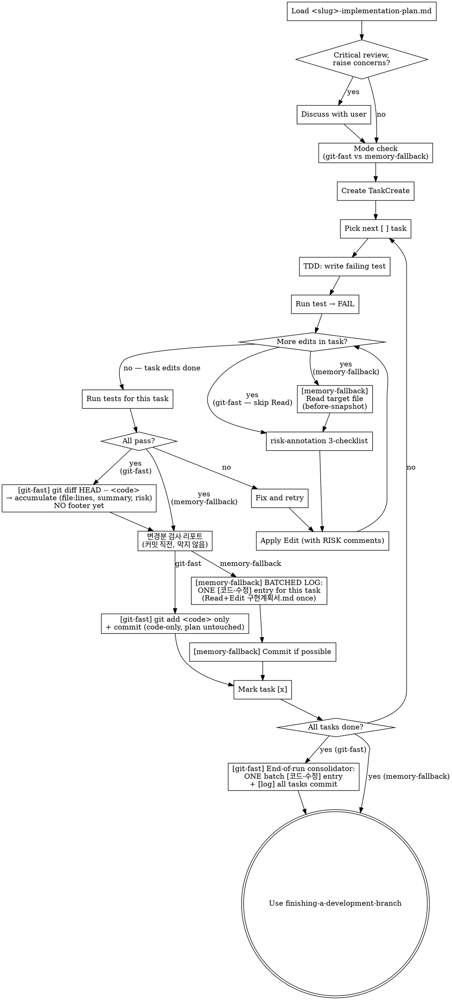

# Executing Plans

## Overview

Load plan, review critically, execute all tasks task-by-task, with strict per-edit discipline that captures before/after code and risk annotations into <slug>-implementation-plan.md change-history.

**Announce at start:** "executing-plans skill 로 본 계획을 task-by-task 실행하겠습니다."

**Note (subagent path):** This skill is the **inline** execution mode. If subagents are available (Claude Code, Codex) AND the user wants to preserve main context for large features, the recommended subagent path is `js-super-sub-driven` (slim 2-stage: implementer + spec reviewer + main post-processing for RISK / 변경이력 / atomic commit). The original upstream `subagent-driven-development` (3-stage: + quality reviewer) is also available for compatibility but duplicates governance js-super already provides via `verifying-spec` + TDD + RISK + 변경이력.

## When to Use

- A <slug>-implementation-plan.md exists in `docs/features/<date>-<slug>/`
- Inline (single-session) execution preferred over per-task subagents
- Each task in the plan follows TDD bite-sized steps

> **Task 이름 가이드 (FR-6 / v1.1.15+):** 구현계획서 §1 의 각 Task 이름은 사용자 친화 한국어로 작성되어야 합니다 (TaskCreate 시 그대로 노출). 내부 용어 (`Invoke ... skill`, `Gate #N`, 영어 식별자) 는 TaskCreate 이름에 노출하지 말 것. CLAUDE.md TaskCreate 명칭 룰 참조.

## Checklist

- [ ] Step 1 — Plan 로드 + 비판적 검토 (Plan Loading)
- [ ] Step 2 — Code Edit Discipline (git-fast / memory-fallback 모드 선택)
- [ ] Per-edit — risk-annotation 3-checklist + RISK comments
- [ ] Task 마다 — 커밋 직전에 변경분 검사 리포트 확인 (막지 않음, 발견 없으면 모아서 보고)
- [ ] 변경이력 — git-fast: 전체 task 후 end-of-run 1회 batch entry / memory-fallback: task마다 consolidated entry (change-history)
- [ ] Step 3 — Complete Development (테스트 + finishing-a-development-branch)

## Plan Loading

### Step 1: Load and Review Plan
1. Read `docs/features/<date>-<slug>/<slug>-implementation-plan.md`
2. **분할 구조 분기** — 같은 폴더에 `plan/tasks-*.md` 가 있으면 그 계획서는 인덱스다. 인덱스에는 task 헤더 필드(`**상세**` 링크 / Files / Model / 검증)만 있고 step 목록과 코드 블록은 하위 문서에 있다. 여기서 하위 문서를 전부 읽지 마라 — **각 task 를 시작하는 시점에 그 task 의 `**상세**` 문서만 읽는다.** 미리 다 읽으면 나눠 놓은 의미가 없다.
3. Review critically — list any gaps or concerns
4. If concerns exist: raise them with the user before starting
5. If clean: create TaskCreate tasks (one per plan task) and proceed

## Code Edit Discipline (REQUIRED — js-superpowers extension)

### Two execution modes

This skill picks ONE mode at task start based on git availability + plan policy:

| Mode | Trigger | Before-snapshot source |
|---|---|---|
| **git-fast** (default, optimized) | git repo present AND plan frontmatter `commit_policy: per-task` (or omitted) | `git diff HEAD -- <files>` (working tree vs HEAD) at task end, BEFORE commit |
| **memory-fallback** | git unavailable, OR plan frontmatter `commit_policy: single` / `none` | in-memory Read snapshot before every edit |

<HARD-GATE>
At task start (ONCE per `/execute-plan` run), run the mode check:

1. **Run mode-check helper (v1.1.14+ deterministic)**:

```bash
source .venv/bin/activate && python -c "
import sys
from pathlib import Path
from scripts.preflight import execute_plan_mode_check
result = execute_plan_mode_check(Path('<PLAN_PATH>'))
print(f'ok={result.ok} reason={result.reason} | {result.human_reason}')
sys.exit(0 if result.ok else 1)
"
```

이 helper 가 plan frontmatter 의 `commit_policy` 를 deterministic 으로 읽어 반환.

**exit code 분기 (v1.1.15 user-gate)**:

- **exit 0** → reason 에 `commit_policy=per-task` 형식. 메인은 policy 값으로 모드 분기:
  - `per-task` → candidate mode = git-fast
  - `single` → candidate mode = memory-fallback (all tasks → one commit at end)
  - `none` → candidate mode = memory-fallback (no commits during run)
- **exit 1** (semantic fail — plan not found) → `human_reason` 노출 후 `AskUserQuestion` 게이트:
  - `"수정 후 재시도"` (사용자가 plan 경로 확인) / `"강제 진행 (위험)"` (사용자가 입력한 plan 경로 직접 사용 — 메인이 추가 안내) / `"스킵 (이번만)"` (executing-plans 종료).
- **exit ≠ 0,1** (invocation 실패) → stderr 노출 + `AskUserQuestion` 게이트:
  - `"직접 디버깅"` / `"skill 단계 스킵"`.

기존 LLM 산문 추론 단계 제거 (v1.1.14). frontmatter 파싱 결과를 그대로 신뢰. 자세한 룰은 `scripts/preflight.py:execute_plan_mode_check`.

2. **Check git availability**: `git rev-parse --git-dir` (Bash). If git unavailable, force mode = memory-fallback regardless of frontmatter.

3. **Final mode decision**:
   - Both checks point to git-fast → mode = git-fast
   - Either check forces memory-fallback → mode = memory-fallback. If frontmatter requested `single`/`none` (i.e., user-intentional), proceed silently. If git was unavailable but frontmatter said `per-task`, WARN the user once: "⚠️ git repo 미초기화 → memory-fallback 모드로 진행합니다. 변경 전 코드 보존 비용이 큽니다."

The chosen mode applies to the whole `/execute-plan` run. Do not switch mid-run.

**Why a frontmatter field, not prose detection:** Prose scanning ("commit 생략" 등 키워드 매칭) is unreliable. The frontmatter field is unambiguous, machine-checkable, and lives next to the plan it governs.
</HARD-GATE>

### git-fast mode (default)

**Phase 1 — Per code edit (repeat for each edit in the task):**
1. **Risk check**: Run risk-annotation 3-checklist on the planned change.
2. **Apply edit**: Edit/Write the file (insert `# ⚠️ RISK(...)` comments above risky lines as needed). Trust the Edit tool's success/failure return — do NOT re-Read just to confirm the comment landed.

(Repeat 1-2 for every code edit. Track `(file:line, risk_categories)` tuples in memory — before/after code is recovered from git later, no in-memory snapshot needed.)

**Phase 2 — Once per task, AFTER all task edits + tests pass (commit happens LAST):**

Per task: code-only commit (plan.md untouched). Footer entry is deferred to end-of-run consolidator (v1.1.7+). This batches N tasks into a single consolidated [코드-수정] entry, drastically reducing footer noise + Read/Edit cost.

3. **Capture diff for accumulator** (NOT for footer): `git diff HEAD -- <code files only>` — parse hunks. Append `(task_id, file:line_range, summary, risk_categories, planned_commit_msg)` to in-memory accumulator. Do NOT touch <slug>-implementation-plan.md here.
3.5. **변경분 검사 리포트**: "변경분 검사 리포트 (커밋 직전, 리포트 전용)" 섹션을 수행한다. 결과는 보여주기만 하고 commit 을 막지 않는다.
4. **Commit (scoped, code only)**: `git add <explicit list of code files touched in this task>` then `git commit -m "<task summary>"`. NEVER use `git add -A` or `git add .`. The code-file list MUST come from the in-memory `(file:line, ...)` tuples tracked during Phase 1. plan.md is NOT included in this commit — it gets its own single `[log] all tasks` commit at end-of-run.

**Phase 3 — End-of-Run Consolidator (v1.1.7+, runs ONCE after final task):**

5. **Render "구현 요약" message** to the user: planned tasks vs actual commits (incl. follow-ups), RISK triggers by category, 누락/초과 list, code-zero-change tasks (→ separate `[검증]` entry).
6. **Build consolidated batch entry**: from in-memory accumulator → ONE `[코드-수정] (batch: tasks N..M)` entry per change-history slim schema (코드 블록 생략, 연관 commit SHA 참조). For any code-zero-change task, build a separate `[검증]` entry.
7. **Single footer append + log commit**: Read <slug>-implementation-plan.md once → Edit (append batch entry + 검증 entries) → `git add <slug>-implementation-plan.md` → `git commit -m "[log] all tasks: <one-line summary>"`.
8. **Cleanup**: nothing for inline mode (no buffer dir). Subagent path cleans `.js-super/changelog-buffer/<slug>/` separately — see `js-super-sub-driven` skill §2-4.

This Phase 3 ordering is the **single source of truth for inline mode**. Subagent mode uses the same Phase 3 logic but reads manifests from the buffer directory instead of in-memory accumulator (per `js-super-sub-driven` §2).

### memory-fallback mode

**Phase 1 — Per code edit:**
1. **Before-snapshot**: Read the target file → capture the original code for the affected line range. Hold in memory.
2. **Risk check**: Run risk-annotation 3-checklist.
3. **Apply edit**: Edit/Write (with RISK comments).

(Repeat. Track `(file:line, before, after, risk_categories)` tuples in memory.)

**Phase 2 — Once per task, AFTER all edits + tests pass:**
3.5. **변경분 검사 리포트**: "변경분 검사 리포트 (커밋 직전, 리포트 전용)" 섹션을 수행한다. 결과는 보여주기만 하고 commit 을 막지 않는다.
4. **Batched log**: Read plan ONCE, append ONE consolidated [코드-수정] entry, Edit ONCE. Use in-memory snapshots for 변경 전 / 변경 후.
5. Commit if possible (some plans skip).

<HARD-GATE>
NEVER skip logging. In git-fast mode, **strict ordering is mandatory**: per task, extract the diff (`git diff HEAD`) into the accumulator WHILE plan.md is untouched → commit code only (plan.md is NOT included in the per-task commit). Do the plan.md footer append + single `[log] all tasks` commit ONCE at end-of-run (Phase 3), AFTER every task's diff has been captured. Editing or committing plan.md per-task (before the diffs are captured) pollutes future `git diff HEAD` outputs with stale log appends. In memory-fallback mode, before-snapshots must be captured BEFORE each edit (otherwise originals are gone) and held in memory until Phase 2.
</HARD-GATE>

## 변경분 검사 리포트 (커밋 직전, 리포트 전용)

task 의 테스트가 모두 통과한 뒤, 그 task 를 commit 하기 **직전**에 1회 실행한다. 두 모드 공통이다.

```bash
G=$(find "$HOME/.claude/plugins/cache" -maxdepth 6 -path "*/js-super/*/scripts/code_gate.py" 2>/dev/null | sort -V | tail -1); [ -f "$G" ] || G=scripts/code_gate.py; if [ -f "$G" ]; then python3 "$G" --base HEAD; else echo "GATE_ABSENT"; fi
```

- 가상환경을 켜지 않는다. 게이트가 검사 대상 프로젝트의 가상환경을 스스로 찾기 때문이다 (`resolve_python`: `VIRTUAL_ENV` → `.venv` → `venv` → 현재 인터프리터 순). 여기서 js-super 의 가상환경을 켜면 `VIRTUAL_ENV` 가 1순위로 잡혀 **대상 프로젝트가 아닌 인터프리터**로 재게 된다. "도구가 없을 테니 켜자" 는 반대 방향이다.
- 이 Bash 호출에는 `timeout: 600000` 을 준다. 도구 기본값 120초는 게이트에 모자란다 (게이트의 테스트 상한이 300초, 뮤테이션 상한이 600초다). 게이트는 끝에 한 번에 찍으므로 중간에 잘리면 출력이 통째로 없다. 도구 상한이 600초라 뮤테이션 상한까지 덮지는 못한다 — 완화이지 완치가 아니다.
- git 이 없어 memory-fallback 을 고른 경우 (모드 선택 표의 `git unavailable`) 는 이 단계를 통째로 건너뛴다. 게이트가 변경분을 git 으로 계산하므로 일곱 항목이 전부 건너뜀으로 나온다. 건너뛸 때 한 줄 알린다: `ℹ️ git 저장소가 아니라 변경분 검사를 건너뜁니다.` `commit_policy: single` / `none` 으로 memory-fallback 에 들어온 경우는 git 이 있으므로 그대로 실행한다.
- `--base HEAD` 고정. 직전 task 는 이미 commit 됐으므로 working tree = 이번 task 변경분이다.
  (`commit_policy: single` / `none` 은 commit 이 없어 누적분을 재게 된다 — 잘못된 결과가 아니라 범위가 넓어지는 것뿐이라 그대로 둔다.)
- Trivial-Edit 경로도 예외 없이 1회 실행한다 (무엇을 건너뛸지는 게이트가 스스로 판단한다).
- 리포트는 **아무것도 막지 않는다.** 발견이 있어도 commit 을 미루거나 되돌리지 않고, 사용자에게 되묻지 않는다.

**발견이 있을 때** — 게이트 출력 전문을 코드 블록에 그대로 붙인다. 메인이 다시 쓰거나 요약하지 않는다. 살아남은 변이 한 줄에는 파일 · 줄 · 변이 종류 · 원본→변경 · 관련 테스트가 들어 있고, 요약하면 그것이 사라진다. 보고 빈도 룰 (아래 룰 2) 과 어긋나지 않게, **발견이 있는 task 의 리포트만** 그 자리에서 보여준다.

```
검사 리포트 (참고용 — 아무것도 막지 않습니다)
<게이트 출력 전문>
```

**발견이 없을 때** — 그 자리에서 출력하지 않는다. 표 일곱 줄이 매 task 반복되면 진짜 발견이 묻히고, 매 task 보고는 아래 룰 2 의 보고 빈도와도 어긋난다. 결과를 들고 있다가 wave 단위 보고 (3~5 task) 에 한 줄로 합산한다.

```
task 3~5 검사 리포트: 발견 없음 (변경 파일 2개) — 건너뜀 2항목 (coverage 미설치, 규칙 파일 없음)
```

건너뛴 사유는 **게이트 출력에 적힌 그대로** 옮긴다. 사유를 하나로 고정하지 않는다 — 도구 미설치 · 테스트 경로 없음 · git 저장소 아님 · 규칙 파일 없음 처럼 여러 종류이고, 뭉치면 사용자가 원인을 찾을 수 없다.

**한 항목도 검사하지 못했을 때** — `발견 없음` 이라고 쓰지 않는다. 통과로 읽힌다. 검사한 것이 하나도 없다는 사실을 앞에 둔다.

```
task 3~5 검사 리포트: 검사한 항목 없음 — 7항목 모두 건너뜀 (파이썬 테스트 경로 없음, coverage 미설치, 규칙 파일 없음)
```

**목록이 길 때** — 메인이 자르지 않는다. 게이트가 이미 항목당 15줄에서 자르고 `... 외 N건` 을 붙인다. 가려진 N건을 표로 다시 볼 방법은 없다 — `/check-code` 로 다시 돌려도 같은 렌더러라 같은 15줄에서 잘린다. 잘린 표시가 보이면 사실대로 한 줄만 덧붙인다: `가려진 N건은 표에 나오지 않습니다.`

**게이트 부재 · 실패** — 네 갈래 모두 한 줄 알리고 그대로 진행한다.

| 상황 | 판별 | 행동 |
|---|---|---|
| 게이트 파일 없음 | 출력이 `GATE_ABSENT` | `ℹ️ 변경분 검사 게이트를 찾지 못해 이번 task 검사는 건너뜁니다.` 한 줄 → 즉시 commit 진행 |
| 실행 실패 | 종료 코드 ≠ 0 이거나 출력이 비었음 | `ℹ️ 변경분 검사를 실행하지 못해 건너뜁니다.` 한 줄 → 즉시 commit 진행 |
| 시간 초과 | 도구가 시간 초과를 알리고 출력이 비었음 | `ℹ️ 변경분 검사가 제한 시간을 넘겨 건너뜁니다.` 한 줄 → 즉시 commit 진행 |
| 게이트 내부 오류 리포트 | 출력 머리글에 `게이트 내부 오류:` | 출력 그대로 보여주고 진행 (게이트가 스스로 알리는 정상 경로) |

- 재시도하지 않는다. 보조 에이전트를 띄우지 않는다. `AskUserQuestion` 을 부르지 않는다.
- 같은 실행 안에서 게이트가 계속 없어도 알림 한 줄은 첫 번째만 낸다.
- 발견을 심각도로 재분류하거나 "이 변이는 무해합니다" 처럼 판정하지 않는다. 리포트를 근거로 코드를 고치지 않는다.

## Trivial-Edit Exception (skip full discipline for tiny changes)

For changes that meet ALL of the following criteria, you MAY substitute a "trivial" path:

- Edit affects ≤ 3 lines
- No logic change (comments / docstrings / typos / unused-import cleanup / import reordering / whitespace only)
- risk-annotation 3-checklist returns 0/3 triggers (no side-effect / breaking / race signal)

When trivial:

1. **Skip before-snapshot** — irrelevant in both modes (git-fast doesn't need it; memory-fallback skips because no full block will be logged)
2. Risk check still runs to confirm 0/3
3. Apply edit runs as usual (typically no RISK comment needed since 0/3)
4. Log writes a **trivial entry** (no `git diff` extraction needed) instead of the full schema:

```markdown
### [YYYY-MM-DD HH:MM] [코드-수정] (trivial)
- **id**: CH-YYYYMMDD-NNN
- **이유**: <one-line reason, e.g. "타이포 수정 (witdraw → withdraw)">
- **무엇이**: <file:line>
```

No 영향범위, no 위험 카테고리, no before/after code blocks.

**git-fast mode: trivial 편집이라도 task당 1 commit은 반드시 유지.** 다음 task의 `git diff HEAD -- <code>` 가 깨끗하게 이번 task만 포함하려면 이번 task가 commit으로 닫혀야 함. "trivial이니 commit 생략"은 다음 task의 변경이력 정확성을 깨뜨림. (memory-fallback 모드는 commit 선택사항 그대로.)

**If ANY criterion is uncertain → fall back to full discipline.** Trivial is a fast path, not a shortcut for "anything that looks small".

<HARD-GATE>
Triviality is determined ONLY by the three criteria above. Logic changes — even one-line ones — are NOT trivial. When in doubt, take the safe path.
</HARD-GATE>

## 테스트 소스 분기 (v2.9+ — 계획서 테스트 자연어 축약)

task 의 "실패 테스트 작성" step 에서 테스트 코드의 소스는 task 형식에 따라 갈린다:

- **새 형식** (task 헤더에 `**검증**:` 필드, 테스트 코드 블록 없음) — `**검증**:` 의 자연어 설명 (무엇을 + 성공 기준) 을 읽고 실행 단계가 테스트 코드를 직접 작성한다. TDD 순서 (작성 → FAIL 확인 → 구현 → PASS) 는 그대로.
- **기존 형식** (task 에 테스트 코드 블록 존재) — 블록의 코드를 그대로 사용한다 (하위 호환. 블록 존재 = 기존 룰 우선).

두 형식이 한 plan 에 섞여 있어도 task 단위로 분기한다.

## Process Flow



## When to Stop and Ask for Help

**STOP executing immediately when:**
- Hit a blocker (missing dependency, test fails repeatedly, instruction unclear)
- Plan has critical gaps preventing the next task
- A 위험 카테고리 is genuinely ambiguous AND the trigger seems significant
- Verification fails after two retries

Ask the user rather than guessing.

## When to Revisit Earlier Steps

**Return to Step 1 (Load and Review Plan) when:**
- The user updates the plan based on your feedback
- A fundamental approach in the plan needs rethinking (e.g., chosen library doesn't fit, an FR was misread)
- Mid-execution discoveries invalidate later tasks

**Don't force through blockers** — stop and ask. The plan can be wrong. If it is, route the change through `change-propagation` so <slug>-implementation-plan.md is updated coherently before resuming.

## Anti-Patterns

| Wrong | Right |
|---|---|
| (memory-fallback) Edit first, capture before-snapshot later | Always Read → snapshot → Edit. Otherwise original is gone. |
| (git-fast) Skip the per-task commit | Commit is REQUIRED — without it, the next task's `git diff HEAD` includes both tasks' changes and the log gets fabricated. |
| (git-fast) Edit plan.md BEFORE running `git diff` | The diff would then include the plan log append, polluting "변경 전 코드" with non-code content. Order: per task, `git diff` → accumulate → code-only commit; the plan.md footer edit + `[log] all tasks` commit happen ONCE at end-of-run. |
| (git-fast) Edit / commit plan.md per task | plan.md must stay untouched during the per-task code-only commits — editing it per task pollutes the next task's `git diff HEAD`. The plan footer gets ONE separate `[log] all tasks` commit at end-of-run (Phase 3). |
| (git-fast) `git add -A` or `git add .` | Sweeps unrelated untracked files into the commit. Use the explicit code-file list from Phase 1 tuples (plan.md is NOT included — it gets its own end-of-run `[log] all tasks` commit). |
| (git-fast) Include plan.md in the `git diff` extract | Extract scope = code files only. plan.md is never in the per-task commit or its diff — it changes only in the separate end-of-run `[log] all tasks` commit (Phase 3). |
| Switch modes mid-run | Mode is decided at task-start mode-check. Stick to it. |
| (memory-fallback) Defer logging past each task | memory-fallback logs one consolidated entry per task — context evaporates fast, so don't defer. (git-fast is different: it accumulates in memory per task and writes ONE end-of-run batch entry — expected, not this anti-pattern.) |
| Skip RISK annotation because "looks safe" | Run the 3-checklist. 0/3 means no annotation, but the check happens. |
| Skip Phase 2 logging | HARD-GATE violation. Revert + redo. |
| Marking a logic-changing edit as "trivial" to skip discipline | Triviality requires zero logic change AND 0/3 risk triggers AND ≤3 lines. Logic changes are NEVER trivial. |
| Force progress through a blocker | Stop. Ask. The plan can be wrong. |
| Inferring commit policy from prose ("commit 안 할게") | Read `commit_policy` from plan frontmatter only. If user wants a different policy, route through change-propagation to update the field, then re-run the mode check. |
| Frontmatter says `per-task` but user verbally says skip commits mid-run | Stop and reconcile the field first (change-propagation). Do not silently switch modes. |

## Red Flags

| Thought | Reality |
|---|---|
| "This is a tiny tweak, skip discipline" | Tiny tweaks are exactly where regressions hide. Run the 4 steps. |
| "User won't notice if I skip the entry" | The user is reviewing 변경이력 later. They'll notice. |
| "Plan said do X, but I think Y is better" | Stop. Update the plan via change-propagation, then proceed. |

## Step 3: Complete Development

After all tasks complete and verified:
- **Final step**: invoke `finishing-a-development-branch` — 테스트 자동 검증 + 종료 메시지 (v1.1.14 슬림화). AskUserQuestion 게이트 X, 사용자가 직접 git/gh 명령 실행.

## Remember
- Review plan critically before starting
- Pick mode (git-fast vs memory-fallback) at task-start mode-check; do not switch
- Follow plan steps exactly
- Per-edit discipline: risk-check → apply (memory-fallback adds before-snapshot Read upfront)
- Per-task discipline: tests pass → git-fast: `git diff` 누적 + code-only commit (footer log 는 end-of-run consolidator 로 연기) / memory-fallback: 이 task 에서 batched log → mark task done
- Don't skip verifications — if a step says "run X, expect Y", run X and confirm Y
- Reference skills when the plan says to (e.g., "use risk-annotation here")
- Never start implementation on main/master without explicit user consent
- Ask when blocked

## Related Skills

- `risk-annotation` — invoked on every code edit for the 3-checklist
- `change-history` — invoked on every code edit for the [코드-수정] entry
- `change-propagation` — invoked when an in-flight insight requires plan/spec edits
- `js-super-sub-driven` — recommended subagent path (slim 2-stage + main post-processing)
- `subagent-driven-development` — upstream original subagent path (3-stage, kept for compatibility)
- `finishing-a-development-branch` — final wrap-up after all tasks

## Critical / Non-critical 판정 룰 (v2.3.5+)

execute-plan 실행 흐름의 핵심 UX 룰. 사용자가 모드 (inline / subagent) 를 선택한 시점부터 메인은 진행 위임으로 간주하고, **critical 케이스만 재질문** 한다.

### 룰 1: Critical 케이스 — 사용자 재질문 mandatory (AskUserQuestion 강제)

| 케이스 | 이유 |
|---|---|
| 사용자가 선택한 모드 자체를 변경 (inline → subagent / 반대) | 약속 위반. 명시 동의 필수. |
| plan 의 task 범위 확장 (계획 안 된 파일 / 함수 손대야 함) | scope creep — 사용자 의도 모호 |
| 파괴적 작업 (rm -rf / git reset --hard / force-push / 데이터 손실 위험) | 비가역 |
| plan 안 task 간 충돌 발견 (task A 수정본이 task B 원본과 불일치) | byte-copy 룰 위반, plan 재작성 필요 |
| BLOCKED 보고 후 self-correct 도 자동 복구 실패 (최대 3회) | 사용자 직접 개입 필요 |
| 외부 서비스 호출 (push / PR 생성 / 외부 API 트리거) | blast radius 커짐 |
| 사용자가 명시 약속 X 한 새 의존성 / 외부 도구 도입 | 약속 외 변경 |

### 룰 2: Non-critical 최적화 — 자율 진행 (게이트 X)

| 케이스 | 자율 결정 방향 |
|---|---|
| task 병렬 vs 순차 실행 여부 | plan 의 dependencies 만족 시 병렬 default |
| task 묶음 (same-file mechanical 3-AND 룰 만족 시) | 묶음 default (v2.0.1+) |
| task 안 보조 결정 (변수명 / format / order of imports) | plan 의 `**원본**` + `**수정본**` byte-copy 우선, 없으면 LLM 자율 |
| dispatch model 선택 | (subagent 모드) plan 의 `**Model**:` 값 자동 적용 — 생략 시 sonnet, 하한 sonnet (`js-super-sub-driven` Model Selection 참조). 게이트 없이 자동 |
| task 완료 후 다음 task 진입 타이밍 | 자동 진입 (게이트 X) |
| 중간 결과 보고 빈도 | 매 task X, 매 wave (3-5 task) 단위 OR BLOCKED 시만 |

### 룰 3: 모드 선택 = 사용자 위임 신호

사용자가 inline / subagent 모드를 선택한 시점부터, 그 모드에 내포된 진행 방식 (병렬 / 묶음 / 자동 진입) 은 묵시 동의로 간주한다. 사용자는 모드 선택 후 백그라운드 작업으로 이동할 수 있어야 한다. **모드 진행 중 추가 게이트는 룰 1 (critical) 에 해당하지 않으면 차단**.

### 룰 4: BLOCKED 자가 복구 우선

inline mode 의 task 실행 중 의도 모호 발견 시:

- plan 재독 + self-correct 시도 (최대 3회)
- 3회 실패 시에만 룰 1 의 마지막 케이스로 사용자 재질문 (AskUserQuestion fire)

→ 안전성은 보존, non-critical 결정 자체를 안 만든다.

## 사용자 질문 = AskUserQuestion 도구 (v2.3.5+)

룰 1 (critical 7 케이스) 재질문은 **반드시 `AskUserQuestion` 도구** 로 호출. prose 자연어 질문 금지.

- yes/no 도 `choices: [yes, no]` AskUserQuestion
- 다중 옵션은 `choices` enum
- 자유 응답 필요 시 dummy choice `[알겠음]` + question 본문에 "자유 응답" 명시
- 알람 시스템 (`repeat-alert.sh` 4-layer) 의 `Notification.elicitation_dialog` 매처 fire — 사용자 백그라운드 작업 시 OS 알람 catch

prose 질문 좁은 예외:

- 자유 텍스트 / 긴 응답 요구 (brainstorming open question)
- 사용자 응답 직후 확인용 단순 ack (그래도 AskUserQuestion yes/no 권장)
- 질문 아닌 상태 보고 / 진행 알림

본 룰은 `using-superpowers` (매 세션 주입) 의 "User Decisions — AskUserQuestion First (v2.3.5+)" 전역 룰의 skill body 측 cross-reference.

## --no-ask 플래그 (v2.5+) — 짧은 reference

기본 흐름은 룰 1 (critical 7 케이스) 재질문과 BLOCKED 자가복구 3회 실패 시 `AskUserQuestion` 도구를 fire 한다 (위 "사용자 질문 = AskUserQuestion 도구" 섹션). 즉 이 skill 에는 정상적으로 AskUserQuestion 호출이 존재한다.

사용자가 `--no-ask` 플래그를 **명시** 하면, 이 게이트들을 모두 **prose (메인 turn 자유 텍스트)** 로 처리하고 `AskUserQuestion` 도구 호출을 **0 보장** 한다.

- 게이트 자체는 살아 있음 — critical 7 / BLOCKED escalation 결정 지점은 유지, 도구만 우회 (사용자 prose 응답 대기)
- 알람 fire X (사용자가 명시 invoke 했으니 인지 가정)
- 자세한 boilerplate 는 `skills/brainstorming/SKILL.md` 의 `### 예외 — \`--no-ask\` 플래그 (v2.5+)` 답습

## Anti-Patterns (v2.3.5)

| 안티 패턴 | 이유 |
|---|---|
| "T3~T5 병렬로 진행해도 될까요?" 류 게이트 | 룰 2 위반. plan dependencies 만족 시 자율 진행. |
| 매 task 완료 후 "다음 task 진입할까요?" 게이트 | 룰 3 위반. 모드 선택 = 진행 위임. |
| "같은 파일이라 묶을까요?" 게이트 | 룰 2 위반. 3-AND 룰 (v2.0.1+) 으로 자동 판정. |
| BLOCKED → 곧장 사용자 재질문 (self-correct skip) | 룰 4 위반. 자가 복구 우선. |
| dispatch model 변경 시 게이트 | 룰 2 위반. (subagent 모드) plan **Model**: 값 (생략 시 sonnet, 하한 sonnet) 으로 자동 판정. |
| 변수명 / format / import 순서 게이트 | 룰 2 위반. plan byte-copy 우선, 없으면 자율. |
| 사용자 모드 선택 무시하고 inline → subagent 자동 전환 | 룰 1 위반. 모드 변경은 명시 동의 필수. |
| 모든 mid-flight 결정을 "안전성" 명목으로 게이트 | 과보호. 룰 1 7 케이스 외엔 자율. |
| "이렇게 진행할까요?" 류 prose 자연어 질문 | AskUserQuestion 룰 위반. (yes/no) 도구 사용 강제. |
| "옵션 1: ... 옵션 2: ... 어느 쪽?" prose 멀티 옵션 | AskUserQuestion options 사용. |
| 마크다운 체크박스 / numbered list 로 사용자 선택 유도 (prose) | AskUserQuestion 사용. |
| critical 재질문을 prose 로 ("force-push 해도 될까요?") | critical 일수록 AskUserQuestion + 알람 fire 필수. |
| AskUserQuestion 호출 직후 prose 추가 질문 (이중 질문) | 한 turn 한 도구 호출 / 답변 흐름 보존. |
| "Y/N?" 한 글자 응답 유도 prose | AskUserQuestion (yes/no) 사용. |
| skill body boilerplate 만 따르고 ad-hoc 결정엔 prose | using-superpowers 전역 룰 위반. 전역 적용. |
| AskUserQuestion 호출이 overhead 라며 prose fallback | 일관성 ≫ 호출 비용. |
