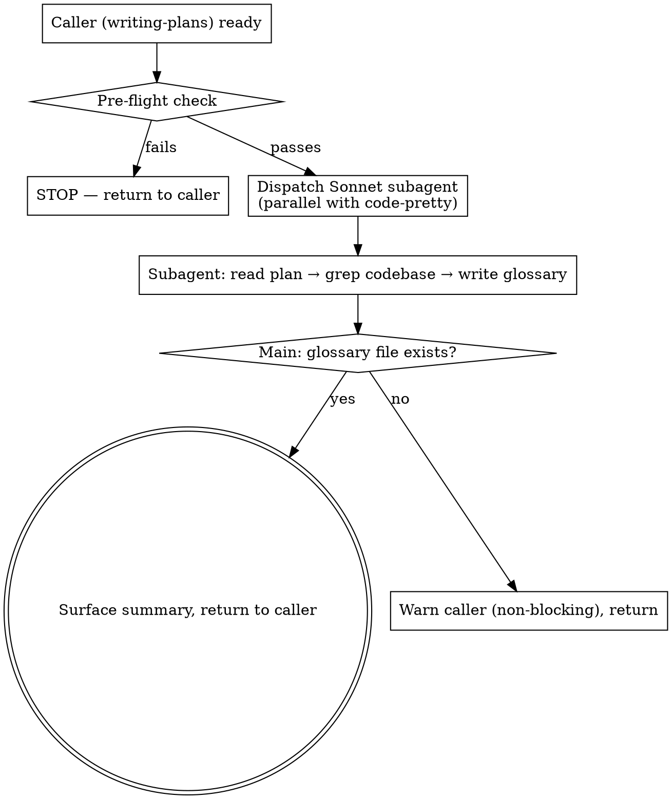

# Glossary (Handover Reference for the Implementation Plan)

This skill produces `<slug>-glossary.md`: a short reference document that lets a developer who has never seen this project read `<slug>-implementation-plan.md` without getting stuck on unfamiliar names.

The plan is the source of truth. The glossary is a derived reading aid — it is regenerated whenever the plan is rewritten, and it never edits the plan.

**Announce at start:** "구현계획서에 나오는 이름들을 정리한 용어집을 만들고 있습니다."

<HARD-GATE>
This skill runs during the `writing-plans` initial-creation loop, dispatched **in parallel with `code-pretty`** and **BEFORE `verifying-spec`**. It runs as many times as the review loop iterates (initial draft + each user-fix revision).

It STOPS firing the moment the first `change-history` entry has been logged on the plan. That boundary marks the doc as "live" — from then on, no glossary regeneration.

Specifically, glossary MUST NOT:
- Read or target `<slug>-requirements.md` / `<slug>-tech-design.md` as its source (implementation-plan only)
- Modify `<slug>-implementation-plan.md` in ANY way — not one byte, including its `## 변경이력` footer
- Run on a plan that already has a `## 변경이력` entry
- Be invoked from `auto-writing-plans` (auto-flow does not call it — same rule as `code-pretty`)

If you are unsure whether this is still the initial creation phase — STOP. Look for an existing `## 변경이력` footer with one or more entries. If ANY entry exists, skip this skill.
</HARD-GATE>

## When to Use

| Trigger (yes) | Anti-trigger (no) |
|---|---|
| `writing-plans` just wrote/rewrote `<slug>-implementation-plan.md`, no `## 변경이력` entries yet | The plan is live (first change-history entry logged) |
| User requested revision in the writing-plans review loop, agent rewrote — fire again alongside code-pretty | User asked to update wording in an already-live plan |
| Plan references classes / functions / variables / project-specific terms | `auto-writing-plans` flow (never fires there) |

## Why a Subagent (and which model)

Two reasons: the lookup work is codebase exploration (many Grep/Read calls that would flood the main context), and the output is an independent file, so nothing has to come back except a short summary.

**Always dispatch a subagent with `model: "sonnet"`.** The job needs real judgment — deciding which names a newcomer would actually stumble on — but not deep reasoning. Haiku under-explains and invents descriptions for symbols it did not open; Opus is overkill for a reference table.

## Process

### Step 1 — Pre-flight check

Before dispatching, run the deterministic helper:

```bash
source .venv/bin/activate && python -c "
import sys
from pathlib import Path
from scripts.preflight import glossary_check
result = glossary_check(Path('<TARGET>'))
print(f'ok={result.ok} reason={result.reason} | {result.human_reason}')
sys.exit(0 if result.ok else 1)
" 2>&1
```

**exit code 분기 (v1.1.15 user-gate 패턴 동일)**:

- **exit 0** → 검증 통과, Step 2 dispatch 진행.
- **exit 1** (helper semantic fail) → `human_reason` 노출 후 `AskUserQuestion` 게이트:
  - `"수정 후 재시도"` / `"강제 진행 (위험)"` (메인이 `⚠️ preflight 우회. <reason> 무시.` 한 줄 안내) / `"스킵 (이번만)"` (caller 에게 abnormal return).
- **exit ≠ 0,1** (invocation 실패) → stderr 전문 + `AskUserQuestion` 게이트:
  - `"직접 디버깅"` / `"skill 단계 스킵"`.

helper 의 검사: file 존재 / filename `*-implementation-plan.md` / 변경이력 footer 비어있음. `code_pretty_check` 와 달리 `**수정 후**` 블록 존재는 요구하지 않는다 — 코드 블록이 하나도 없는 계획서에도 용어집은 의미가 있다. 자세히는 `scripts/preflight.py:glossary_check`.

### Step 2 — Dispatch the Sonnet subagent

Use the `Agent` tool with these exact parameters:

- `subagent_type`: `general-purpose`
- `model`: `sonnet`
- `description`: `Glossary for <filename>`
- `prompt`: see template below

**Parallel dispatch (caller responsibility)**: `writing-plans` issues this `Agent` call and the `code-pretty` `Agent` call **in the same message** so they run concurrently. The two never touch the same file — code-pretty writes the plan, glossary writes `<slug>-glossary.md` — so there is no write conflict.

### Step 3 — Verify, surface summary, return to caller

After the subagent returns:

1. Confirm `<slug>-glossary.md` exists at the expected path (1 check)
2. Confirm the glossary has no `## 변경이력` heading (1 grep)
3. Confirm the subagent's report ends with `구현계획서 수정: 없음`. Do NOT try to prove this by comparing the plan's size or mtime — `code-pretty` is legitimately rewriting the same file in parallel, so any byte-level diff is unattributable. The read-only guarantee lives in the subagent prompt and its report line.
4. Surface the subagent's one-paragraph summary (항목 수 + 확인 못 한 이름 목록) to the caller
5. Return control to caller (writing-plans). Do NOT invoke change-history yourself.

If the glossary file is missing → warn the caller; caller decides whether to rerun or continue without it (the glossary is a reading aid, not a gate — a missing glossary must never block the approval gate).

## Output

Path: `docs/features/<date>-<slug>/<slug>-glossary.md` — same folder as the plan.

No `## 변경이력` footer. The glossary is a derived view, regenerated from the plan on each revision; a change log on a regenerated file would be noise. This is the one js-super feature-folder MD that is exempt from the change-history footer rule.

## Subagent Prompt Template

The dispatched subagent receives this exact prompt (filled in with target paths):

```
당신은 구현계획서를 처음 읽는 개발자를 위한 용어집을 씁니다.

읽을 파일: <PLAN_ABSOLUTE_PATH>
쓸 파일:   <GLOSSARY_ABSOLUTE_PATH>
프로젝트 루트: <REPO_ROOT>

# 독자 설정 (이게 전부입니다)

오늘 이 프로젝트에 처음 합류한 개발자가, 인수인계 문서 한 장만 받고 이 구현계획서를
읽으려 합니다. 그 사람이 계획서를 읽다가 "이게 뭐지" 하고 멈출 이름들을 미리 풀어주는 게
당신의 일입니다.

# 1단계 — 계획서에서 이름 뽑기

계획서 전체를 읽고, 본문·표·코드 블록에 등장하는 다음을 모읍니다:

- 클래스 / 타입 / 인터페이스 이름
- 함수 / 메서드 이름
- 중요한 변수 / 상수 / 설정 키 이름
- 파일 / 모듈 이름 중 역할이 이름만으로 안 드러나는 것

문서 작성 규약이나 필드 형식 같은 것은 모으지 않습니다. 코드에 실제로 존재하는
이름만 다룹니다.

# 2단계 — 실제 코드에서 확인하기 (건너뛰지 말 것)

모은 이름 각각을 프로젝트 루트에서 Grep / Glob 으로 찾습니다.

- **찾았으면**: 해당 파일을 열어 실제로 무엇을 하는지 확인하고, 그 근거로 설명을 씁니다.
  경로는 `path/to/file.ts:42` 형태로 적습니다.
- **못 찾았고 계획서가 새로 만든다고 한 것이면**: "이번에 새로 만듦" 으로 분류합니다.
- **못 찾았고 새로 만드는 것도 아니면**: 추측해서 쓰지 말고 "확인 못 함" 으로 적습니다.
  외부 라이브러리 심볼이면 그렇게 적습니다.

추측으로 채운 설명은 이 문서를 쓸모없게 만듭니다. 모르면 모른다고 적으세요.

# 3단계 — 걸러내기

모은 것을 전부 싣지 않습니다. 다음만 남깁니다:

- 이름만 봐서는 무슨 일을 하는지 알기 어려운 것
- 계획서가 쓰긴 하는데 배경 설명 없이 지나가는 것
- 비슷한 이름이 둘 이상이라 헷갈릴 수 있는 것

빼는 것: `id`, `name`, `useState`, `map`, `console.log` 처럼 어느 프로젝트에나 있고
설명이 필요 없는 것. 프레임워크 표준 API 도 그 프로젝트에서 특이하게 쓰는 게 아니면 뺍니다.

전체 항목이 30개를 넘어가면, 계획서를 읽는 데 실제로 필요한 순서로 잘라냅니다.
길어서 안 읽히는 용어집은 없는 것과 같습니다.

# 4단계 — 쓰기

아래 구조로 <GLOSSARY_ABSOLUTE_PATH> 에 Write 합니다. 내용이 없는 섹션은 통째로 뺍니다
(빈 표를 남기지 않습니다).

---
# 용어집: <피처 이름>

> 이 문서는 `<slug>-implementation-plan.md` 를 처음 읽는 사람을 위한 참고 자료입니다.
> 계획서가 바뀌면 다시 만들어지며, 내용이 어긋날 때는 계획서가 정본입니다.

## 한눈에 보기

<이 피처가 코드베이스의 어느 부분을 건드리는지 2~4문장. 어디서부터 읽으면 좋은지 한 줄.>

## 이번에 새로 만드는 것

| 이름 | 종류 | 위치 | 하는 일 |
|---|---|---|---|
| `TokenBucket` | 클래스 | `src/limit/bucket.ts` (신규) | 초당 요청 수를 세서 넘으면 막는다 |

## 이미 있는 것 (계획서가 건드리거나 불러 쓰는)

| 이름 | 종류 | 위치 | 하는 일 | 알아둘 점 |
|---|---|---|---|---|
| `SessionStore` | 클래스 | `src/auth/session.ts:18` | 로그인 세션을 메모리에 보관 | 프로세스가 죽으면 세션도 사라진다 |

## 헷갈리기 쉬운 짝

| 이것 | 저것 | 차이 |
|---|---|---|
| `userId` | `accountId` | 앞은 로그인한 사람을 가리키고 뒤는 결제가 청구되는 조직을 가리킨다. 같은 사람이라도 값이 다르다 |

## 확인 못 한 이름

| 이름 | 계획서에서 나온 곳 | 상태 |
|---|---|---|
| `LegacyBridge` | Task 4 | 코드베이스에서 못 찾음. 외부 의존성이거나 계획서 오탈자일 수 있음 |
---

# 쓰는 방식

설명 칸은 옆자리 동료에게 말해주듯 이어지는 문장으로 씁니다. 항목을 나열하고 기호로
잇는 메모가 아니라, 읽으면 그대로 이해되는 말이어야 합니다.

- **백틱은 "이름" 칸과 "위치" 칸에만** 씁니다. 설명 문장 안에서는 되도록 쓰지 않습니다.
  파일 확장자나 필드 이름을 언급할 때도 코드 표기 없이 풀어서 적습니다.
- 가운뎃점(·) 이나 슬래시로 항목을 늘어놓지 않습니다. 문장으로 잇습니다.
- "하는 일" 은 한 문장. 한 줄에 담기면 두 문장으로 늘리지 않습니다.
- 비유를 쓰지 않습니다. 그 이름이 실제로 무엇을 하는지 그대로 씁니다.
- 계획서 문장을 그대로 옮기지 않습니다. 처음 보는 사람이 이해할 말로 다시 씁니다.
- 영어 식별자는 이름 칸에 그대로 두고, 설명은 한국어로 씁니다.
- 마케팅 표현("강력한", "효율적인") 을 쓰지 않습니다.

이렇게 쓰지 마세요:

> `-requirements.md`/`-tech-design.md`/`-implementation-plan.md` 세 종류 파일에 대해
> 존재 여부·파일명 패턴·변경이력 유무를 확인하는 게이트. `generating-html` skill 의
> 명시 호출 전 검사로 쓰인다

이렇게 쓰세요:

> 요구사항서와 설계서, 구현계획서 세 종류를 대상으로 파일이 실제로 있는지, 이름이 정해진
> 형식에 맞는지, 변경이력이 아직 비어 있는지를 차례로 확인한다. 세 가지를 모두 통과해야
> 다음 단계로 넘어간다.

# 절대 하지 않는 것

- 구현계획서 파일을 Write / Edit 하지 않습니다. 읽기만 합니다.
- 용어집에 `## 변경이력` 을 넣지 않습니다.
- 코드를 고치지 않습니다. 어떤 소스 파일도 수정하지 않습니다.
- 열어보지 않은 심볼을 설명하지 않습니다. 안 열어봤으면 "확인 못 함" 입니다.
- 계획서의 결정을 평가하거나 대안을 제안하지 않습니다. "이 설계는 별로다", "이렇게 하는 게 낫다" 는 당신 몫이 아닙니다.

단, **사실 관찰은 적습니다.** 계획서가 쓰는 이름인데 선언하는 diff 가 어디에도 없거나,
검증 문구가 가리키는 대상이 Task 목록에 없으면 해당 항목의 설명 칸에 그대로 적습니다.
설계 비평이 아니라 "처음 읽는 사람이 여기서 막힌다" 는 사실 보고이고, 이게 이 문서의
값어치입니다. 판단이 섞이면 "(추정)" 을 붙여 추측임을 드러냅니다.

# 마지막에 보고할 것

Write 를 마친 뒤 아래 형식으로 한 문단만 돌려줍니다:

용어집 작성 완료 — <경로>
- 새로 만드는 것 N개 / 이미 있는 것 N개 / 헷갈리는 짝 N개
- 확인 못 한 이름: <목록, 없으면 "없음">
- 구현계획서 수정: 없음
```

## Process Flow



## Anti-Patterns

| Wrong | Right |
|---|---|
| Subagent edits the implementation plan | Read-only on the plan. The glossary is a separate file. |
| Listing every identifier in the plan | Only names a newcomer would stumble on. Noise makes it unread. |
| Describing a symbol without opening its file | Grep → open → describe. Never found = "확인 못 함". |
| Adding a `## 변경이력` footer to the glossary | Derived file, regenerated per revision. No change log. |
| Blocking the approval gate when the glossary fails | Reading aid, not a gate. Warn and continue. |
| Running it from `auto-writing-plans` | Auto-flow does not call it — same rule as code-pretty. |
| Running it after the plan goes live | HARD-GATE blocks this — pre-flight 변경이력 empty check. |
| Explaining names with metaphors | State what the code actually does. |

## Red Flags (STOP if you think these)

| Thought | Reality |
|---|---|
| "The plan is short, I'll write the glossary inline in main context" | Subagent dispatch is mandatory — the codebase lookup floods main context. |
| "This name is obviously a cache, I'll just say so" | Obvious-looking names lie. Open the file or mark it 확인 못 함. |
| "More entries means a more useful glossary" | The opposite. A 60-row table gets skipped entirely. |
| "I'll wait for the glossary before running verifying-spec" | Both run before verifying-spec, in parallel with code-pretty. Don't serialize. |

## Acceptance

A glossary run is correct when ALL hold:

1. Pre-flight passed (file exists, target = implementation-plan.md, 변경이력 empty)
2. Subagent was dispatched with `model: sonnet` and the prompt above, in the same message as the `code-pretty` dispatch
3. `<slug>-glossary.md` exists in the feature folder, with no `## 변경이력` footer
4. The subagent's report line reads `구현계획서 수정: 없음`
5. Every "이미 있는 것" row cites a real `file:line`; unresolved names appear under 확인 못 한 이름 instead of being described
6. Summary surfaced to the caller for the user review gate

## Related Skills

- `writing-plans` — dispatches this in parallel with `code-pretty`, before `verifying-spec`
- `code-pretty` — the parallel sibling; formats the plan's `수정 후` code blocks
- `verifying-spec` — runs after both, on the prettified plan
- `change-history` — invoked by the caller after user approval; its first entry closes the door on both this skill and code-pretty
