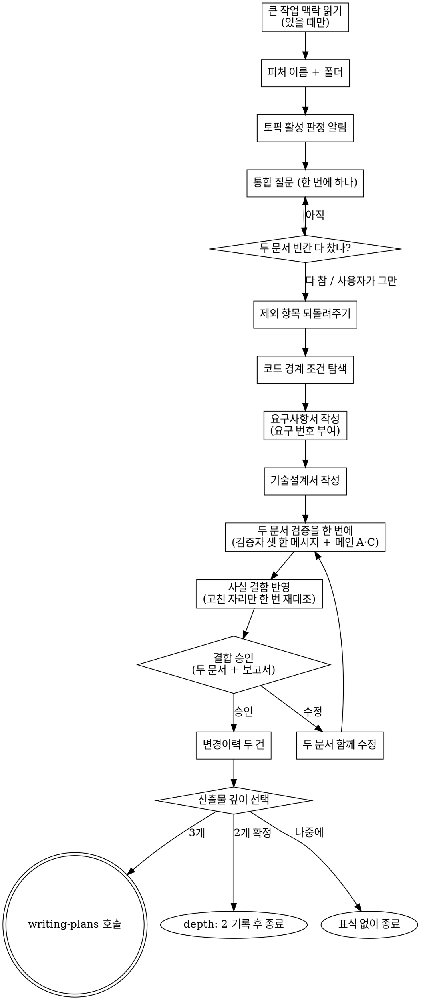

# Paired Spec Writing → requirements + tech-design (한 번에 작성)

기존 흐름은 요구사항 대화 → 요구사항서 → 기술설계 대화 → 기술설계서 순서로 문서마다 대화를 따로 한다. 이 스킬은 대화를 한 번으로 합치고, 대화가 끝나면 메인이 두 문서를 연달아 쓴 뒤 두 문서의 검증을 한 번에 돌린다. 기존 `/brainstorm` → `/design-tech` 흐름은 그대로 있고, 이 스킬은 그 옆에 있다.

작성을 보조 에이전트 둘에게 나눠 맡기지 않는 이유 (실측 2026-09-24): 문서 작성 시간은 글 생성 속도에 묶여 있어 동시에 써도 짧은 문서 몫 (30초~1분) 만 준다. 대신 작성자에게 넘길 대화 요약을 만드는 단계가 생기고, 두 작성자가 같은 요약을 서로 다르게 옮겨 두 문서가 어긋났다. 대화를 전부 아는 메인이 연달아 쓰면 요약 단계와 불일치가 함께 사라진다.

산출물 두 개의 형식은 기존 흐름과 똑같다. 다음 단계 (`writing-plans` · `verifying-spec` · `change-propagation`) 는 두 흐름의 문서를 구분하지 않는다.

## 사용자 질문 룰 — 항상 AskUserQuestion

이 흐름 안에서 사용자에게 묻는 것은 모두 `AskUserQuestion` 도구로 한다. 산문으로 "~ 할까요?" 를 던지지 않는다. 알람 훅이 도구 호출만 잡는다.

- 소크라테스 자유 응답이 필요한 질문은 question 본문에 "자유롭게 답해주세요. 별도 옵션 선택 불필요" 를 적고 dummy option `[알겠음]` 하나만 둔다. 응답은 다음 turn 의 산문으로 받는다
- 사용자가 "Other" 로 모호하게 답하거나 "모르겠음" 류로 답하면 그 질문만 단독으로 다시 부르고 산문 설명을 덧붙인다. 다음 단계로 자동 진행하지 않는다
- 예외: 답에 "추천대로" 처럼 판단을 맡기는 말이 있으면 모호한 답이 아니다. 다시 묻지 않고 추천안을 채택한다. 3단 사다리도 돌리지 않는다

<HARD-GATE>
- 두 문서는 메인이 직접 쓴다. 작성을 보조 에이전트에게 맡기지 않는다 (검증자는 띄운다)
- 기존 `brainstorming` / `tech-design` 스킬을 Skill 도구로 부르지 않는다. 그 두 스킬의 본문은 규칙 원본으로 **읽기만** 한다
- 사용자 승인 전에는 변경이력을 쓰지 않는다. 승인 없이 다음 단계 스킬을 부르지 않는다
- 코드를 쓰지 않는다
</HARD-GATE>

## Checklist

1. **큰 작업 맥락 읽기** — 진행 중인 큰 작업이 있을 때만. 없으면 무출력
2. **피처 이름 확인과 폴더 만들기** — 질문 하나
3. **기술설계 토픽 판정 알림** — 활성 토픽 한 줄 알림
4. **통합 질문 대화** — 한 번에 하나, 두 문서의 빈칸이 다 찰 때까지
5. **제외 항목 되돌려주기** — 모아서 한 번 보여주고 추가만 받기
5.5. **코드 경계 조건 탐색** — 문서를 쓰기 전에 메인이 코드를 한 번 더 본다
6. **요구사항서 작성** — 요구 번호를 여기서 매긴다
7. **기술설계서 작성** — 요구사항서의 번호와 결정을 그대로 이어 받는다
8. **두 문서 검증을 한 번에** — 검증자 셋을 한 메시지로 띄우고 메인 검증을 함께 돌린다
9. **사실 결함 반영** — 승인 전에 고치고, 고친 자리만 한 번 다시 대조한다
10. **두 문서 한 번에 승인받기** — 수정 요청이면 두 문서를 함께 고치고 재검증
11. **변경이력 두 건 기록** — 요구사항서 · 기술설계서 각각
12. **산출물 깊이 선택** — 구현계획서까지 / 두 문서로 종료 / 나중에

다음 스킬을 부르기 전에 위 항목의 task 를 모두 완료로 바꾼다.

## 규칙 원본 경로

이 스킬은 불릴 때 자기 폴더 경로 (Base directory) 를 받는다. 기존 두 스킬 본문의 절대 경로는 그 한 단계 위에서 만든다.

| 이름 | 경로 |
|---|---|
| 요구사항 규칙 | `<Base directory>/../brainstorming/SKILL.md` |
| 기술설계 규칙 | `<Base directory>/../tech-design/SKILL.md` |
| 단독 검증자 지시문 | `<Base directory>/../verifying-spec/clean-solo-prompt.md` |

메인이 규칙 원본에서 읽는 섹션은 아래와 같다. 결합 승인과 깊이 선택 게이트는 원본에서 읽지 않고 이 스킬 10 · 12 단계에 옮겨 두었다.

| 원본 | 섹션 | 쓰는 단계 |
|---|---|---|
| 요구사항 규칙 | `## 큰 작업 맥락` · `## Socratic Procedure` | 1 · 4 · 5 |
| 요구사항 규칙 | `## Document Schema` · `## 산출물 문서 스타일` · `## Self-Review` | 6 |
| 기술설계 규칙 | `## Adaptive Topics` | 3 · 4 |
| 기술설계 규칙 | `## Schema` · `## 산출물 문서 스타일` · `### 도면 형식` · `## 서술 수준 — 이름보다 역할` · `## Self-Review` | 7 |

제목을 못 찾으면 파일 전체에서 역할이 같은 섹션 (이름이 바뀐 섹션) 을 찾아 그 규칙을 쓰고, 대신 쓴 제목을 승인 메시지에 한 줄 적는다 — 결합 메모의 제목 목록을 고칠 신호다.

## Process Flow



## Process (detail)

**1. 큰 작업 맥락 읽기**

요구사항 규칙의 `## 큰 작업 맥락` 섹션을 그대로 따른다. 진행 중인 큰 작업이 없으면 아무 출력 없이 넘어간다. 있고 이번 피처가 속하면 소속 표식 한 줄 (`> **큰 작업**: <폴더 이름>`) 을 요구사항서 머리에 넣기로 기억한다. 기술설계서에는 넣지 않는다.

**2. 피처 이름 확인과 폴더 만들기**

인자에서 `--no-clean-verify` 토큰을 먼저 떼어 기억해 둔다 (8 단계에서 쓴다). 남은 문자열이 주제다. 주제가 왔으면 그것으로 피처 이름 후보를 만들어 한 번 확인받는다. 이름에서 slug (공백 → 하이픈) 를 만들고 `docs/features/<오늘 날짜>-<slug>/` 폴더를 만든다. 두 산출물의 절대 경로를 여기서 정한다.

**3. 기술설계 토픽 판정 알림**

기술설계 규칙의 `## Adaptive Topics` 판정 규칙을 사용자의 첫 입력에 적용한다. 요구사항서가 아직 없으므로 첫 입력과 프로젝트 탐색 결과로 판단한다. 한 줄로 알린다.

```
ℹ️ 기술설계 활성 토픽은 1, 2, 5, 6 과 <조건부 활성> 입니다. <비활성 토픽> 은 비활성입니다 (이유: ...). 대화 중 달라지면 다시 알립니다.
```

대화에서 조건부 토픽의 판단 근거가 바뀌면 그 자리에서 판정을 고치고 한 줄로 다시 알린다.

**4. 통합 질문 대화**

요구사항 규칙의 `## Socratic Procedure` 블록 1 (질문) · 블록 2 (대안) 를 따른다. 한 번에 하나만 묻고, 방향을 정할 지점마다 2~3안을 고정 비교축 셋 (무엇이 달라지는가 · 무엇을 포기하는가 · 되돌리는 비용) 으로 보이고 추천을 먼저 말한다. 사용자가 모른다고 하면 그 절차의 3단 사다리를 쓴다.

커버 목록을 두 문서 분량으로 넓힌다.

| 묶음 | 채울 것 |
|---|---|
| 요구사항 | 무엇을 만드는가 · 왜 필요한가 · 성공 판정 기준 · 하지 않는 것 · 제약과 의존 |
| 기술설계 | 아키텍처 방향 · 영향 범위 · 핵심 결정 (대안 비교) · 위험 · 활성인 조건부 토픽 (데이터 모델 / 외부 인터페이스 / 테스트 전략) |

기술설계 묶음에서 사용자에게 묻는 것은 **사용자가 판단할 수 있는 것**뿐이다 — 사용자가 보게 될 동작 차이, 비용·속도·범위 같은 맞바꿈. 필터를 어느 파일에서 거를지, 출력 모양, 내부 함수 구성 같은 순수 구현 결정은 묻지 않는다. 메인이 추천안으로 정하고 기술설계서의 결정 표에 "메인 추천" 으로 적는다. 이 결정들은 10 단계 승인 메시지에 "메인이 정한 기술 결정" 목록으로 한 번에 보여준다.

질문 개수 상한은 없다. 두 묶음이 다 차면 멈춘다. 이미 답이 나온 항목은 다시 묻지 않는다. 사용자가 먼저 그만하자고 하면 채워진 것까지만 쓰고 빈칸은 "미정 — <이유>" 로 남긴다.

대화가 독립된 여러 피처로 드러나면 계속하기 전에 나누자고 제안한다.

**5. 제외 항목 되돌려주기**

요구사항 규칙 블록 3 의 제외 항목 취합 규칙대로, 대화 중 나온 제외를 모아 한 번 보여주고 추가할 것만 받는다. 빈 상태에서 "범위 밖이 뭔가요" 라고 묻지 않는다.

**5.5. 코드 경계 조건 탐색**

대화 중에 본 코드는 질문에 필요한 만큼만이다. 문서에 적을 사실 (개수 · 파일 · 호출처 · 경계 조건) 은 쓰기 전에 영향 범위의 코드를 한 번 더 읽어 확인한다. 틀린 사실은 두 문서에 함께 들어가고 검증에서야 걸린다.

| 확인할 것 | 예 |
|---|---|
| 입력 해석 | 인자 파서가 특정 문자 (`-` 로 시작하는 값, 공백, 따옴표) 를 어떻게 다루는가 |
| 대체 값 | 값이 없을 때 넣는 문구나 기본값이 새 동작에 끼어드는가 |
| 버전·캐시 | 옛 버전 파일이 남아 있을 때 새 동작이 어떻게 깨지는가 |
| 인코딩·정규화 | 문자열 비교가 정규화 차이로 어긋나는가 |
| 기존 테스트 | 바꾸려는 함수를 테스트가 직접 부르고 반환값을 단언하는가 |
| 개수·존재 | 문서에 적을 개수 · 파일 · 호출처를 실제로 세어 확인했는가 |

찾은 것은 기술설계서의 위험에 적고, 대응이 기술 판단이면 메인이 추천값으로 정해 결정 표에 넣는다. 미정으로 남기는 것은 사용자만 정할 수 있는 항목뿐이다.

**6. 요구사항서 작성**

요구사항 규칙의 `## Document Schema` · `## 산출물 문서 스타일` 대로 쓰고 `## Self-Review` 로 점검한다. 규칙 원본의 다음 단계 안내 문장은 이 흐름에 맞게 "기술설계서는 같은 폴더의 `<slug>-tech-design.md` 에 함께 작성됨" 으로 바꿔 쓴다.

- 요구 번호는 여기서 매긴다. 기술설계서는 이 번호를 그대로 쓴다
- 대화의 결정 중 **사용자가 보게 될 동작 결정**만 옮긴다. 필터를 어디서 거를지, 출력 형식 같은 구현 방식 결정은 옮기지 않는다
- 큰 작업 소속 표식이 있으면 머리에 한 줄

**7. 기술설계서 작성**

기술설계 규칙의 `## Schema` · `## 산출물 문서 스타일` · `### 도면 형식` · `## 서술 수준 — 이름보다 역할` 대로 쓰고 `## Self-Review` 로 점검한다.

- 요구사항서를 방금 쓴 그대로 이어 받는다. 요구 번호 · 결정 · 제외 항목을 다시 해석하지 않는다
- 요구사항서의 표를 다시 싣지 않는다. 요구 번호로 가리킨다
- 결정 표에는 사용자 결정과 구현 방식 결정을 모두 싣고, 결정마다 누가 정했는지 (사용자 / 메인 추천) 를 적는다
- 5.5 에서 확인한 코드 사실만 적는다. 확인하지 않은 개수나 경로를 추측으로 채우지 않는다

**8. 두 문서 검증을 한 번에**

`verifying-spec` 스킬을 부른다. 대상은 기술설계서, 상위 문서는 요구사항서다. 그 스킬이 무맥락 검증자 둘 (단독 · 대조) 을 한 메시지로 띄울 때, **같은 메시지에 요구사항서 단독 검증자를 하나 더** 넣는다. 지시문은 단독 검증자 지시문을 그대로 쓰고 `<TARGET_PATH>` 에 요구사항서 경로만 넣는다. `model` 인자는 넘기지 않는다.

```
ℹ️ 두 문서 검증을 한 번에 돌립니다 — 기술설계서 단독 · 대조, 요구사항서 단독 (검증자 셋, 백그라운드).
```

메인은 검증자를 기다리지 않고 기술설계서 A·C 검증을 한다. 끝나면 세 검증자 결과를 모두 받아 `verifying-spec` 의 중재 규칙 (사실 판정 → 성격 분리, 기각 사유 기록) 대로 한 보고서로 합친다. 요구사항서 단독 검증자의 지적은 보고서의 무맥락 검증 섹션에 "요구사항서 단독 검증자" 줄로 싣는다.

사용자가 `--no-clean-verify` 를 명시했으면 `verifying-spec` 에 그대로 넘기고, 요구사항서 단독 검증자도 띄우지 않는다. 검증 스킬 끝의 "진행 / 수정" 은 따로 묻지 않고 10 단계 결합 승인으로 합친다.

**9. 사실 결함 반영**

검증 결과 중 **사실 결함**은 승인 게이트 전에 메인이 고친다 — 상위 대비 누락 · 두 문서 사이 모순 · 코드 사실과 다른 서술 · 문서대로 만들 수 없게 만드는 모호함. 한 문서의 결정을 고치면 다른 문서의 같은 결정도 함께 고친다.

고친 뒤에는 **고친 자리만** 메인이 상위 문서와 코드에 한 번 다시 대조한다. `verifying-spec` 전체를 다시 부르지 않는다. 재대조에서 또 걸린 것은 더 고치지 않고 승인 메시지에 "남은 결함" 으로 싣는다 — 반복이 끝나지 않는 것을 막는 상한이다.

반영 여부가 판단 사안인 권장 (설계 방향을 바꾸는 것) 은 고치지 않고 승인 메시지에 목록으로 싣는다. 사용자가 짚어야만 고쳐지는 구조로 두지 않는다.

**10. 두 문서 한 번에 승인받기**

두 문서 RAW 전체와 검증 보고서를 한 메시지에 싣는다. 같은 메시지에 "메인이 정한 기술 결정" 목록 (기술설계서 결정 표 중 메인 추천으로 정한 것), 9 단계에서 이미 고친 사실 결함 목록, 남은 결함, 반영하지 않은 판단 사안 권장 목록을 함께 싣는다. 문서별로 끊어 승인받지 않는다.

```json
{
  "question": "<slug>-requirements.md + <slug>-tech-design.md (+ 검증 보고서) 승인하고 진행?",
  "header": "두 문서 승인",
  "multiSelect": false,
  "options": [
    {"label": "예 — 승인", "description": "승인하고 변경이력 두 건 + 산출물 깊이 선택으로 진행"},
    {"label": "아니오 — 수정", "description": "피드백을 받아 두 문서를 함께 고친 뒤 다시 보여줌"}
  ]
}
```

수정 요청은 메인이 직접 고친다. 한 문서의 결정을 고치면 다른 문서의 같은 결정도 함께 고친다. 어느 문서든 바뀌었으면 8 · 9 를 다시 돌린 뒤 두 문서와 새 보고서를 다시 한 번에 보여준다. "어디를 고칠까요" 라고 되묻지 않는다.

**11. 변경이력 두 건 기록**

`change-history` 스킬로 두 건을 쓴다.

| 문서 | 태그 | 이유 | 무엇이 |
|---|---|---|---|
| 요구사항서 | `[요구사항-수정]` | 신규 피처 — 통합 대화 후 두 문서 작성 | 요구사항서 전체 (요구 1..N) |
| 기술설계서 | `[개발방향-수정]` | 신규 피처 — 통합 대화 후 두 문서 작성 | 기술설계서 전체 (§1~§7) |

두 번째 건의 연관 항목에 첫 번째 건의 CH-id 를 적는다.

**12. 산출물 깊이 선택**

기존 기술설계 흐름의 깊이 선택과 같은 질문 · 같은 동작이다.

```json
{
  "question": "두 문서가 확정됐습니다. 산출물을 어디까지 만들까요?",
  "header": "산출물 깊이",
  "multiSelect": false,
  "options": [
    {"label": "구현계획서까지 진행 (3개)", "description": "/write-plan 자동 invoke — 기존 기본 흐름"},
    {"label": "여기서 종료 (2개 확정)", "description": "frontmatter depth: 2 기록 — 이 피처는 tech-design 까지"},
    {"label": "나중에 결정", "description": "표식 없이 종료 — 나중에 /write-plan 수동 실행"}
  ]
}
```

- "구현계획서까지 진행" → `writing-plans` 스킬을 Skill 도구로 부른다
- "여기서 종료" → 기술설계서 맨 위에 프론트매터 (`depth: 2` + `depth_reason: 사용자 선택`) 를 쓰고, `change-history` 로 `[개발방향-수정]` 한 건 (이유: 2-doc 확정) 을 남긴 뒤 `ℹ️ 이 피처는 2개 문서로 확정됐습니다. 구현이 필요해지면 /write-plan 으로 승격하세요.` 를 출력하고 멈춘다. 요구사항서 머리에 소속 표식이 있으면 `ℹ️ 큰 작업에 속한 피처입니다. 구현이 끝나면 /epic-next 로 파트를 마무리하세요.` 를 한 줄 더 붙인다
- "나중에 결정" → `ℹ️ 알겠습니다. /write-plan 은 나중에 직접 실행해주세요.` 를 출력하고 멈춘다

## Anti-Patterns

| Wrong | Right |
|---|---|
| 작성을 보조 에이전트에게 나눠 맡김 | 메인이 연달아 쓴다. 요약 단계와 두 문서 불일치가 생긴다 (실측) |
| 요구사항서 단독 검증자를 따로 한 메시지로 띄움 | `verifying-spec` 의 두 검증자와 같은 메시지에 |
| 검증자에 `model` 인자 지정 | 생략 — 메인 모델 상속 |
| 기존 `brainstorming` / `tech-design` 스킬을 Skill 도구로 호출 | 본문을 규칙 원본으로 읽기만 한다 |
| 기술설계서가 요구 번호를 새로 매기거나 요구사항서 표를 다시 실음 | 요구사항서의 번호를 그대로 쓰고 번호로 가리킨다 |
| 요구사항서에 구현 방식 결정을 옮김 | 사용자가 보는 동작 결정만. 구현 방식은 기술설계서에 |
| 문서별로 따로 승인 | 두 문서 + 보고서를 한 번에 |
| 사실 결함을 고친 뒤 `verifying-spec` 전체를 다시 부름 | 고친 자리만 한 번 재대조, 남은 것은 승인 메시지로 |
| 사용자 수정 요청 반영 후 재검증 생략 | 어느 문서든 바뀌면 8 · 9 를 다시 |
| 승인 전에 변경이력 기록 | 승인 뒤 두 건 |
| 코드를 다시 안 보고 문서 작성 | 5.5 에서 확인한 사실만 적는다 |
| 기술 미정을 문서에 미정으로 남김 | 메인이 추천값으로 정한다. 미정은 사용자만 정할 수 있는 것 |
| 순수 구현 결정을 사용자에게 질문 | 메인이 정하고 승인 메시지에 목록으로 보인다 |
| "추천대로" 답에 재질문 | 추천안 채택 |
| 검증의 사실 결함을 사용자가 짚을 때까지 방치 | 승인 전에 고친다 |

## Related Skills

- `brainstorming` — 요구사항 규칙 원본 (읽기만)
- `tech-design` — 기술설계 규칙 원본 (읽기만)
- `verifying-spec` — 8 단계 (단독 검증자 지시문도 여기서 빌린다)
- `change-history` — 11 단계
- `writing-plans` — 12 단계에서 3개 선택 시
