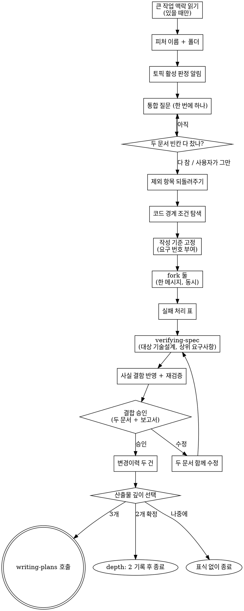

# Paired Spec Writing → requirements + tech-design (동시 작성)

기존 흐름은 요구사항 대화 → 요구사항서 → 기술설계 대화 → 기술설계서 순서로 문서마다 대화를 따로 한다. 이 스킬은 대화를 한 번으로 합치고, 대화가 끝나면 두 문서를 보조 에이전트 둘이 동시에 쓴다. 기존 `/brainstorm` → `/design-tech` 흐름은 그대로 있고, 이 스킬은 그 옆에 있다.

산출물 두 개의 형식은 기존 흐름과 똑같다. 다음 단계 (`writing-plans` · `verifying-spec` · `change-propagation`) 는 두 흐름의 문서를 구분하지 않는다.

## 사용자 질문 룰 — 항상 AskUserQuestion

이 흐름 안에서 사용자에게 묻는 것은 모두 `AskUserQuestion` 도구로 한다. 산문으로 "~ 할까요?" 를 던지지 않는다. 알람 훅이 도구 호출만 잡는다.

- 소크라테스 자유 응답이 필요한 질문은 question 본문에 "자유롭게 답해주세요. 별도 옵션 선택 불필요" 를 적고 dummy option `[알겠음]` 하나만 둔다. 응답은 다음 turn 의 산문으로 받는다
- 사용자가 "Other" 로 모호하게 답하거나 "모르겠음" 류로 답하면 그 질문만 단독으로 다시 부르고 산문 설명을 덧붙인다. 다음 단계로 자동 진행하지 않는다
- 예외: 답에 "추천대로" 처럼 판단을 맡기는 말이 있으면 모호한 답이 아니다. 다시 묻지 않고 추천안을 채택한다. 3단 사다리도 돌리지 않는다

<HARD-GATE>
- 두 문서는 보조 에이전트 둘이 쓴다. 메인은 실패 처리 표가 허락한 경우에만 직접 쓴다
- 기존 `brainstorming` / `tech-design` 스킬을 Skill 도구로 부르지 않는다. 그 두 스킬의 본문은 규칙 원본으로 **읽기만** 한다
- 사용자 승인 전에는 변경이력을 쓰지 않는다. 승인 없이 다음 단계 스킬을 부르지 않는다
- 코드를 쓰지 않는다
</HARD-GATE>

## Checklist

1. **큰 작업 맥락 읽기** — 진행 중인 큰 작업이 있을 때만. 없으면 무출력
2. **피처 이름 확인과 폴더 만들기** — 질문 하나
3. **기술설계 토픽 판정 알림** — 활성 토픽 한 줄 알림
4. **통합 질문 대화** — 한 번에 하나, 두 문서의 빈칸이 다 찰 때까지
5. **제외 항목 되돌려주기** — 모아서 한 번 보여주고 추가만 받기
5.5. **코드 경계 조건 탐색** — 작성 기준을 정하기 전에 메인이 코드를 한 번 더 본다
6. **작성 기준 고정** — 두 작성자가 똑같이 볼 짧은 기준 한 메시지
7. **두 문서 동시 작성** — 대화를 물려받는 fork 두 개를 한 메시지로
8. **작성 결과 확인** — 실패 처리 표대로
9. **사양 정합성 검증** — 기술설계서를 요구사항서와 대조하고, 사실 결함은 승인 전에 고친다
10. **두 문서 한 번에 승인받기** — 수정 요청이면 두 문서를 함께 고치고 재검증
11. **변경이력 두 건 기록** — 요구사항서 · 기술설계서 각각
12. **산출물 깊이 선택** — 구현계획서까지 / 두 문서로 종료 / 나중에

다음 스킬을 부르기 전에 위 항목의 task 를 모두 완료로 바꾼다.

## 규칙 원본 경로

이 스킬은 불릴 때 자기 폴더 경로 (Base directory) 를 받는다. 기존 두 스킬 본문의 절대 경로는 그 한 단계 위에서 만든다.

| 이름 | 경로 |
|---|---|
| 요구사항 규칙 | `<Base directory>/../brainstorming/SKILL.md` |
| 기술설계 규칙 | `<Base directory>/../tech-design/SKILL.md` |
| 요구사항 작성 지시문 | `<Base directory>/requirements-writer-prompt.md` |
| 기술설계 작성 지시문 | `<Base directory>/design-writer-prompt.md` |

메인이 규칙 원본에서 읽는 섹션은 셋이다 — 요구사항 규칙의 `## 큰 작업 맥락` · `## Socratic Procedure`, 기술설계 규칙의 `## Adaptive Topics`. 결합 승인과 깊이 선택 게이트는 원본에서 읽지 않고 이 스킬 10 · 12 단계에 옮겨 두었다. 작성 에이전트가 읽을 섹션은 각 지시문에 적혀 있다.

## Process Flow



## Process (detail)

**1. 큰 작업 맥락 읽기**

요구사항 규칙의 `## 큰 작업 맥락` 섹션을 그대로 따른다. 진행 중인 큰 작업이 없으면 아무 출력 없이 넘어간다. 있고 이번 피처가 속하면 소속 표식 한 줄 (`> **큰 작업**: <폴더 이름>`) 을 작성 기준에 넣기로 기억한다.

**2. 피처 이름 확인과 폴더 만들기**

인자에서 `--no-clean-verify` 토큰을 먼저 떼어 기억해 둔다 (9 단계에서 쓴다). 남은 문자열이 주제다. 주제가 왔으면 그것으로 피처 이름 후보를 만들어 한 번 확인받는다. 이름에서 slug (공백 → 하이픈) 를 만들고 `docs/features/<오늘 날짜>-<slug>/` 폴더를 만든다. 두 산출물의 절대 경로를 여기서 정한다.

**3. 기술설계 토픽 판정 알림**

기술설계 규칙의 `## Adaptive Topics` 판정 규칙을 사용자의 첫 입력에 적용한다. 요구사항서가 아직 없으므로 첫 입력과 프로젝트 탐색 결과로 판단한다. 한 줄로 알린다.

```
ℹ️ 기술설계 활성 토픽은 1, 2, 5, 6 과 <조건부 활성> 입니다. <비활성 토픽> 은 비활성입니다 (이유: ...). 대화 중 달라지면 다시 알립니다.
```

대화에서 조건부 토픽의 판단 근거가 바뀌면 그 자리에서 판정을 고치고 한 줄로 다시 알린다.

**4. 통합 질문 대화**

요구사항 규칙의 `## Socratic Procedure` 블록 1 (질문) · 블록 2 (대안) 를 따른다. 한 번에 하나만 묻고, 방향을 정할 지점마다 2~3안을 고정 비교축 셋 (무엇이 달라지는가 · 무엇을 포기하는가 · 되돌리는 비용) 으로 보이고 추천을 먼저 말한다. 사용자가 모른다고 하면 그 절차의 3단 사다리를 쓴다.

커버 목록을 두 문서 분량으로 넓힌다.

| 묶음 | 채울 것 |
|---|---|
| 요구사항 | 무엇을 만드는가 · 왜 필요한가 · 성공 판정 기준 · 하지 않는 것 · 제약과 의존 |
| 기술설계 | 아키텍처 방향 · 영향 범위 · 핵심 결정 (대안 비교) · 위험 · 활성인 조건부 토픽 (데이터 모델 / 외부 인터페이스 / 테스트 전략) |

기술설계 묶음에서 사용자에게 묻는 것은 **사용자가 판단할 수 있는 것**뿐이다 — 사용자가 보게 될 동작 차이, 비용·속도·범위 같은 맞바꿈. 필터를 어느 파일에서 거를지, 출력 모양, 내부 함수 구성 같은 순수 구현 결정은 묻지 않는다. 메인이 추천안으로 정하고 작성 기준의 "구현 방식 결정" 에 적는다. 이 결정들은 10 단계 승인 메시지에 "메인이 정한 기술 결정" 목록으로 한 번에 보여준다.

질문 개수 상한은 없다. 두 묶음이 다 차면 멈춘다. 이미 답이 나온 항목은 다시 묻지 않는다. 사용자가 먼저 그만하자고 하면 채워진 것까지만 작성 기준에 담고 빈칸은 "미정 — <이유>" 로 넘긴다.

대화가 독립된 여러 피처로 드러나면 계속하기 전에 나누자고 제안한다.

**5. 제외 항목 되돌려주기**

요구사항 규칙 블록 3 의 제외 항목 취합 규칙대로, 대화 중 나온 제외를 모아 한 번 보여주고 추가할 것만 받는다. 빈 상태에서 "범위 밖이 뭔가요" 라고 묻지 않는다.

**5.5. 코드 경계 조건 탐색**

작성 fork 는 메인이 대화에서 확인한 사실을 그대로 믿는다. 메인이 놓친 코드 사실은 두 문서 어디에도 들어가지 않는다. 그래서 작성 기준을 정하기 전에 메인이 영향 범위의 코드를 한 번 더 읽고 아래를 확인한다.

| 확인할 것 | 예 |
|---|---|
| 입력 해석 | 인자 파서가 특정 문자 (`-` 로 시작하는 값, 공백, 따옴표) 를 어떻게 다루는가 |
| 대체 값 | 값이 없을 때 넣는 문구나 기본값이 새 동작에 끼어드는가 |
| 버전·캐시 | 옛 버전 파일이 남아 있을 때 새 동작이 어떻게 깨지는가 |
| 인코딩·정규화 | 문자열 비교가 정규화 차이로 어긋나는가 |
| 기존 테스트 | 바꾸려는 함수를 테스트가 직접 부르고 반환값을 단언하는가 |
| 개수·존재 | 작성 기준에 적을 개수 · 파일 · 호출처를 실제로 세어 확인했는가 (잘린 출력은 근거가 아니다) |

찾은 것은 대화에 밝히고, 대응이 기술 판단이면 메인이 추천값으로 정해 "구현 방식 결정" 에 넣는다. 작성 기준의 미정에는 사용자만 정할 수 있는 항목만 남긴다.

**6. 작성 기준 고정**

두 작성자는 fork 라서 이 대화 전체를 물려받는다. 대화 요약을 따로 쓰지 않는다. 대신 대화 끝에서 한 메시지로 짧은 "작성 기준" 을 사용자에게 보여 준다. 두 fork 가 이 메시지를 똑같이 보므로 번호와 결정이 두 문서에서 어긋나지 않는다.

```
작성 기준 — <피처 이름>
요구 항목: 요구 1: <한 문장> / 요구 2: ... (메인이 여기서 번호를 매긴다)
사용자가 보는 동작 결정: <결정 지점 — 고른 안> 한 줄씩
구현 방식 결정: <결정 지점 — 고른 안 (사용자 / 메인 추천)> 한 줄씩
제외 항목: <항목> 한 줄씩
기술설계 토픽: 활성 <번호> / 비활성 <번호 — 이유>
미정 (사용자만 정할 수 있는 것): <항목 — 이유, 없으면 없음>
```

- 한 항목은 한 줄이다. 대안 비교와 근거는 대화에 이미 있으므로 다시 쓰지 않는다
- 코드 사실 (개수 · 파일 · 호출처) 은 5.5 에서 실제로 확인한 값만 적는다. 명령 출력이 잘렸으면 그 출력을 근거로 삼지 않는다
- 요구 항목마다 확인 방법이 대화나 5.5 결과에 있는지 훑는다. 없는 항목은 구현 방식 결정에 한 줄 추가한다
- 빈칸을 "—" 로 두지 않는다. 해당이 없으면 "없음" 이라고 쓴다
- 두 결정 목록은 섞지 않는다. 요구사항서에는 사용자가 보는 동작 결정만 들어간다

**7. 두 문서 동시 작성 (fork 두 개)**

- `Agent` 도구로 `subagent_type: "fork"` 호출 두 개를 **한 메시지에** 묶는다. 나눠 부르면 대기 시간이 합쳐져 동시 작성의 의미가 없다
- 지시문은 `requirements-writer-prompt.md` · `design-writer-prompt.md` 의 코드 블록을 쓰고, 각 파일의 치환 규칙대로 자리만 채운다
- fork 는 메인 모델과 대화를 그대로 물려받는다. 요약이나 대화 원문을 지시문에 붙이지 않는다
- 두 fork 의 결과를 모두 받은 뒤 다음 단계로 간다

호출 직후 한 줄 알린다.

```
ℹ️ 요구사항서와 기술설계서를 이 대화를 물려받은 보조 에이전트 두 개가 동시에 쓰고 있습니다.
```

**fork 를 쓸 수 없을 때** — 하네스에 fork 타입이 없으면 (호출이 "not found" 로 실패하거나 Claude Code 가 아닌 하네스) 메인이 두 문서를 직접 쓴다. 요구사항서를 먼저, 기술설계서를 다음에 쓴다. 규칙 섹션과 자체 점검은 두 지시문에 적힌 것과 같다. 이 경우 8 단계는 건너뛴다.

**8. 작성 결과 확인**

두 보고의 Status 와 파일 존재를 확인한다.

| 상황 | 처리 |
|---|---|
| Status DONE + 파일 있음 | 정상 |
| 오류로 끝남 / 파일을 쓰지 않음 / 보고 필수 항목 (Status · Fixed · Undecided, 기술설계는 Mismatch 까지) 이 빠짐 | 그 한쪽만 한 번 다시 부른다. 두 번째도 같으면 메인이 해당 규칙 원본의 형식 · 문서 스타일 · 자체 점검 섹션대로 직접 쓴다 |
| Status SECTION_MISSING | 재시도하지 않는다 (다시 불러도 같다). 메인이 규칙 원본 파일 전체를 읽고, 못 찾은 제목과 역할이 같은 섹션 (이름이 바뀐 섹션) 을 찾아 그 규칙으로 직접 쓴다. 대신 쓴 섹션 제목을 승인 게이트에 적는다 — 결합 메모의 제목 목록을 고칠 신호다. 같은 역할의 섹션도 없으면 문서를 쓰지 않고 승인 게이트에서 그 사실을 알린다 |

실패와 처리는 어느 경우든 승인 게이트 메시지에 한 줄씩 적는다. 두 보고의 Undecided 항목도 승인 게이트에 싣는다.

**9. 사양 정합성 검증**

`verifying-spec` 스킬을 부른다. 대상은 기술설계서, 상위 문서는 요구사항서다. 사용자가 이번 호출에 `--no-clean-verify` 를 명시했으면 그대로 전달한다.

이 검증만 두 문서가 끝난 뒤에 돈다 — 기술설계서를 요구사항서와 대조하는 일이라 요구사항서가 있어야 한다. 두 문서의 결정이 어긋났는지도 여기서 걸린다. 검증 스킬 끝의 "진행 / 수정" 은 따로 묻지 않고 아래 결합 승인으로 합친다.

검증 결과 중 **사실 결함**은 승인 게이트 전에 메인이 고친다 — 상위 대비 누락 · 두 문서 사이 모순 · 코드 사실과 다른 서술 · 기술설계 작성자가 보고한 Mismatch. 고친 뒤 검증을 한 번 더 돌린다. 반영 여부가 판단 사안인 권장 (설계 방향을 바꾸는 것) 은 고치지 않고 승인 메시지에 목록으로 싣는다. 사용자가 짚어야만 고쳐지는 구조로 두지 않는다.

**10. 두 문서 한 번에 승인받기**

두 문서 RAW 전체와 검증 보고서를 한 메시지에 싣는다. 같은 메시지에 "메인이 정한 기술 결정" 목록 (작성 기준의 구현 방식 결정 중 메인 추천으로 정한 것), 9 단계에서 이미 고친 사실 결함 목록, 반영하지 않은 판단 사안 권장 목록을 함께 싣는다. 문서별로 끊어 승인받지 않는다.

```json
{
  "question": "<slug>-requirements.md + <slug>-tech-design.md (+ 검증 보고서) 승인하고 진행?",
  "header": "두 문서 승인",
  "multiSelect": false,
  "options": [
    {"label": "예 — 승인", "description": "승인하고 변경이력 두 건 + 산출물 깊이 선택으로 진행"},
    {"label": "아니오 — 수정", "description": "피드백을 받아 두 문서를 함께 고친 뒤 다시 보여줌"}
  ]
}
```

수정 요청은 메인이 직접 고친다. 한 문서의 결정을 고치면 다른 문서의 같은 결정도 함께 고친다. 어느 문서든 바뀌었으면 9 를 다시 돌린 뒤 두 문서와 새 보고서를 다시 한 번에 보여준다. "어디를 고칠까요" 라고 되묻지 않는다.

**11. 변경이력 두 건 기록**

`change-history` 스킬로 두 건을 쓴다.

| 문서 | 태그 | 이유 | 무엇이 |
|---|---|---|---|
| 요구사항서 | `[요구사항-수정]` | 신규 피처 — 통합 대화 후 동시 작성 | 요구사항서 전체 (요구 1..N) |
| 기술설계서 | `[개발방향-수정]` | 신규 피처 — 통합 대화 후 동시 작성 | 기술설계서 전체 (§1~§7) |

두 번째 건의 연관 항목에 첫 번째 건의 CH-id 를 적는다.

**12. 산출물 깊이 선택**

기존 기술설계 흐름의 깊이 선택과 같은 질문 · 같은 동작이다.

```json
{
  "question": "두 문서가 확정됐습니다. 산출물을 어디까지 만들까요?",
  "header": "산출물 깊이",
  "multiSelect": false,
  "options": [
    {"label": "구현계획서까지 진행 (3개)", "description": "/write-plan 자동 invoke — 기존 기본 흐름"},
    {"label": "여기서 종료 (2개 확정)", "description": "frontmatter depth: 2 기록 — 이 피처는 tech-design 까지"},
    {"label": "나중에 결정", "description": "표식 없이 종료 — 나중에 /write-plan 수동 실행"}
  ]
}
```

- "구현계획서까지 진행" → `writing-plans` 스킬을 Skill 도구로 부른다
- "여기서 종료" → 기술설계서 맨 위에 프론트매터 (`depth: 2` + `depth_reason: 사용자 선택`) 를 쓰고, `change-history` 로 `[개발방향-수정]` 한 건 (이유: 2-doc 확정) 을 남긴 뒤 `ℹ️ 이 피처는 2개 문서로 확정됐습니다. 구현이 필요해지면 /write-plan 으로 승격하세요.` 를 출력하고 멈춘다. 요구사항서 머리에 소속 표식이 있으면 `ℹ️ 큰 작업에 속한 피처입니다. 구현이 끝나면 /epic-next 로 파트를 마무리하세요.` 를 한 줄 더 붙인다
- "나중에 결정" → `ℹ️ 알겠습니다. /write-plan 은 나중에 직접 실행해주세요.` 를 출력하고 멈춘다

## Anti-Patterns

| Wrong | Right |
|---|---|
| 두 작성 호출을 두 메시지로 나눔 | 한 메시지에 두 `Agent` 호출 |
| 대화 요약을 따로 써서 fork 에 붙임 | fork 는 대화를 이미 봤다. 짧은 작성 기준 한 메시지만 대화에 남긴다 |
| 빈 컨텍스트 보조 에이전트로 작성 | fork 로 쓴다. 빈 작성자는 규칙과 요약을 처음부터 읽느라 느리다 (A/B 실측) |
| 기존 `brainstorming` / `tech-design` 스킬을 Skill 도구로 호출 | 본문을 규칙 원본으로 읽기만 한다 |
| 요구 번호를 작성 fork 가 매기게 함 | 메인이 작성 기준에서 매긴다. 두 문서가 같은 번호를 쓴다 |
| 문서별로 따로 승인 | 두 문서 + 보고서를 한 번에 |
| 요구사항만 고쳤다고 재검증 생략 | 어느 문서든 바뀌면 재검증 |
| 승인 전에 변경이력 기록 | 승인 뒤 두 건 |
| SECTION_MISSING 인데 재시도 | 재시도하지 않고 메인이 직접 쓴다 |
| 작성 기준에 결정을 한 목록으로 섞음 | 사용자가 보는 동작 결정과 구현 방식 결정을 나눈다. 요구사항서에 기술 결정이 새어 들어간다 |
| 코드를 다시 안 보고 작성 기준 고정 | 5.5 코드 경계 조건 탐색 후 확인한 사실만 적는다. 메인의 오류는 두 문서로 복제된다 |
| 기술 미정을 작성자에게 넘김 | 작성자는 판단 근거가 없다. 메인이 추천값으로 정한다 |
| 순수 구현 결정을 사용자에게 질문 | 메인이 정하고 승인 메시지에 목록으로 보인다 |
| "추천대로" 답에 재질문 | 추천안 채택 |
| 검증의 사실 결함을 사용자가 짚을 때까지 방치 | 승인 전에 고치고 재검증 |

## Related Skills

- `brainstorming` — 요구사항 규칙 원본 (읽기만)
- `tech-design` — 기술설계 규칙 원본 (읽기만)
- `verifying-spec` — 9 단계
- `change-history` — 11 단계
- `writing-plans` — 12 단계에서 3개 선택 시
