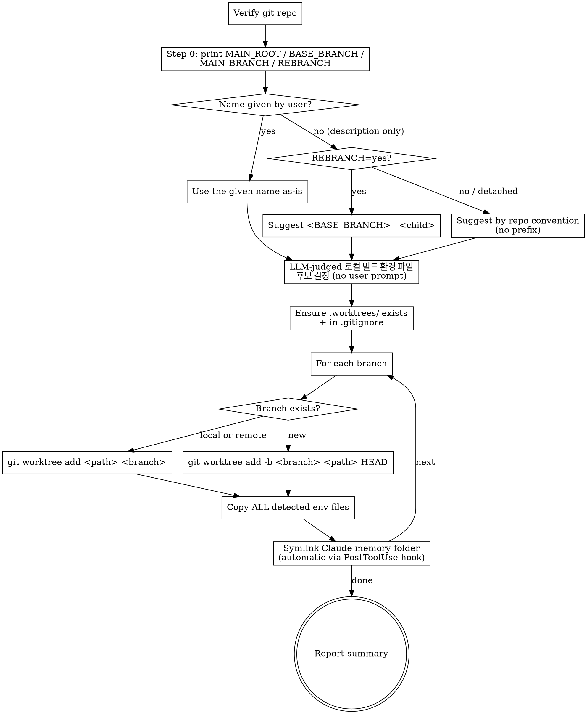

# Setting Up Worktrees (Quick Batch Creation)

User-personal workflow shortcut for spinning up multiple parallel work streams. Each worktree gets its own branch, an automatic copy of the project's 로컬 빌드 환경 파일 (LLM-judged per platform — Node `.env*`, Android `local.properties`, iOS `*.xcconfig`, etc.; so the user can build/run servers concurrently without env-loading fights), AND a symlink to the main repo's Claude Code memory folder (so user/feedback/project memory is immediately available in the worktree's first session).

<HARD-GATE>
This skill MUST be invoked from a git repository. If the current working directory is not inside a git repo (`git rev-parse --is-inside-work-tree` returns false), abort and tell the user to run `git init` first or switch to the target project.
</HARD-GATE>

<HARD-GATE>
NEVER ask the user which 로컬 빌드 환경 파일 to copy. 메인 에이전트가 프로젝트 컨텍스트 (Android / iOS / Node / Flutter / Rust / etc.) 를 읽고 적절한 후보를 판단 + 후보 list 사용자에게 노출 + 복사. The user only specifies branch names — 파일 선택은 LLM-judged. The single exception: if the user EXPLICITLY says "X 파일은 복사하지 마" (exclude pattern), honor that.
</HARD-GATE>

## Trigger Examples

- 단수: `/worktree feature-a`
- 복수: `/worktree feature-a feature-b feature-c`
- 자연어: "워크트리 3개 만들어줘. 브랜치는 feature-a, feature-b, feature-c."

> 사용자가 실제 티켓명(예: `TICKET-123-기능명`)으로 호출하면 그대로 브랜치명에 사용한다. 위 `feature-a` 등은 placeholder.

## Defaults (No User Prompt)

| Knob | Default behavior |
|---|---|
| Worktree root | `<메인 저장소 루트>/.worktrees/` — 워크트리 안에서 호출해도 메인 루트 기준, 중첩 생성 금지 (override only if user explicitly asks) |
| Branch creation | If branch missing → `-b <name>` from **호출 위치 HEAD** (워크트리 안이면 그 워크트리의 커밋이 시작점; 사용자가 베이스 명시 시 그 브랜치). Existing local → use as-is. Remote-only → `-B <name> origin/<name>`. 신규 생성 시 분기 부모를 공유 git config 에 기록 (`js-super-parent` / `js-super-parent-base`) |
| 브랜치 네이밍 제안 | 이름 미지정 (설명만) 시 메인이 이름 생성 제안 — 재분기 (`BASE_BRANCH` ≠ `MAIN_BRANCH`) 면 `<부모>__<자식>` (누적), 메인 기준이면 접두어 없이 저장소 관례. 사용자 명시 이름은 그대로 (Step 1) |
| Dirty 워크트리에서 분기 (v2.9.0+) | Step 3.5 게이트 — "WIP 커밋 후 분기" / "마지막 커밋 시점 기준 분기" 선택. stash 금지 |
| 로컬 빌드 환경 파일 복사 | **메인 에이전트가 프로젝트 컨텍스트 기반 후보 판단** (Node/Web → `.env*` / Android → `local.properties`, keystore 류 / iOS → `*.xcconfig` 등 / Desktop → `secrets.*`). 후보 list 사용자 노출 후 자동 복사. committed templates / build artifacts 자동 제외. |
| Claude memory folder | **Symlink handled by `worktree-memory-symlink` PostToolUse hook** — fires automatically on `git worktree add`. Skips if main has no memory yet or if worktree's memory dir already exists. The skill body does NOT perform this step. |
| `.worktrees/` in `.gitignore` | Auto-add if missing |

## Process



## Procedure (Step-by-Step)

**Step 0 — Verify git context + 루트 해석 이원화 (v2.9.0+)**

```bash
git rev-parse --is-inside-work-tree   # must print "true"

# 배치 기준 = 메인 저장소 루트. git worktree list 는 메인 워크트리를 항상 첫 줄에
# 출력하므로, 워크트리 안에서 호출해도 메인 루트가 잡힌다 (중첩 생성 방지).
MAIN_ROOT=$(git worktree list --porcelain | head -1 | sed 's/^worktree //')

# 분기 기준 = 호출 위치의 현재 HEAD (워크트리 A 안에서 호출하면 A 의 커밋)
BASE_SHA=$(git rev-parse HEAD)
BASE_BRANCH=$(git branch --show-current)
MAIN_BRANCH=$(git -C "$MAIN_ROOT" branch --show-current)

# 판별 근거를 화면에 남긴다. 셸 변수는 Bash 호출 사이에 유지되지 않으므로,
# 여기서 찍힌 문자열이 Step 1 (재분기 판별) 과 Step 4 (부모 기록) 의 유일한 입력이다.
echo "MAIN_ROOT=$MAIN_ROOT"
echo "BASE_SHA=$BASE_SHA"
echo "BASE_BRANCH=${BASE_BRANCH:-(detached)}"
echo "MAIN_BRANCH=$MAIN_BRANCH"
if [ -n "$BASE_BRANCH" ] && [ "$BASE_BRANCH" != "$MAIN_BRANCH" ]; then
  echo "REBRANCH=yes (접두어: ${BASE_BRANCH}__)"
else
  echo "REBRANCH=no"
fi
```

**Step 0 의 출력 다섯 줄 (`MAIN_ROOT` / `BASE_SHA` / `BASE_BRANCH` / `MAIN_BRANCH` / `REBRANCH`) 이 도구 결과에 보이지 않으면 Step 1 로 넘어가지 않는다.** 위 블록을 그대로 다시 실행한다. 값이 안 보이는 상태에서 재분기 여부를 현재 경로 · 이전 대화 · 추측으로 정하지 않는다 — 과거 실행 기록에서 이 블록을 출력 없이 (변수 대입만) 돌린 뒤 접두어 판별을 추정으로 처리해 재분기 접두어가 빠진 사례가 있다.

If not in a repo, abort with: "현재 디렉터리가 git repo 아닙니다. `git init` 후 다시 호출해주세요."

호출 위치가 워크트리 안이어도 (`git rev-parse --show-toplevel` ≠ `$MAIN_ROOT`) 새 워크트리는 항상 **메인 루트의 `.worktrees/`** 아래에 생성된다 (중첩 금지). 사용자가 위치를 신경 쓰거나 별도 지시할 필요 없다 — 자동 판정.

**Step 1 — 이름 해석 (명시 이름 / AI 제안 분기)**

사용자 메시지에서 브랜치 이름 또는 작업 설명을 추출해 `BRANCHES=(...)` 를 확정한다. Korean ticket-style names like `<TICKET>-<번호>-<설명>` are fine (UTF-8 OK). Do NOT ask about env files — those are auto-detected.

1. **이름 명시** — 사용자가 브랜치 이름을 줬으면 그대로 쓴다. 네이밍 규칙을 덮어씌우거나 "더 좋은 이름" 을 제안하지 않는다.
2. **설명만 있고 이름 없음** — 메인이 이름을 생성해 제안한다. **부모브랜치__자식이름 규칙**. 갈래는 **Step 0 출력의 `REBRANCH=` 줄만** 보고 고른다 (경로 · 기억 · 추측 금지, 출력이 안 보이면 Step 0 재실행):
   - `REBRANCH=yes` (`BASE_BRANCH` ≠ `MAIN_BRANCH`, 재분기) → `<BASE_BRANCH>__<자식이름>`. 접두어는 그 줄에 찍힌 문자열을 그대로 쓴다. 구분자는 밑줄 두 개 (`__`). 부모 이름에 이미 `__` 가 있으면 그대로 누적된다 (`a__b` 에서 분기 → `a__b__c`).
   - `REBRANCH=no` 이고 `BASE_BRANCH` 가 메인 브랜치 이름 → 접두어 없이, 저장소의 기존 브랜치 관례 (언어 · 스타일 · 접두어 유무) 를 참고해 짓는다.
   - `BASE_BRANCH=(detached)` 가 실제로 찍힌 경우 (detached HEAD) → 접두어 생략 + 한 줄 안내: "부모 브랜치를 알 수 없어 접두어를 생략했습니다". 이 갈래는 Step 0 출력이 `(detached)` 를 보여줬을 때만 — 값을 못 봤다는 이유로 이 갈래로 오지 않는다.
   - AI 가 새로 짓는 부분 (재분기면 자식 이름, 메인 기준이면 이름 전체) 에는 `__` 를 넣지 않는다 — 부모 구분자로 예약 (공백 → 하이픈). `/` 는 자식 이름에 넣지 않는다 (새 폴더 중첩 층 방지 — 부모에게서 물려받은 `/` 는 그대로 수용). 메인 기준 이름은 저장소 관례가 슬래시 접두어를 쓰는 경우에만 `/` 허용.
   - AI 가 짓는 이름의 언어 · 스타일은 저장소의 기존 브랜치 관례를 따른다 (재분기 자식 부분 포함).
3. **확정** — AI 가 이름을 생성한 경우 기본은 `AskUserQuestion` 으로 제안 이름 (후보 1~3개) 을 확인받고 생성한다. 사용자가 "바로 만들어 / 알아서 해줘" 류 속행 신호를 이미 준 상황이면 확인 없이 생성하고 결과 이름을 알린다. 명시 이름은 질문 없이 그대로.

**Step 2 — LLM-judged 로컬 빌드 환경 파일 후보 결정 (NO bash glob, NO user prompt)**

메인 에이전트가 프로젝트 루트 + 설정 파일 (예: `package.json`, `build.gradle`, `Podfile`, `pubspec.yaml`, `Cargo.toml`) 을 read → 프로젝트 종류 추론 → 다음 **레시피** 참고하여 후보 list 결정:

| 플랫폼 | 후보 (gitignored 인 경우 복사 대상) |
|---|---|
| Node / Web | `.env`, `.env.local`, `.env.production`, `.env.development`, `.envrc` (committed templates `.env.example` / `.env.sample` 제외) |
| Android | `local.properties` (SDK 경로), `keystore.properties`, `*.keystore`, `*.jks`, `google-services.json` (gitignored 인 경우) |
| iOS / macOS | `*.xcconfig` (local-only), `GoogleService-Info.plist` (gitignored 인 경우), `Secrets.swift` |
| Desktop / 기타 | `secrets.properties`, `secrets.json`, `config.local.*` |
| Flutter | `android/local.properties` + `android/key.properties` + iOS 항목 + `.env.*` |
| Rust | `.env*`, `.cargo/credentials` (gitignored 인 경우) |

**컨셉**: "로컬 빌드 환경 파일" = 빌드 / 실행 시 필요하지만 git committed 가 아닌 파일. build artifact (`dist/` / `build/` / `target/` / `.gradle/` / `node_modules/`) 와 IDE 디렉토리 (`.idea/` / `.vscode/local-state.json`) 와 OS 임시 파일 (`.DS_Store`) 은 **제외**.

**Procedure**:

1. 메인이 프로젝트 종류 추론 (위 레시피 기준)
2. 루트에서 후보 파일 존재 확인 (`ls` + `git ls-files --error-unmatch <path>` 로 gitignored 인지 판정 — committed 면 git checkout 자동 복원 가능하므로 복사 skip)
3. 후보 list 를 **통지** (응답 대기 아님): `ℹ️ 감지된 로컬 빌드 환경 파일: <list> — 그대로 복사합니다. 특정 파일 제외를 원하면 알려주세요.`
4. 기본 = 후보 전체 복사. blocking-wait 없이 바로 진행. 단 사용자가 명시적으로 "X 파일은 복사하지 마" (EXCLUDE) 라고 하면 그 파일만 제외 (기존 HARD-GATE 의 EXCLUDE 옵션 유지)
5. ENV_FILES (또는 LOCAL_BUILD_FILES) 배열에 최종 후보 저장 → 다음 Step 으로 전달

후보가 없으면 한 줄 안내 (`ℹ️ 프로젝트 루트에 로컬 빌드 환경 파일 후보 없음 — 복사 skip`) 후 다음 Step 진행. Don't abort.

**Step 3 — Ensure `.worktrees/` exists and is gitignored (메인 루트 기준)**

```bash
mkdir -p "$MAIN_ROOT/.worktrees"

if ! grep -qE '^\.worktrees/?$' "$MAIN_ROOT/.gitignore" 2>/dev/null; then
    echo ".worktrees/" >> "$MAIN_ROOT/.gitignore"
fi
```

워크트리 안에서 호출했고 위 append 가 실제로 일어났다면 한 줄 알림: "ℹ️ 메인 루트 `.gitignore` 에 `.worktrees/` 를 추가했습니다 (메인 워크트리에 커밋 안 된 변경 1건이 생겼습니다)."

**Step 3.5 — 분기 전 dirty 확인 (v2.9.0+)**

호출 위치에 커밋 안 된 변경이 있는지 확인한다:

```bash
git status --porcelain   # 출력이 있으면 dirty
```

dirty 면 `AskUserQuestion` 으로 선택받는다 (stash 로 변경을 넘기는 방식 금지):

- **"WIP 커밋 후 분기"** — `git add -A` 후 커밋. 커밋 메시지는 `git diff HEAD` 요약으로 자동 생성 (고정 문구 금지). 새 브랜치가 WIP 내용을 포함한다.
- **"마지막 커밋 시점 기준 분기"** — 커밋하지 않고 현재 HEAD 커밋에서만 분기. 커밋 안 된 변경은 호출 위치 워크트리에 그대로 남는다.

clean 이면 질문 없이 다음 Step 으로 진행.

**Step 4 — For each branch, create or attach the worktree (개별 Bash 호출, v2.9.0+)**

`worktree-memory-symlink` 훅은 Bash 명령 문자열이 `git worktree add ` 로 **시작**할 때만 발화한다. 브랜치·디렉토리 존재 판정과 변수 계산은 별도 선행 Bash 호출로 끝내고, 워크트리 생성은 브랜치마다 **`git worktree add` 로 시작하는 개별 Bash 호출** 로 실행한다 (for-loop 한 방에 묶으면 훅이 발화하지 않는다):

```bash
# 선행 판정 (별도 Bash 호출):
#   [ -d "$MAIN_ROOT/.worktrees/<BR>" ]                    # 이미 존재 → skip + notice (덮어쓰기 X)
#   git show-ref --verify --quiet refs/heads/<BR>          # 로컬 브랜치 존재?
#   git show-ref --verify --quiet refs/remotes/origin/<BR> # remote 브랜치 존재?

# 생성 — 경로·브랜치명을 실제 값으로 치환한 개별 호출 (아래 중 케이스에 맞는 1줄):
git worktree add <MAIN_ROOT>/.worktrees/<BR> <BR>                  # 로컬 브랜치 존재 → attach
git worktree add -B <BR> <MAIN_ROOT>/.worktrees/<BR> origin/<BR>   # remote-only
git worktree add -b <BR> <MAIN_ROOT>/.worktrees/<BR> HEAD          # 신규 (분기 기준 = 호출 위치 HEAD)
git worktree add -b <BR> <MAIN_ROOT>/.worktrees/<BR> <BASE>        # 사용자가 베이스 명시 시 (예: "dev 기준으로")
```

분기 기준 값은 생성 후 Step 6 보고와 아래 부모 기록에 쓴다. 기본은 Step 0 캡처값 (`BASE_SHA` / `BASE_BRANCH` = 호출 위치 HEAD) 이지만, **사용자가 베이스를 명시한 마지막 케이스에서는 그 베이스 기준으로 두 값을 다시 읽는다** (`git rev-parse <BASE>` 와 브랜치 이름 `<BASE>`). Step 0 값을 그대로 쓰면 이름 접두어, 부모 기록, 보고가 모두 실제 부모가 아닌 브랜치를 가리킨다.

**분기 부모 기록 (`-b` 신규 생성 케이스만)**: 신규 분기 (`-b`) 로 워크트리를 만든 경우에만, `git worktree add` 성공 직후 **별도의 후속 Bash 호출**로 분기 부모를 공유 git config 에 기록한다 (`git worktree add` 와 한 Bash 호출로 묶으면 `worktree-memory-symlink` 훅의 프리픽스 매치가 깨져 심링크가 생성되지 않는다).

⚠️ **값은 실제 문자열로 치환해서 넣는다.** `<BR>` / `<BASE_BRANCH>` / `<BASE_SHA>` 는 Step 0 **출력에 찍힌** 값으로 바꿔 쓰는 자리표시자다. 셸 변수(`"$BASE_BRANCH"`) 형태로 두면 안 된다 — 셸 변수는 Bash 도구 호출 사이에 유지되지 않으므로, Step 0 과 다른 호출인 여기서는 빈 값이 기록된다. 빈 값은 `worktree-merge-back` 에서 "기록 없음" 과 구분되지 않아 부모 자동 판별이 매번 실패한다.

```bash
git config "branch.<BR>.js-super-parent" "<BASE_BRANCH>"
git config "branch.<BR>.js-super-parent-base" "<BASE_SHA>"
```

`worktree-merge-back` 은 이 기록으로 직계 부모를 판별해 그 브랜치로 머지한다. 같은 이름 브랜치를 이 스킬로 다시 만들면 (기존 워크트리 제거 후 재생성 등) 기록은 덮어쓴다.

기록을 생략하는 케이스 (정상 동작, 에러 아님):
- 기존 로컬 브랜치를 attach 한 경우 (`git worktree add <path> <BR>`) — 그 브랜치의 분기 이력을 이 스킬이 모른다
- remote-only 브랜치를 attach 한 경우 (`git worktree add -B <BR> <path> origin/<BR>`) — 마찬가지로 분기 이력 미상
- `BASE_BRANCH` 가 빈 값인 경우 (detached HEAD 에서 호출) — 기록할 부모 브랜치명이 없다

기록이 없으면 `worktree-merge-back` 실행 시점에 사용자 확인 게이트가 이를 흡수한다 (머지 대상을 사용자에게 되묻는다).

**Step 5 — Copy ALL detected env files into each worktree (no prompts)**

복사 소스는 **호출 위치 워크트리 루트 우선** (base 워크트리에서 갱신된 env 가 최신일 가능성이 높다), 후보 파일이 호출 위치에 없으면 메인 루트에서 fallback:

```bash
SRC_ROOT=$(git rev-parse --show-toplevel)   # 호출 위치 루트 (메인 루트에서 호출하면 = MAIN_ROOT)
for BR in "${BRANCHES[@]}"; do
    WT_PATH="$MAIN_ROOT/.worktrees/$BR"
    [ -d "$WT_PATH" ] || continue   # was skipped earlier
    for EF in "${ENV_FILES[@]}"; do
        if [ -f "$SRC_ROOT/$EF" ]; then
            cp "$SRC_ROOT/$EF" "$WT_PATH/$EF" && echo "📋 $BR ← $EF 복사 완료"
        elif [ -f "$MAIN_ROOT/$EF" ]; then
            cp "$MAIN_ROOT/$EF" "$WT_PATH/$EF" && echo "📋 $BR ← $EF 복사 완료 (메인 루트 fallback)"
        fi
    done
done
```

**Step 5.5 — Memory symlink (handled automatically by hook)**

Memory-folder symlinking is performed by the `worktree-memory-symlink` PostToolUse hook (see `hooks/hooks.json` + `hooks/worktree-memory-symlink`). It fires only when a Bash command starts with the exact prefix `git worktree add ` — which is why Step 4 issues each add as a standalone prefixed command. It parses the worktree path from the command, and invokes `scripts/setup-memory-symlinks.sh`. **Do nothing here.** No mkdir, no ln, no sed — the hook owns this concern entirely. The script's output (e.g. `🔗 <branch> ← Claude 메모리 폴더 심링크 ...`) appears as hook stderr in your tool output and should be forwarded to the user as part of the Step 6 summary if visible.

Behavior summary:
- Main memory dir missing → skip with notice (first-run user, nothing to share yet).
- Worktree memory dir already exists → skip without clobbering (user already ran a session in that path).
- Otherwise → symlink. New memories saved in either side are visible from both.

⚠️ Cleanup note: when the user later removes a worktree, `git worktree remove` will not touch the symlink (lives outside the worktree dir) — no risk to main memory. But `rm -rf <worktree-path>` is also safe because the memory symlink is OUTSIDE the worktree directory (`~/.claude/projects/...`), not inside it. The only thing to watch is users manually `rm -rf $HOME/.claude/projects/<wt-encoded>/memory` — that would delete the LINK, not the target, so still safe; whereas `rm -rf $HOME/.claude/projects/<wt-encoded>/memory/` (with trailing slash on some shells) could traverse into the linked main memory. Add a tiny note in the report so the user knows.

**Step 6 — Report summary**

Print a Korean-friendly summary listing each worktree path + the env files copied:

```
✅ 워크트리 생성 완료 (n개)
감지된 .env* 파일: .env, .env.local, .env.production (3개)
Claude 메모리 폴더: 메인 → 워크트리 심링크 (n개)

- feature-a   → .worktrees/feature-a   (.env ✓ .env.local ✓ .env.production ✓ | 🔗 memory)
  분기 기준: <BASE_BRANCH> @ <BASE_SHA 앞 7자리>
  부모 기록: ✓ (머지백이 이 브랜치로 머지)
- feature-b   → .worktrees/feature-b   (.env ✓ .env.local ✓ .env.production ✓ | 🔗 memory)
  분기 기준: <BASE_BRANCH> @ <BASE_SHA 앞 7자리>
  부모 기록: ✓ (머지백이 이 브랜치로 머지)

각 워크트리에서 바로 빌드·서버 실행 가능합니다.
워크트리 첫 세션부터 메인 레포의 Claude 메모리(user/feedback/project) 즉시 활용됩니다.
정리: `git worktree remove <path>` — 메모리 심링크는 워크트리 디렉터리 밖이라 메인 메모리에 영향 없음.
```

기존 로컬/remote 브랜치를 attach 한 케이스는 "부모 기록: ✓" 대신 "부모 기록: 없음 (기존 브랜치 attach — 머지백 시 대상 확인)" 으로 표기한다.

분기 베이스가 메인 브랜치가 아니면 (Step 0 출력 `REBRANCH=yes`) 다음 주의를 함께 출력한다 (v2.9.0+):

```
ℹ️ 머지 경로가 스택 구조입니다: <새브랜치> → <BASE_BRANCH> → <MAIN_BRANCH>
   <BASE_BRANCH> 가 <MAIN_BRANCH> 에 리베이스되면 <새브랜치> 도 리베이스가 필요합니다.
```

## Anti-Patterns

| Wrong | Right |
|---|---|
| Asking the user "which 로컬 빌드 환경 파일 to copy?" | Forbidden by HARD-GATE. 메인이 프로젝트 컨텍스트 보고 후보 자동 판단 + 노출 + 복사. |
| Skipping copy because user didn't mention it | 항상 메인이 감지된 후보 모두 복사 시도 (사용자 명시 exclude 만 예외). build-ready worktree 가 목적. |
| Hardcoded `.env*` glob 만 사용 (Android/iOS/desktop 미커버) | LLM-judged 레시피 적용. 새 플랫폼 (Flutter / RN / Rust) 도 컨텍스트 추론으로 cover. |
| Force-create when worktree path already exists | Detect + skip with notice. Don't clobber user's WIP. |
| Skip `.gitignore` update | Always add `.worktrees/` (idempotent check). |
| Use `git checkout -b` first then `worktree add` | Prefer `worktree add -b <branch> <path>` (atomic). |
| Copy `.env.example` (template, already in git) | Excluded from glob. |
| 워크트리 안에서 호출 시 호출 위치 루트 아래 `.worktrees/` 중첩 생성 | 항상 `MAIN_ROOT` (worktree list 첫 entry) 기준 배치. |
| for-loop 한 방에 `git worktree add` 묶기 | 훅 프리픽스 미매치 → 심링크 미생성. 브랜치별 개별 Bash 호출. |
| dirty 워크트리에서 말없이 분기 (또는 stash 로 넘기기) | Step 3.5 게이트 — WIP 커밋 / 커밋 시점 분기 선택. stash 금지. |
| 기록 명령을 `git worktree add` 와 한 Bash 호출로 묶기 | 훅 프리픽스 미매치 → 심링크 미생성. 기록은 add 이후 별도 호출. |
| 기록 명령에 `"$BASE_BRANCH"` 처럼 셸 변수를 그대로 두기 | 셸 변수는 Bash 도구 호출 사이에 유지되지 않아 빈 값이 기록된다. Step 0 출력에 찍힌 실제 문자열로 치환해서 넣는다. |
| Step 0 를 변수 대입만 하고 (출력 없이) 실행한 뒤 Step 1 재분기 판별을 경로 · 기억으로 추정 | Step 0 은 `REBRANCH=` 줄까지 찍는다. 출력이 안 보이면 Step 0 재실행. 추정 금지 — 재분기 접두어 누락의 실제 원인이었다. |
| 값을 못 봤다는 이유로 detached HEAD 갈래 (접두어 생략) 로 빠짐 | 그 갈래는 Step 0 출력이 실제로 `BASE_BRANCH=(detached)` 를 찍었을 때만. |
| Performing the memory symlink yourself in this skill | Forbidden — handled by `worktree-memory-symlink` PostToolUse hook. The agent must not run any path-mutating shell command (directory creation, symlink, or string substitution) against the Claude memory location. Past versions failed because agents mentally simulated the encoding rule and produced folder names Claude Code never reads. |
| Clobber worktree's existing memory dir with a symlink | Forbidden. If `$WT_MEMORY` already exists, skip and tell user to migrate manually. |
| Skip the symlink because "user didn't ask for it" | Always attempt. The whole point is zero-friction worktree start. Only skip when main memory missing or WT memory already there. |
| 사용자가 명시한 브랜치 이름을 개명하거나 "더 좋은 이름" 을 제안 | 명시 이름은 그대로 쓴다. 제안은 이름 미지정 (설명만) 일 때만. |
| AI 제안 자식 이름에 `__` 또는 `/` 포함 | `__` 는 부모 구분자로 예약. `/` 는 새 폴더 중첩 층 유발 (부모에게서 물려받은 `/` 는 수용). 공백은 하이픈으로. |

## Red Flags

| Thought | Reality |
|---|---|
| "Branch name has Korean — might break" | git handles UTF-8 branch names fine. Don't sanitize unless user asks. |
| "Should I confirm which env files?" | NO. HARD-GATE forbids it. Auto-glob always. |
| ".gitignore is annoying to update" | Idempotent: only append if not already there. One-time cost. |
| "User has secrets in .env, scary to copy automatically" | Files are already on disk; copying within the same machine doesn't expand exposure. The .worktrees/ folder is gitignored. |
| "사용자가 준 이름이 아쉽다 — 더 좋은 이름을 제안하자" | 명시 이름은 그대로 쓴다. 제안은 이름 미지정일 때만 (Step 1). |
| "지금 워크트리 안이니까 재분기겠지 / 메인이겠지" | 경로 · 기억으로 판정하지 않는다. Step 0 출력의 `REBRANCH=` 줄만 근거. 안 보이면 다시 찍는다. |

## Cleanup (separate operation)

If the user later asks to remove a worktree:

```bash
git worktree remove "$MAIN_ROOT/.worktrees/<branch>"
git branch -d <branch>   # only if no longer needed
```

This skill does NOT auto-remove. Removal is destructive and must be explicit.

## Acceptance

After running this skill:
1. Each requested branch has a worktree at `<root>/.worktrees/<branch>/`
2. Every detected 로컬 빌드 환경 파일 (Step 2 의 LLM-judged 후보 — 플랫폼별 `.env*` / `local.properties` / `*.xcconfig` 등, committed templates `.env.example`/`.env.sample`/`.env.template` 제외) is copied into each worktree
3. `.worktrees/` is in `.gitignore`
4. `git worktree list` shows all created worktrees
5. The `worktree-memory-symlink` PostToolUse hook fired for every `git worktree add` invocation issued by this skill. (The skill itself did NOT mkdir / ln any memory paths.)
6. User got a summary report listing each worktree's path + per-file copy status + memory symlink status (the latter coming from the hook's stderr output).
7. The user was NOT asked which env files to copy, NOR about the memory symlink.
8. 워크트리 안에서 호출된 경우에도 새 워크트리는 메인 루트 `.worktrees/` 아래에 있고, 호출 위치 워크트리 내부에 `.worktrees/` 중첩이 생기지 않았다. (v2.9.0+)
9. 보고에 분기 기준 커밋 해시가 포함됐고, 베이스가 메인 브랜치가 아니면 스택 구조 주의가 함께 출력됐다. (v2.9.0+)
10. 호출 위치가 dirty 였다면 Step 3.5 게이트 (WIP 커밋 / 커밋 시점 분기) 가 발화했다. (v2.9.0+)
11. 신규 분기로 만든 워크트리마다 분기 부모 기록 (`js-super-parent` + `js-super-parent-base`) 이 남았고, attach 케이스는 기록 없이 보고에 그 사실이 표기됐다.
12. 이름 미지정 호출에서는 AI 이름 제안이 이뤄졌고 (재분기면 `<부모>__<자식>` 형식), 사용자가 명시한 이름은 개명 없이 그대로 쓰였다.
13. Step 0 의 출력 다섯 줄 (`REBRANCH=` 포함) 이 도구 결과에 남았고, Step 1 의 접두어 결정과 Step 4 의 부모 기록이 그 출력 문자열과 일치한다. 출력 없이 판별한 흔적이 없다.

## Related Skills

- `executing-plans` — often run inside a freshly-created worktree
- `worktree-merge-back` / `worktree-remove` — 작업 완료 후 머지와 정리
