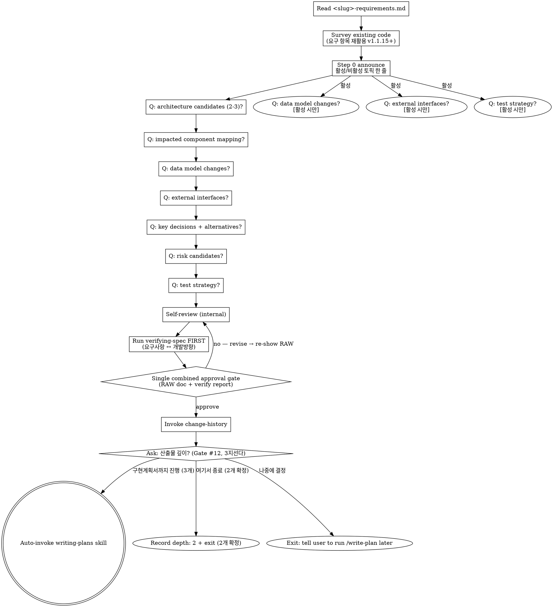

# Designing Direction → <slug>-tech-design.md (Technical Spec)

## 사용자 질문 룰 (v2.0.3+) — 항상 AskUserQuestion

이 skill 흐름 안에서 사용자에게 질문할 일이 생기면 **반드시** `AskUserQuestion`
도구로 호출한다. 산문으로 "~ 할까요?" 한 줄 던지지 마라.

### Why

Notification 훅 (`elicitation_dialog` 매처) 이 알람을 발화하려면 도구 호출이
실제로 일어나야 함. 산문 질문은 훅이 못 잡아서 사용자가 놓침 (v1.1.8 신고 재발).

### How to apply

- clarifying / Socratic / 모호점 확인 / 게이트 / 모드 선택 — 모두 포함
- 단답 yes/no 도 prose X → `AskUserQuestion` options `[yes, no]` 사용
- 다중 선택은 enum options 또는 multi-question batching (의미 결합 시 max 4 questions[])
- **Socratic 자유 응답**: AskUserQuestion 의 question 본문에 "자유롭게 답해주세요. 별도 옵션 선택 불필요" + dummy option `[알겠음]` 1개 → 트리거만 발화, 응답은 다음 turn prose
- **예외**: 본문 자체의 알람-friendly 안내문 (`ℹ️ Auto-proceeding ...`) 는 질문 아니라 안내 — 도구 호출 불필요

### Other / 모호 응답 처리 (v2.1.1+)

사용자가 "Other" 자유 응답 또는 "모르겠음 / 이해 안 됨" 류 답변 catch 시 → **그 질문만 단독 재호출 + prose 설명 추가**. 다음 단계 자동 진행 X (anchor 질문 강제 X 룰은 명확 yes/no 답변에만 적용).

Take <slug>-requirements.md as input and produce <slug>-tech-design.md, a technical spec covering architecture, data model, interfaces, key decisions with alternatives, preliminary risks, and test strategy. Step-by-step task decomposition belongs to `writing-plans`, not here.

<HARD-GATE>
You MUST have an existing <slug>-requirements.md in the current feature folder before invoking this skill. If none exists, instruct the user to run /brainstorm first.
</HARD-GATE>

### 예외 — `--no-ask` 플래그 (v2.5+)

사용자가 슬래시 명령에 `--no-ask` 토큰을 **명시** 한 경우에만 진입. 메인 자체 판단으로 활성화 X.

- 모든 사용자 질문을 prose (메인 turn 자유 텍스트) 로 처리
- `AskUserQuestion` 도구 호출 **0 보장**
- 게이트 자체는 살아 있음 — 사용자 prose 응답 기다림
- 알람 fire X (사용자가 명시 invoke 했으니 인지 가정)

#### skill 진입 시 1회 boilerplate

skill 진입 직후 다음 한 줄을 prose 로 출력:

> ℹ️ `--no-ask` 모드 진입 — AskUserQuestion 도구 호출 X, 응답 알람 X. 백그라운드 작업 중이면 응답 시점을 직접 체크해주세요.

#### 위험 명령 진입 직전 보강

critical 7 케이스 (파일 삭제 / `git push --force` / DB migration / mass commit / 외부 메시지 등) 실행 직전에는 다음 한 줄을 prose 로 출력:

> ⚠️ 위험 명령 진입 — 응답 기다림. 백그라운드 작업 중이면 직접 catch 해주세요.

`⚠️` 마커 + 별도 줄로 일반 prose 보다 두드러지게.

## Checklist

You MUST create a TaskCreate task for each of these items and complete them in order:

1. **입력 확인** — confirm <slug>-requirements.md exists (HARD-GATE if not)
2. **기존 코드 둘러보기** — `<slug>-requirements.md` 의 `## 요구 항목` 을 먼저 Read. 추가 grep/Read 는 tech-design 결정 (아키텍처 / data flow / pattern) 깊이 부족할 때만. (v1.1.15+ slim)
3. **적응형 7-토픽 질의응답** — `<slug>-requirements.md` 읽고 활성/비활성 토픽 판정 후 한 줄 announce. 항상 활성 4개 (1 아키텍처 / 2 컴포넌트 / 5 결정+대안 / 6 위험), 조건부 3개 (3 데이터 모델 / 4 외부 인터페이스 / 7 테스트 전략). 자세한 룰은 "Adaptive Topics" 섹션 참조. (v1.1.15+, FR-1)
4. **자체 점검** — 요구 항목 mapping coverage, alternatives present, risk categorization, 산출물 문서 스타일 + 도면 형식 (no user prompt yet)
5. **사양 정합성 검증 (사전)** — main agent runs A+C verification via `verifying-spec`, produces 4-axis report internally (Tolerance for missing skill)
6. **초안 검토 및 승인** — show the full RAW `<slug>-tech-design.md` AND the verify-spec report in one message; ask once "Approve and proceed? — yes / no". On `no` → revise → loop back to step 4 (Self-review → re-verify → re-show RAW).
7. **변경이력 기록** — append first `[개발방향-수정]` entry via `change-history` skill
8. **다음 단계 진입 확인 (산출물 깊이 선택)** — change-history 직후 사용자에게 3지선다 게이트 (Gate #12). "구현계획서까지 진행 (3개)" → invoke `writing-plans` via Skill tool. "여기서 종료 (2개 확정)" → tech-design frontmatter 에 `depth: 2` 기록 + [개발방향-수정] entry + 종료 안내. "나중에 결정" → 표식 없이 exit with notice telling the user to run /write-plan later. (v1.1.12+ restored · 깊이 선택 확장)

If you find yourself skipping ahead, stop and create the missing task.

**Before invoking the next skill via Skill tool, mark ALL checklist TaskCreate items as completed (in_progress → completed). The Skill tool transition does NOT auto-complete prior tasks. (v1.1.15+, FR-2)**

## Input

`docs/features/YYYY-MM-DD-<slug>/<slug>-requirements.md`

## Output

`docs/features/YYYY-MM-DD-<slug>/<slug>-tech-design.md`

## Schema (<slug>-tech-design.md)

```markdown
# 개발방향: <feature-name>

> **다음 단계 안내**: 이 문서는 기술 설계서입니다 (아키텍처 / 컴포넌트 / 데이터 / 인터페이스 / 결정 / 위험 / 테스트 전략). `<slug>-requirements.md` 를 기반으로 작성됩니다. 3개 트랙이면 다음 단계 `<slug>-implementation-plan.md` (단계별 계획) 의 입력이 됩니다 (`writing-plans` skill 또는 `/write-plan` 슬래시). 2개 확정 트랙 (frontmatter `depth: 2`) 이면 이 문서가 마지막 산출물입니다. 단계별 구현 task 는 여기 박지 마세요 — 그건 다음 산출물 (plan) 에 들어갑니다.

## 1. 아키텍처 개요 (도면 + 짧은 산문 — "도면 형식" 참조)
## 2. 영향 받는 컴포넌트/파일
## 3. 데이터 모델/스키마 변경
## 4. 외부 인터페이스 (API, events)
## 5. 핵심 결정 + 대안 비교 (why this path)
## 6. 위험/사이드이펙트 (preliminary)
## 7. 테스트 전략

---
## 변경이력
```

## 산출물 문서 스타일

이 규칙은 이 skill 이 만드는 산출물 문서에 적용된다. 이 skill 본문 자체는 대상이 아니다.

**위에서 아래로 읽힌다.** 용어는 처음 쓰는 자리에서 뜻을 밝힌다. 뒤 섹션을 먼저 읽어야 이해되는 문장을 쓰지 않는다. 앞 섹션이 뒤 섹션의 결론에 기대고 있으면 순서를 바꾼다.

**간결한 자연어로 쓴다.** 한 문장에 하나를 말한다. 비유를 쓰지 않는다 — 무엇에 빗대지 말고 그것이 무엇인지 그대로 쓴다. 배경 반복, 다짐, 같은 말 되풀이는 넣지 않는다.

**나열과 비교와 구조는 표나 도면으로 보인다.** 항목이 셋 이상이면 표로 만든다. 구성 요소들의 관계나 배치를 설명해야 하면 도면을 그린다. 산문은 배경과 판단 근거에 쓴다.

**항목 코드를 만들지 않는다.** 본문에 알파벳-숫자 코드를 붙이지 않는다. 결정이나 위험을 가리켜야 하면 짧은 한국어 제목을 쓴다 (`### 결정 1 — 요구 항목 번호를 바꾼다`). 유일한 예외는 요구 항목 번호 (`요구 N`) 다 — 상위 문서가 정한 번호라 그대로 인용한다.

도면 안에 붙이는 번호 (①②③) 는 표에서 설명하기 위한 도면 표기법이지 항목 코드가 아니다. 금지 대상이 아니다.

### 도면 형식

§1 의 그림은 구역과 배치가 보이는 도면을 기본으로 한다. 절차 단계를 노드와 화살표로 나열한 흐름도로 구조 설명을 대신하지 않는다.

| 상황 | 형식 |
|---|---|
| 구역·레이어·배치를 보일 때 (기본) | 아스키 박스 도면 |
| 구성 요소가 여섯 개를 넘거나 요소마다 설명이 필요할 때 | 아스키 도면에 번호를 달고 표에서 설명 |
| 관계와 조건 분기가 본질이고 렌더링 환경 (GitHub, 에디터 미리보기) 을 전제할 수 있을 때 | mermaid |

mermaid 를 쓸 때도 절차 나열이 아니라 관계를 보이는 그림이어야 한다.

이 규칙은 산출물에만 적용된다. 이 skill 본문 안의 dot 흐름도는 에이전트 실행용이라 대상이 아니다.

## 서술 수준 — 이름보다 역할

`<slug>-tech-design.md` 의 **서술 문단** (줄글로 설명하는 부분) 에서는 코드 식별자를 기본적으로 쓰지 않는다. 이름을 쓰려는 자리마다 먼저 그 역할을 말로 풀어쓴다.

예외는 하나다 — **그 이름이 바뀌면 문서 밖의 무언가가 깨지는 경우**에만 실제 이름을 쓴다.

| 실제 이름을 쓴다 | 말로 풀어쓴다 |
|---|---|
| 사용자가 입력하는 명령어 | 내부 변수, 지역 변수 |
| 설정 파일의 키 이름 | 아직 없는 새 함수·클래스 이름 |
| 외부나 다른 팀이 호출하는 공개 함수 | 직접 지은 중간 계산값 |
| 저장소에 이미 있는 파일 경로 | 반복문 변수, 임시로 붙인 이름 |

왼쪽은 이름 자체가 약속이라 바꾸면 문서 밖이 깨진다. 오른쪽은 구현하면서 얼마든지 달라져 지금 적어봐야 문서만 먼저 낡는다.

**적용 부위는 서술 문단뿐이다.** §2 의 영향 파일 표, 코드 블록, 도식은 그대로 둔다 — 이름을 보여주는 것이 그 자리의 목적이다.

### Why

설계 문서는 구조·계약·결정을 담는 자리다. 구현 단계에서 바뀔 이름이 서술에 박히면 문서가 먼저 낡고, 정작 읽어야 할 결정이 이름 사이에 묻힌다. 기본 동작을 풀어쓰기로 두는 이유는 매번 판정을 통과시키는 방식으로는 결과가 달라지지 않기 때문이다.

## Process Flow



## Adaptive Topics (v1.1.15+, FR-1)

Step 3 의 7-topic dialogue 를 사용자 마찰 줄이기 위해 adaptive 진행. 메인 에이전트가 `<slug>-requirements.md` 본문을 읽고 판단.

### 항상 활성 (4개)

- 1 아키텍처
- 2 영향 컴포넌트
- 5 결정+대안 비교
- 6 위험 (preliminary)

### 조건부 활성 (3개) — 메인 판단

- **3 데이터 모델** — DB / 스키마 / 마이그레이션 / 영구 저장 / 외부 시스템 데이터 교환을 implicit/explicit 시사하면 활성. 메타 워크플로우 / 순수 함수 / 산문 처리만이면 비활성.
- **4 외부 인터페이스** — REST / GraphQL / webhook / 이벤트 발행 / 외부 노출 시사하면 활성. 내부 모듈 간 호출만이면 비활성.
- **7 테스트 전략** — 요구 항목 수가 많거나 (≥3), 위험 카테고리 다수, 다중 파일 영향이면 활성. trivial 변경 / 단일 함수면 비활성.

### Step 0 announce — 항상 노출

판단 직후 사용자에게 한 줄 노출 (case 무관, 전부 활성이든 비활성 있든):

```
ℹ️ 활성 토픽은 1, 2, 3, 5, 6 입니다. 4번 외부 인터페이스와 7번 테스트 전략은 비활성입니다 (이유: 내부 모듈 변경 + 단일 함수). 추가로 활성화할 토픽이 있으면 알려주세요.
```

→ white box / override 시점 일관. 사용자가 즉시 catch + 활성 추가 요청 가능.

### 비활성 토픽 처리

`<slug>-tech-design.md` 의 해당 섹션은 다음 형식으로 한 줄만 박음:

```markdown
## 3. 데이터 모델/스키마 변경 — N/A: 본 피처는 DB/스키마 무관 (skill 본문 + Python helper 변경)
## 4. 외부 인터페이스 — N/A: API/event 노출 없음
```

비활성 토픽은 dialogue 자체를 스킵 — 빈 섹션도 아니고 placeholder 도 아님. N/A 한 줄.

### deterministic Python classifier 도입 X

키워드 hardcode list (예: `테이블 / 마이그레이션 / API / 엔드포인트`) 는 brittle (Postgres 만 있고 DB 없는 경우 등 미스매칭). 메인 에이전트의 컨텍스트 이해가 더 정확. 사용자 override 한 줄로 false negative 즉시 catch.

## Process (detail)

**1. Verify input**
- Confirm <slug>-requirements.md exists in the same feature folder. If not, HARD-GATE — instruct the user to run `/brainstorm` first.
- **Locate the requirements** — find the `## 요구 항목` section and read its numbered items. Three generations exist and ALL are read the same way: `**요구 N**:` (current), `**FR-N**:` under `## 요구 항목` (previous), and `**FR-N**:` under `## 3. 기능 요구사항 (FR)` (oldest). Never rewrite an old doc's numbering — read it as-is.
- If a doc has no numbered anchors at all, treat every sentence describing a behavior the system must have as one requirement, and say so in a one-line notice. Never reject a doc as "missing requirements".

**2. Survey the codebase**
- For each requirement item, Grep/Read to identify likely impacted code areas
- (Full impact analysis is reserved for verifying-spec.)

**3. Step-by-step questions** (one at a time, multiple choice when possible)
- Architecture candidates (2-3 options + recommendation with reasoning)
- Component/file mapping (요구 N → which file/module)
- Data model changes (tables, schema, migrations)
- External interfaces (REST/GraphQL/events)
- Key decisions (each one with at least one alternative + reason for chosen path)
- Risk/side-effect candidates (categorized using risk-annotation taxonomy)
- Test strategy (unit/integration/api breadth)

**4. Self-review** (see checklist) — internal pass, do NOT prompt the user yet

**5. Run verifying-spec FIRST (before any user-approval gate)**
- Inputs: target = `<slug>-tech-design.md`, upstream = `[<slug>-requirements.md]`
- The main agent runs consistency check + code impact analysis and produces the 4-axis report
- Tolerance: if verifying-spec is not installed, skip and emit the notice (existing tolerance rule)

**6. Single combined user-approval gate** (RAW review)
- Present BOTH the full RAW `<slug>-tech-design.md` AND the verifying-spec report in one message
- DO NOT split into "approve doc" and "approve verify report" — that's two gates for one decision

**Gate #11 — RAW doc + verify 결합 승인**

**Tool form (preferred)**

Call `AskUserQuestion`:

```json
{
  "question": "<slug>-tech-design.md (+ verify-spec 보고서) 승인하고 진행? (RAW doc + 4축 보고서 한 메시지로 노출)",
  "header": "설계 승인",
  "multiSelect": false,
  "options": [
    {"label": "예 — 승인", "description": "승인하고 change-history + 다음 단계 진행"},
    {"label": "아니오 — 수정", "description": "사용자 피드백 받아 수정 후 재제시"}
  ]
}
```

**Prose fallback**

When `AskUserQuestion` is unavailable, ask once:

> Approve `<slug>-tech-design.md` and proceed? — `yes` / `no`

- On `yes` → continue to step 7 (change-history)
- On `no` → 피드백 받아 수정 후 재제시. anchor 질문 강제 X.

**7. Invoke change-history**
- Entry: `[개발방향-수정] CH-YYYYMMDD-NNN / 이유: 신규 기술 설계 / 무엇이: <slug>-tech-design.md 전체 / 영향범위: 없음 (최초 생성)`

**8. Ask the proceed-to-writing-plans gate (v1.1.12+ restored · 산출물 깊이 선택 확장)**

After change-history is logged, ask the user explicitly. Tech-design → implementation-plan 전환은 의사결정 깊이가 다른 단계 (구현 계획에 commit 하는 시점) 라서 자동승인보다 명시적 게이트가 안전하다는 사용자 신고 반영. 이 게이트가 산출물 깊이 (2개/3개) 의 결정 지점이기도 하다 — 실제 분기 지점 (tech-design → writing-plans 전환) 과 일치하고, 문서를 다 본 상태라 가장 정보가 많은 시점이다.

**Gate #12 — proceed-to-writing-plans**

**Tool form (preferred)**

Call `AskUserQuestion`:

```json
{
  "question": "<slug>-tech-design.md 가 확정됐습니다. 산출물을 어디까지 만들까요?",
  "header": "산출물 깊이",
  "multiSelect": false,
  "options": [
    {"label": "구현계획서까지 진행 (3개)", "description": "/write-plan 자동 invoke — 기존 기본 흐름"},
    {"label": "여기서 종료 (2개 확정)", "description": "frontmatter depth: 2 기록 — 이 피처는 tech-design 까지"},
    {"label": "나중에 결정", "description": "표식 없이 종료 — 나중에 /write-plan 수동 실행"}
  ]
}
```

**Prose fallback**

```
<slug>-tech-design.md 가 확정됐습니다. 산출물을 어디까지 만들까요? — 3개 진행 / 2개 확정 / 나중에
```

- The user may reply in any language; parse intent.
- On "구현계획서까지 진행 (3개)" → invoke the `writing-plans` skill via Skill tool. NEVER cross without approval.
- On "여기서 종료 (2개 확정)" → `<slug>-tech-design.md` 맨 위에 frontmatter (`depth: 2` + `depth_reason: 사용자 선택`) 를 기록하고, `change-history` 로 [개발방향-수정] entry (이유: 2-doc 확정) 를 남긴 뒤 `ℹ️ 이 피처는 2개 문서로 확정됐습니다. 구현이 필요해지면 /write-plan 으로 승격하세요.` 를 출력하고 stop.
- On "나중에 결정" → emit `ℹ️ 알겠습니다. /write-plan 은 나중에 직접 실행해주세요.` and stop (표식 기록 없음).

## Self-Review

- Every `요구 N` in <slug>-requirements.md is mapped to either §2 (impacted components) or §4 (external IF) — 옛 문서의 `FR-N` 도 같은 항목으로 센다
- 서술 문단이 "산출물 문서 스타일" 네 가지를 지키는가 — 뒤를 먼저 읽어야 이해되는 문장 / 비유 / 산문으로 늘어놓은 나열 / 새로 만든 항목 코드
- §1 의 그림이 "도면 형식" 세 형식 중 하나이고, 절차 나열 흐름도로 구조 설명을 대신하지 않았는가
- Every key decision in §5 has at least one alternative and a reason for the chosen path
- Risk candidates in §6 are pre-classified using risk-annotation categories (`side-effect | breaking | race`)
- §7 test strategy is consistent with §3 and §4 (DB changes → migration tests, APIs → integration/contract tests)
- 서술 문단에 남은 코드 식별자가 모두 "그 이름이 바뀌면 문서 밖이 깨지는" 예외에 해당한다 — 아니면 역할 서술로 교체 (표 / 코드 블록 / 도식은 대상 아님, "서술 수준 — 이름보다 역할" 섹션)

## Design for Isolation and Clarity

When mapping the architecture in §1 and components in §2, design units that:

- Have one clear purpose
- Communicate through well-defined interfaces
- Can be understood and tested independently

For each unit, you should be able to answer: what does it do, how do you use it, what does it depend on?

- Can someone understand what a unit does without reading its internals?
- Can you change the internals without breaking consumers?

If not, the boundaries need work. Smaller, well-bounded units are also easier for the implementer to work with — code that fits in context produces more reliable edits. When a file grows large, that's often a signal it's doing too much.

## Working in Existing Codebases

- Explore the current structure before proposing changes (this is what step 2 of the Checklist is for). Follow existing patterns.
- Where existing code has problems that affect the work (e.g., a file that's grown too large, unclear boundaries, tangled responsibilities), include targeted improvements as part of the design — the way a good developer improves code they're working in.
- Don't propose unrelated refactoring. Stay focused on what serves the current feature.

## Anti-Patterns

| Wrong | Right |
|---|---|
| Listing step-by-step tasks here | Tasks belong in <slug>-implementation-plan.md. 개발방향 stops at "how it is designed". |
| Missing FR mapping | Every `FR-N` from `## 요구 항목` must appear in §2 or §4. |
| One decision, no alternatives | Always present at least one alternative + comparison. |
| "Be careful here" without a category | Force one of the three risk-annotation categories (`side-effect`, `breaking`, `race`). |
| 서술 문단에 내부 변수나 아직 없는 함수 이름을 그대로 박기 | 역할을 말로 풀어쓴다. 이름이 바뀌면 문서 밖이 깨지는 경우만 실제 이름. |
| 룰을 표나 코드 블록까지 확대 적용해 이름을 지우기 | 적용 부위는 서술 문단뿐. 표와 코드 블록은 이름을 보여주는 자리다. |

## Red Flags

| Thought | Reality |
|---|---|
| "The decision is self-evident, leave §5 blank" | Self-evident means write a one-liner — six months later you'll forget why. |
| "No risks here" | If NFRs or external interfaces change, there are always risk candidates. Reconsider. |

## After Save — approval gate → proceed-to-next gate

This summarizes the corrected order (matches Process detail steps 5-8 above):

1. **Run verifying-spec FIRST** (before any user prompt):
   - Target: `<slug>-tech-design.md`
   - Upstream: `[<slug>-requirements.md]`
   - Procedure: consistency (FR mapping coverage) + code impact (Grep for impacted files/callers, side-effect candidates)
   - **Tolerance**: if verifying-spec skill is not installed, skip the call and emit a one-line notice ("ℹ️ verify-gate 가 설치되지 않아 검증 없이 진행합니다.")

2. **Single combined approval gate** — present in ONE message:
   - The full RAW `<slug>-tech-design.md` content (or summary if very long)
   - The verify-spec 4-axis report
   - DO NOT split into "approve doc" → "approve verify report". One gate, one decision.

   **Gate #11 — RAW doc + verify 결합 승인** — see Tool form + Prose fallback above.

3. On `yes` → invoke change-history (`[개발방향-수정]` entry) → continue to step 4.
   On `no` → 피드백 받아 수정 후 재제시. anchor 질문 강제 X.

4. **Proceed-to-writing-plans gate** (v1.1.12+ restored · 산출물 깊이 선택 3지선다):

   **Gate #12 — 산출물 깊이** — see Tool form + Prose fallback above (step 8 in the main Process detail).

   On "구현계획서까지 진행 (3개)" → invoke writing-plans via Skill tool. On "여기서 종료 (2개 확정)" → frontmatter `depth: 2` 기록 + [개발방향-수정] entry + 승격 안내 후 stop. On "나중에 결정" → emit `ℹ️ 알겠습니다. /write-plan 은 나중에 직접 실행해주세요.` and stop.

## Related Skills

- `brainstorming` — produces the upstream <slug>-requirements.md
- `verifying-spec` — verification gate (active from Phase 2)
- `writing-plans` — next step for 3개 트랙 (<slug>-implementation-plan.md); 2개 확정 시 미호출
- `change-history` — entry recording
- `risk-annotation` — risk category taxonomy

## 승인 게이트 / multi-choice 결정 = AskUserQuestion 도구 (v2.3.6+)

산출물 (요구사항 / tech-design / impl-plan) 작성 완료 후 사용자에게 **승인 / 수정 / 다른 방향** 류 multi-choice 결정을 요청할 때 → **반드시 `AskUserQuestion` 도구로 호출**. prose 자연어 멀티 옵션 금지.

### Why

- `Notification.elicitation_dialog` 매처 fire → OS 알람 (사용자 백그라운드 작업 시 catch)
- prose multi-choice 는 알람 X → 응답 멈춤
- "Other" / 자유 응답 / multiSelect / preview 등 도구 기능 활용

### 적용 케이스

- 산출물 ("이대로 진행 / 수정 필요 / 다른 방향") 게이트
- alternatives 2-3 안 사용자 선택
- partial 수정 후 재승인

기존 v2.0.3+ Socratic clarifying Q boilerplate + v2.1.1+ Other / 모호 응답 처리 룰 보존 (변경 X). 본 룰은 그 위에 multi-choice 결정 게이트 시점 명시 보강. CLAUDE.md "AskUserQuestion 도구 우선 (v2.3.5+)" 글로벌 룰의 요구사항 흐름 측 boilerplate.

### Anti-Patterns

| 안티 패턴 | 이유 |
|---|---|
| "승인 / 수정 / 다른 방향 — 어느 쪽이신지 알려주십시오." prose | AskUserQuestion options 사용. |
| 마크다운 numbered list (`1. ... 2. ... 3. ...`) 로 선택 유도 | AskUserQuestion options 사용. |
| "Y/N?" / "yes/no?" 한 글자 응답 유도 prose | AskUserQuestion (yes/no) 사용. |
| "어느 쪽?" / "어떤 안?" prose 멀티 옵션 | AskUserQuestion options 사용. |
| 산출물 작성 후 prose "검토 부탁" 만 던지고 응답 대기 | multi-choice 있으면 도구. 단순 보고는 OK. |
