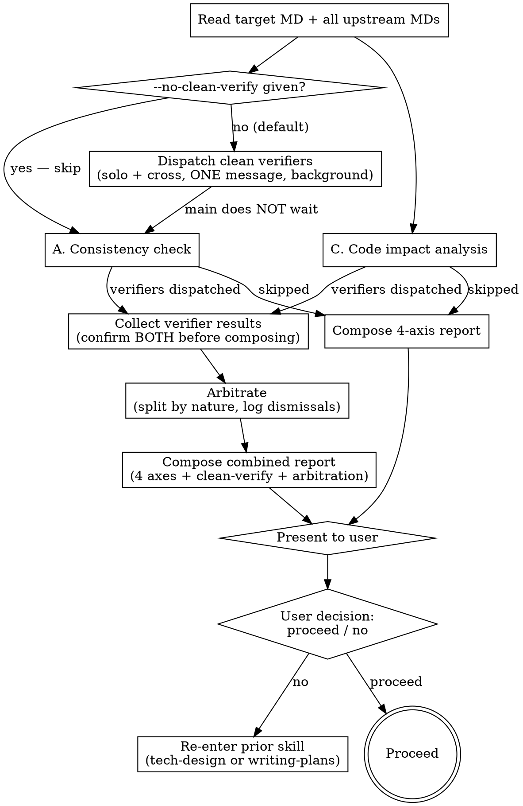

# Verifying Spec (Main-Agent Verification Gate)

This is the verification gate after upstream superpowers' self-review. The user explicitly required main-agent verification (NOT a subagent) for context preservation, transparency, and accuracy.

<HARD-GATE>
You (main agent) execute the A + C verification yourself. NEVER let a subagent REPLACE that main-agent pass — the user explicitly requires main-agent verification for context preservation. The ban targets SUBSTITUTION, not the existence of subagents.
EXCEPTION 1: If code impact analysis requires extensive grep across many files (≥10), you MAY dispatch ONE Explore subagent for read-only impact survey, then synthesize the report yourself.
EXCEPTION 2 — clean-context verifiers: You MUST ALSO dispatch two context-free verifier subagents IN PARALLEL with your own pass (see "Clean-Context Verifiers"), unless the user explicitly passed --no-clean-verify. This is an ADDITION: the main-agent A + C pass still runs in full and the main agent still writes the report. Do NOT delete this exception on the grounds that the first line forbids subagents — that reading is the regression this sentence exists to prevent.
</HARD-GATE>

## When to Invoke

| Phase | Target MD | Upstream MDs |
|---|---|---|
| End of `tech-design` | <slug>-tech-design.md | [<slug>-requirements.md] |
| End of `writing-plans` | <slug>-implementation-plan.md | [<slug>-requirements.md, <slug>-tech-design.md] |

<slug>-requirements.md is the source of truth and is therefore not a verification target.

2-doc 확정 트랙 (tech-design frontmatter `depth: 2`) 은 첫 행 (End of `tech-design`) 만 실행된다 — 이미 requirements + tech-design 조합만 전제하므로 검사 로직 변경 없음. plan 부재로 빠지는 "FR → 결정 → task 추적" 축은 tech-design §2 (영향 컴포넌트) + §7 (테스트 전략) 매핑으로 대체 커버한다.

## Procedure



## Clean-Context Verifiers (무맥락 검증자 병렬)

메인의 A + C 검증과 **동시에** 맥락 없는 보조 에이전트 둘을 백그라운드로 띄운다. 메인은 이들을 기다리지 않고 자기 검증을 계속한다.

### 왜 둘인가

| 검증자 | 받는 것 | 보는 것 |
|---|---|---|
| **단독 (solo)** | 대상 MD 경로 **하나만** | 문서 자체의 문제 — 모호 / 미결정 / 내부 모순 / 검증 불가능한 서술 / 이 문서만으로 구현 불가한 지점 |
| **대조 (cross)** | 대상 MD + 모든 upstream MD 경로 | 상위 대비 누락 / 모순 (메인 A축의 독립 재판정) |

단독 검증자에게 upstream 경로를 **주지 않는 것**이 이 설계의 핵심이다. 프롬프트로 "먼저 대상 문서만 읽어라" 라고 지시하면 지켰는지 확인할 방법이 없다 — 지시 위반이 결과물에 흔적을 남기지 않는다. 경로가 없으면 그 위반이 애초에 성립하지 않는다.

대조 검증자가 메인 A축과 겹치는 것은 의도된 중복이다. 같은 질문에 대한 두 판정(작성자의 판정과 낯선 이의 판정)이 있어야 대조가 가능하다.

### Dispatch 규칙

- **두 `Agent` 호출을 한 메시지에 묶는다.** 순차 dispatch 는 대기 시간이 합산되어 병렬 설계가 무의미해진다
- `run_in_background: true`
- **`model` 인자를 넘기지 않는다.** 메인 세션 모델을 상속한다. 고정 모델 상수를 두지 않는 이유는 판정이 갈렸을 때 모델 등급 차이를 변명으로 쓸 수 없게 하기 위함이다
- 프롬프트 템플릿: `./clean-solo-prompt.md` / `./clean-cross-prompt.md`
- **주입 금지** — 대화 이력 / 메인의 중간 검증 결과 / 각 결정의 배경 서술 / 대상 문서의 `## 변경이력` footer. 전달하는 것은 파일 경로뿐이다
- dispatch 직후 사용자에게 한 줄 안내를 출력한다: `ℹ️ 무맥락 검증자 2개를 백그라운드로 띄웠습니다. 끄려면 --no-clean-verify 를 붙여주세요.`

### `--no-clean-verify` 플래그

사용자가 이번 슬래시 호출(`/design-tech`, `/write-plan`, `/auto-design-tech`, `/auto-write-plan`)에 `--no-clean-verify` 토큰을 **명시**한 경우에만 건너뛴다. 메인 자체 판단으로 끄지 않는다.

변경 규모나 복잡도를 보고 알아서 켜고 끄는 조건부 게이팅은 도입하지 않는다 — 판정이 틀리면 건너뛴 사실이 사용자에게 보이지 않는다.

플래그가 있으면 dispatch 를 생략하고 기존 4축 보고서만 낸다. 보고서의 무맥락 검증 섹션에는 건너뛴 사실을 한 줄로 남긴다.

### 결과 수합과 중재

메인 A + C 검증이 끝나면 두 검증자 결과를 수합한다. **보고서 작성 전에 두 검증자의 상태를 각각 확인한다** — 한쪽만 받은 상태로 보고서를 내지 않는다.

**"응답 없음" 판단 시점** — 메인 A + C 검증이 끝난 뒤 두 검증자의 상태를 확인하는 그 시점이 기준이다. 아직 실행 중인 검증자가 있으면 그 하나를 기다린다. 완료 통보가 오지 않은 채 에이전트가 종료됐거나 오류로 끝났으면 그때 "응답 없음" 으로 확정한다. 별도의 초 단위 타임아웃을 두지 않는다 — 검증자는 문서 두어 개를 읽을 뿐이라 메인 검증보다 오래 걸릴 이유가 없고, 임의의 타임아웃은 정상 결과를 버리게 만든다.

실패했거나 응답이 오지 않은 검증자는 **보고서에 실패로 표기하고 진행한다**. 조용히 건너뛰면 사용자가 "무맥락 검증까지 돌았다" 고 오인한다. 반대로 검증자 실패로 흐름 전체를 막는 것도 과잉이다.

지적마다 **먼저 사실 여부를 판정하고, 사실인 것만 성격으로 나눈다**. 두 단계다.

**1단계 — 사실 판정.** 지적이 실제로 성립하는지 메인이 직접 확인한다. 성립하지 않으면 **기각**이다. 기각 사유를 보고서 중재 섹션에 남긴다. 조용히 버리면 무맥락 검증자를 돌린 의미가 사라진다.

기각 사유는 예를 들면 이렇다 — 검증자가 인용한 문장이 문서에 실제로는 없다, 지적한 모순이 두 문장을 잘못 읽어 생긴 것이다, 상위 문서에 그 항목이 실제로 존재하는데 못 찾았다.

**2단계 — 성격 분리.** 사실로 확인된 지적만 아래로 나눈다.

| 지적 성격 | 처리 |
|---|---|
| 상위 문서 대비 누락 / 모순 | 문서 수정 사유. `## 권장` 에 수정 권고로 올린다 |
| 상위 문서와 무관한 문서 자체 문제 | 자동 수정 사유는 아니다. 무맥락 검증 섹션에 남기고, 그 중 **문서대로 만들 수 없게 만드는 것** (모호 / 미결정 / 내부 모순 / 검증 불가능한 기준) 은 `## 권장` 에도 함께 올린다. 나머지는 기록만 하고 진행한다 |

두 번째 행의 단서가 중요하다. 이 단서가 없으면 단독 검증자의 지적은 어떤 경우에도 문서를 못 고치게 되고, 그러면 단독 검증자를 띄운 이유 자체가 사라진다. 사용자가 최종 게이트에서 무엇을 고칠지 정한다 — 메인이 대신 묻어두지 않는다.

판정이 엇갈릴 때마다 사용자에게 묻지 않는다. 사용자가 이 흐름에 진입한 시점부터 진행은 위임된 것으로 보고, 메인이 판정해 보고서에 반영한다.

## A. Consistency Check

Verify every upstream item is reflected in the target. Two failure modes:
- **누락 (gap)**: an upstream FR/decision that does not appear downstream
- **모순 (conflict)**: an upstream constraint contradicted downstream

### Checklist

When target = `<slug>-tech-design.md`:
- Every FR-N from <slug>-requirements.md is mapped to <slug>-tech-design.md §2 (impacted components) or §4 (external interfaces)
- Every NFR is addressed in <slug>-tech-design.md §6 (risks) or §7 (test strategy)
- <slug>-tech-design.md does not contradict <slug>-requirements.md (e.g., out-of-scope items are not added back)

When target = `<slug>-implementation-plan.md`:
- Every key decision in <slug>-tech-design.md §5 maps to at least one task in <slug>-implementation-plan.md §1
- Every risk category from <slug>-tech-design.md §6 has at least one entry in <slug>-implementation-plan.md §2 위험 코드 지점
- Every FR is implementable through the listed tasks (trace FR → decision → task chain)

## C. Code Impact Analysis

For files/functions/endpoints named in the target MD:

1. **File existence** — Read/Glob to confirm the file exists or is explicitly created in a task
2. **Caller mapping** — Grep the function/symbol name to count usage sites
3. **Side-effect candidates** — Apply the risk-annotation 3-checklist (complex branching, public signature/schema changes, shared state) to each touched function
4. **Test coverage** — Check whether the touched files have tests (Glob `test_*.py` or `*.test.*` adjacent or under `tests/`)

When grep results span ≥10 files, optionally dispatch ONE read-only Explore subagent for the impact survey only, then synthesize the report yourself.

## Report Format

Output to the conversation in this exact structure:

```
🔍 verifying-spec 보고서 — 대상: <target>.md (upstream: <list>)

## A. Consistency
✅ Mapped: <count> items (e.g., FR-1, FR-2, FR-3 → §2/§4)
⚠️ Gaps: <count>
   - <upstream item ID> "<title>" → not found in <target> §<section>
❌ Conflicts: <count>
   - <upstream item> says X, <target> says Y

## C. Code Impact
- Impacted files: <list> (<count>)
- Callers: <function> referenced in <count> places (<list>)
- Risk candidates: <category-counts> (e.g., side-effect: 2, breaking: 1)
- Test coverage: <existing test files / coverage gaps>

## 무맥락 검증 (clean-context)
- 단독 검증자: <완료 | 실패 — 사유> / 지적 <count>건
   - [<category>] <section> — <내용>
- 대조 검증자: <완료 | 실패 — 사유> / 누락 <count>건, 모순 <count>건
   - <upstream item> — <내용>
(건너뛴 경우 이 섹션은 한 줄: `--no-clean-verify 로 건너뜀`)

## 중재 (arbitration)
- 채택: <지적> → `## 권장` 으로 올림
- 기각: <지적> → <기각 사유>
- 기록만: <지적> → 상위 문서와 무관, 수정 사유 아님

## 권장 (recommendation)
- <gap or conflict> → suggest <action>
- <risk candidate> → suggest <mitigation or §6 augmentation>

진행 / 수정 중 선택해주세요.
```

The `진행 / 수정` line is in Korean because the user chooses verbally.

## Anti-Patterns

| Wrong | Right |
|---|---|
| "Looks good, proceed" without a structured report | Always emit the 4-axis report. |
| Reporting only gaps | Cover all 4 axes: gaps + conflicts + impact + test coverage. |
| Letting a subagent REPLACE the main-agent A + C pass | Forbidden by HARD-GATE. Clean-context verifiers run ALONGSIDE, never instead. |
| Skipping when "obviously fine" | Run anyway. Obvious has gaps too. |
| Passing conversation history / author reasoning / 변경이력 footer to a clean verifier | Paths only. Injecting narrative destroys the entire point. |
| Giving the solo verifier the upstream paths | Solo gets the target path ONLY. Order enforcement is structural, not prompt-based. |
| Dispatching the two verifiers in separate messages | One message, two Agent calls. Sequential dispatch makes the wait additive. |
| Pinning a fixed model on the clean verifiers | Omit `model` — inherit the session model, so a split verdict cannot be blamed on tier difference. |
| Dropping a clean-verifier finding without saying why | Log the dismissal reason in the 중재 section. |
| Silently skipping verifiers that failed or timed out | Mark them failed in the report and proceed. |
| Deciding to skip based on doc size or "low risk" | Only an explicit `--no-clean-verify` skips. |

## Red Flags

| Thought | Reality |
|---|---|
| "Skip the gate, the spec is short" | Short specs miss things just like long ones. Run it. |
| "I'll just trust self-review" | Self-review is a different axis. The gate is additive. |
| "User won't read a long report" | Make it scannable, but emit it. |

## Acceptance

A verification run is complete when ALL hold:
1. Report includes all 4 axes (consistency-gaps, consistency-conflicts, impact-files+callers+risks, test-coverage)
2. Counts are concrete (not "some" or "a few")
3. The closing prompt offers `진행 / 수정` choices to the user
4. Unless `--no-clean-verify` was explicitly given, BOTH clean-context verifiers were dispatched in ONE message with `run_in_background: true` and no `model` argument
5. The report carries a 무맥락 검증 section (per-verifier status plus findings, or an explicit skip/failure line) and a 중재 section (adopted / dismissed-with-reason / recorded-only)
6. No clean-verifier finding was dropped without a logged dismissal reason

## Related Skills

- `tech-design` — invokes this on save
- `writing-plans` — invokes this on save
- `risk-annotation` — supplies the 3-checklist used in §C
- `change-history` — captures the verification outcome in the next entry's 영향범위 field
